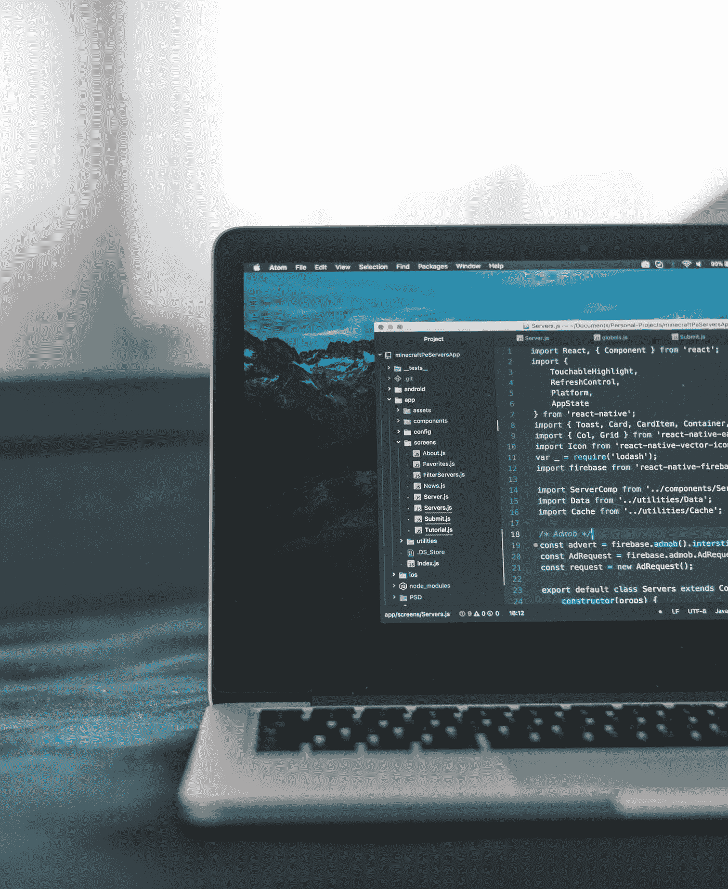
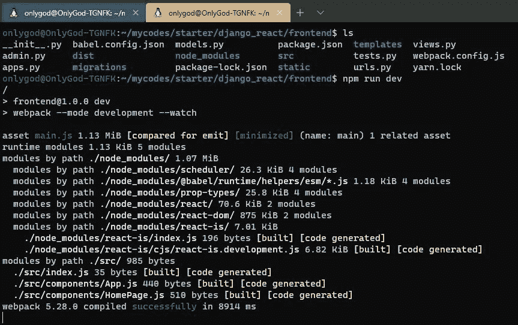
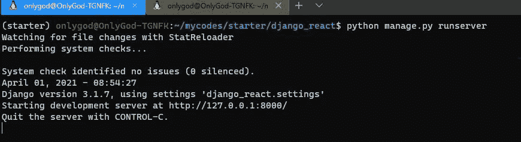
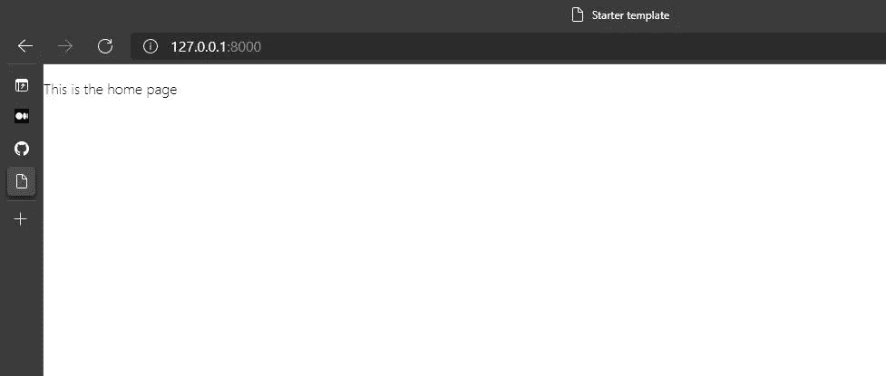

# 如何以更简单的方式集成 React 和 Django 框架。

> 原文：<https://medium.com/codex/how-to-integrate-react-and-django-framework-in-a-simple-way-c8b90f3ce945?source=collection_archive---------0----------------------->

大家好😊因此，今天我将重点关注如何以更简单的方式将 React 集成到您的 Django 项目工作流中。



由 [AltumCode](https://unsplash.com/@altumcode) 在 [Unsplash](https://unsplash.com/) 上拍摄的照片

# 所以让我们开始吧！！！🚀🚀

# 工具

*   [Visual Studio 代码](https://code.visualstudio.com/)(文本编辑器)
*   [Python](https://www.python.org/)3 ++版本
*   [Nodejs](https://nodejs.org/en/)
*   使用 [WSL](https://docs.microsoft.com/en-us/windows/wsl/install-win10) 和 [windows 终端](https://www.microsoft.com/en-us/p/windows-terminal/9n0dx20hk701?activetab=pivot:overviewtab)的 Windows (OS)

> 在这篇文章中，我使用 WSL 2 终端和 **Windows 10** 操作系统，你也可以使用其他像 **mac，linux，**如果任何命令不同，你可以搜索谷歌来解决它。

# 1.设置项目工作流

在这里，我们正在创建名为“django_react_starter”的 Django 项目。

在您的终端中键入以下命令，并确保 python、pip、pipenv 和 Django 都已安装，以避免任何错误。

```
python3 --versionsudo apt install python3-pip # if python is not installedpip3 install pipenvmkdir django_react_startercd django_react_starterpipenv shell # create our virtal enviromentpip3 install djangopip3 listdjango-admin startproject django_react_startercd django_react_startercode . # to open with vscode
```

# 2.安装我们的 Django 应用

另外，为了在我们的项目中集成 react 和 Django，我们需要两个应用程序，一个作为我们的前端(React 将在那里)，另一个作为我们的后端(Django)。现在回到您的终端，确保您在您的 django 项目的目录(django_react_starter)中，

```
python manage.py startapp api
```

django 应用程序(api)将作为我们的应用程序的后端，这是我们将利用模型，序列化等。

接下来是为 React 创建我们的前端应用程序，粘贴下面的命令。

```
python manage.py startapp frontend
```

# 3.设置我们的 API

为了连接 django 以作出反应，我们需要设置我们的 django 应用程序(api)来使用 [django rest-framework](https://www.django-rest-framework.org/) 作为 API 工作，现在我们需要在您的终端中安装`djangorestframework`

```
pip3 install djangorestframeworkpip3 list # to view it
```

> 现在，在我们的 api 应用程序目录中，让我们在我们的 *models.py* 中创建一个简单的 Todo 模型

将此添加到***API/models . py***中

仍然在同一个目录中创建 serializers.py 文件，这将提供一种将 django 模型转换成其他格式的机制。

***API/serializer . py***

现在为我们的观点加上这个

**API/views . py**

在 api 目录中创建一个 urls.py，这样我们就可以路由我们的视图

***API/URLs . py***

接下来将 Django 项目(django_react_starter)中的应用添加到 ***settings.py*** 中已安装的应用中

所以在 ***中添加这个 django _ react _ starter/settings . py***

# 4.与 Django 集成 React

回到我们之前制作的 Django 前端应用程序，这是我们的 React 应用程序所在的地方，现在让我们来设置它。

因此，我们将不会使用 *create-react-app* 以正常方式创建 react 应用程序，而是自己创建我们需要的每个目录和文件。这可能是一个小任务，但只是跟着做，如果出现任何错误，你可以在文章结尾检查我的源代码。

现在首先，确保你在前端目录，现在回到你的终端输入下面的代码

使用 [yarn](https://yarnpkg.com/) 生成我们的 package.json 文件

```
yarn install
```

接下来，创建一个空的 npm 项目

```
npm init -y
```

> *npm init -y* 将简单地生成一个空的 npm 项目，而不经过交互过程

其次，让我们为 React 应用程序安装以下库

仍然在您的终端上的前端目录中输入以下命令

```
npm install @babel/core @babel/preset-env @babel/preset-react babel-loader react react-dom react-router-dom webpack webpack-cli
```

安装后查看你的 ***package.json*** 确保它们都列在那里

第三，让我们在您的终端上或者手动使用 visual studio 代码将这些用于 react 的文件和目录添加到我们的 ***前端*** 目录

```
cd frontendmkdir templatescd templatesmkdir frontendcd frontendtouch index.html
```

*   **frontend/templates/frontend/index . html**

对于我们的静态文件

```
cd frontendmkdir -p static/css/index.cssmkdir -p static/frontend
```

*   ***前端/静态/css/index.css***
*   ***前端/静态/前端***

现在，让我们在您的前端目录中添加 index.js 和 react 应用程序的一些组件，创建一个文件夹 src

```
cd frontendmkdir -p src/*components*/App.js,HomePage.jscd srctouch index.js
```

*   **src/index . js**

*   【T42*src/components/app . js*

*   ***src/components/home page . js***

现在让我们添加一些配置

让我们向前端目录添加一些配置文件

*   **frontend/*babel . config . js***

*   **frontend/web pack . config . js**

最后，让我们编辑我们的***package . JSON****文件*中的 s **脚本**

*   ***frontend/package . JSON***

现在我们已经设置好了 react，让我们为 django 添加视图和 URL 来与 react 应用程序交互

*   ***frontend/views . py***

*   ***frontend/URLs . py***

现在，回到我们的 django 项目(django_react_starter ),让我们更新我们的 urls.py

*   ***django _ react _ starter/URLs . py***

# 5.测试我们的应用

让我们看看到目前为止我们所做的一切是否有效，为了测试它，请在命令行上打开两个终端，一个作为虚拟环境连接起来，用于 Django，另一个用于 Nodejs。

在我们的 frontend terminal for react 中，确保您在 frontend 目录中，键入以下命令

```
npm run dev
```

如果它在终端中返回如下图，并在*中创建一个 ***main，js*** 文件，那么它就全部工作了。*

**

*回到我们的 django 终端，确保您在 Django 项目目录中，并键入或粘贴以下命令*

```
*python manage.py makemigrationspython manage.py migratepython manage.py runserver*
```

**

*最后，在您的浏览器上进入 [http://127.0.0.1:8000/](http://127.0.0.1:8000/)*

**

*祝贺🙌如果你看到这个，那么一切正常😊。如果您有任何问题，您可以在这里 获得源代码[](https://github.com/Onlynfk/django_react_starter_guide)*

**如果你能留下好的评论，我会很高兴😉也谢谢你的时间！！**

> **此外，如果你需要更多帮助，请查看这个视频:Django & React 教程#3 —使用 Webpack 进行 React 集成& Babel —来自 TechwithTim 的 YouTube 我从中获得了大部分信息，如果不是全部的话。**

# **去哪里找我**

> **你可以在这里跟随我上 [**中**](https://onlygod.medium.com/) **❤️****
> 
> **你也可以在上找到我👉[***Github***](https://github.com/Onlynfk)***/****[***insta gram***](https://www.instagram.com/onlyo.codes/)*/*[***LinkedIn***](https://www.linkedin.com/in/onlygod-o-b64084166/)*🔥****