# 如何使用 Telnet、Netcat、Python 或 Django 与 Memcached 交互

> 原文：<https://medium.com/codex/how-to-interact-with-memcached-using-telnet-netcat-python-or-django-b88788b71375?source=collection_archive---------0----------------------->

这比你想象的要容易


Joshua Sortino 在 [Unsplash](https://unsplash.com?utm_source=medium&utm_medium=referral) 上拍摄的照片

# 背景

缓存是一种提高程序或网站性能的技术。主要思想是将昂贵的操作、查询或计算的结果存储到一个位置，以便将来类似的调用/请求不需要再次重做，它将只返回存储的值。

由于 I/O 操作缓慢，文件或数据库不是很好的缓存存储，而利用 RAM 要快得多。Memcached 非常流行，用于扩展大型项目，如脸书、YouTube、Twitter、维基百科等。一旦你的网站有了显著的流量，Memcached 就是提高性能的有效方法之一。

**Memcached**(**Mem**ory**Cache D**aemon)是一个内存缓存服务器。Telnet、Netcat、Python 和 Django 可以充当**客户端**。Memcached 将数据作为键值对存储在 RAM 中，因此它可以被视为一个巨大但快速的 Python 字典。

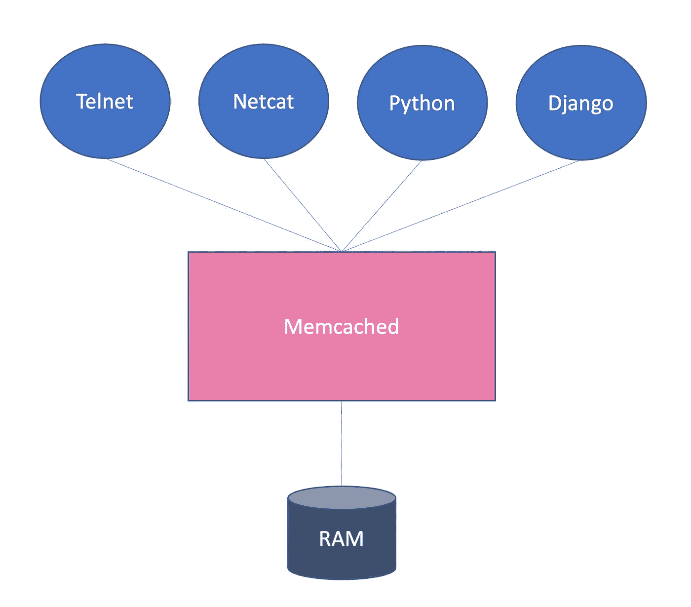

# Memcached 服务器

关于安装，参见[https://github.com/memcached/memcached/wiki/Install](https://github.com/memcached/memcached/wiki/Install)。

对于 Mac 用户来说，通过自制软件安装很容易:

`brew install memcached`

要运行它:

`brew services start memcached`

检查它是否正在运行(对于类 Unix 系统):

`ps aux | grep memcached`

# Telnet 客户端

[**telnet**](https://en.wikipedia.org/wiki/Telnet)**(`**tel**etype **net**work`)是一项古老的技术，创建于 60 年代，因为当时的计算机非常昂贵，而且体积庞大，无法在家中使用。这是一种连接到远程计算机的机制。 **ssh** ( `**s**ecure **sh**ell`)是 *telnet* 的继任者，主要是为了增加安全性。使用 *telnet* 你可以使用 *telnet* 协议与服务器通信。你甚至可以在你的终端上下棋，试试看:**

**`**telnet** www.freechess.org`**

**与`memcached`沟通的方式有很多种，via *telnet* 就是其中之一。**主机**和**端口**都是必需的，`11211`是`memcached`的默认端口:**

**`**telnet** localhost 11211`**

**这将显示 *telnet* 提示符:**

**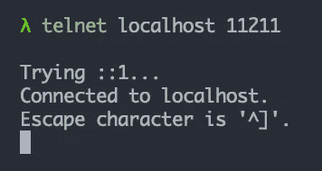**

**然后我们可以开始输入`memcached`命令，如 **set** 、 **get** 、 **delete** 或 **flush_all** :**

```
# Caches *foo* with the value of *bar* for 5 minutes (300 seconds).
# Default timeout is 0 (i.e. no expiration).
# Syntax: **set** KEY FLAGS TIMEOUT SIZE
# FLAGS usually is just 0.
# SIZE is the number of characters.
# the *bar* value is inputted in the next line.
**set** foo 0 300 3
bar# Returns *bar*.
**get** foo# Deletes *foo*.
**delete** foo# Deletes all keys.
**flush_all**
```

**下面是一个运行示例:**

**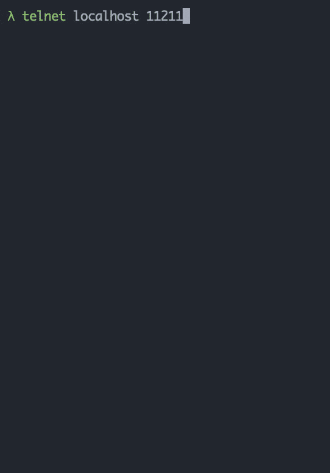**

**更多细节和其他命令，见[https://github.com/memcached/memcached/wiki/Commands](https://github.com/memcached/memcached/wiki/Commands)**

# **Netcat 客户端**

**`[nc](https://en.wikipedia.org/wiki/Netcat)` ( `**n**et**c**at`)是一个 Unix CLI 工具，主要用于网络检查或调试。它可以通过 TCP 协议与`memcached`服务器通信。我们可以使用`echo`语句将`memcached`命令输入其中。**

**因此，要快速检查缓存键的值，使用`nc`比`telnet`更方便:**

**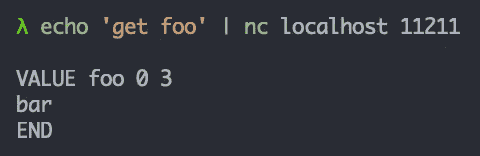**

**并刷新所有按键，这是重启`memcached` 或使用`telnet`的便捷替代方式:**

**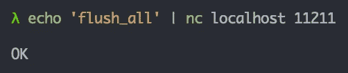**

**以下是使用`nc`的四个`memcached`命令:**

**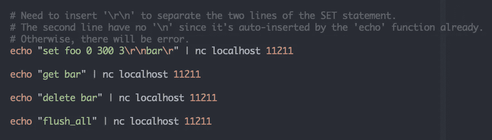**

**同样，为它们创建 shell 函数更有效(将这些放在`.bashrc`或`.zshrc`中):**

**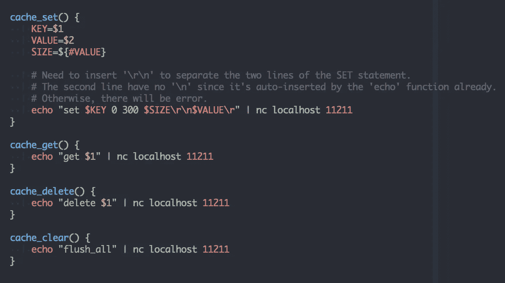**

**所以，现在我们可以简单地将它们运行为 **cache_set** 、 **cache_get** 、 **cache_delete** 和 **cache_clear** :**

**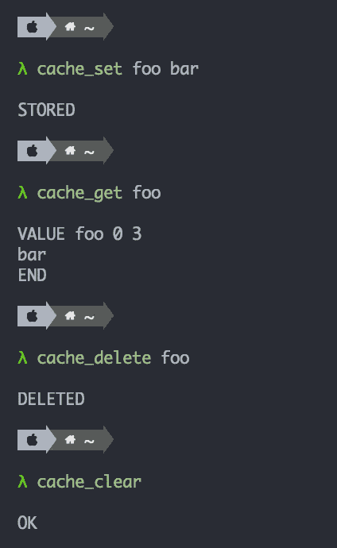**

# **Python 客户端**

**Python 中实现了很多`memcached`客户端。虽然它们有类似的 API(**set**()， **get** ()， **delete** ()， **flush_all** ())。其中比较受欢迎的就是`[python-memcached](https://github.com/linsomniac/python-memcached)`。要安装:**

**`pip install python`**

**它很容易使用:**

**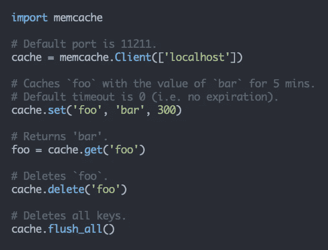**

# **Django 客户**

**Django 可以使用各种缓存后端:文件、数据库、内存等。[缓存 API](https://docs.djangoproject.com/en/dev/topics/cache/) 是一个一致的接口，因此当您决定切换缓存后端时，您的代码不会改变。我们只需要定义**缓存** Django 设置。默认的缓存后端是**本地内存缓存** ( `django.core.cache.backends.locmem.**LocMemCache**`)，它也将利用 RAM。因此，对于`memcached`，我们使用`MemcachedCache`类:**

**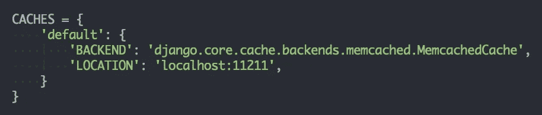**

**然后我们可以调用缓存 API 方法。这里的代码与上面的 Python 代码非常相似。但是，请注意 Django 使用了`clear()`而不是`flush_all()`:**

**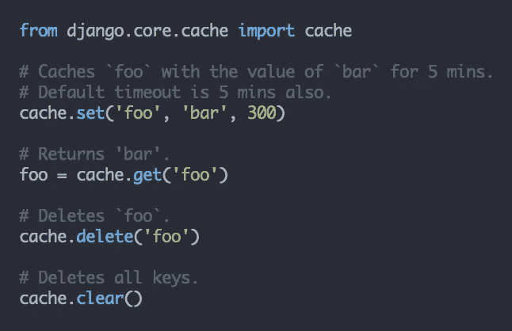**

**为了检查它是否确实存储在`memcached`中，我们需要使用`**get** :1:foo`格式，而不是简单的`**get** foo`，因为 Django 使用了一个[缓存键函数](https://docs.djangoproject.com/en/dev/ref/settings/#key-function)来生成这个字符串模式:**

**`PREFIX:VERSION:**KEY**`**

**其中，默认值为:**

```
PREFIX = ''
VERSION = 1
```

**因此，我们最终得到了`:1:**foo**`结果键。我们可以使用`nc`来验证这一点:**

**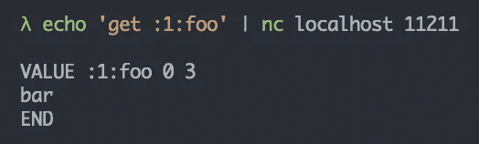**

**或者使用我们为它创建的 shell 函数:**

**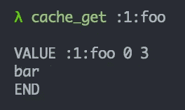**

# **关键要点**

*   **Memcached 功能强大，易于设置，也易于学习。**
*   **各种工具中的命令相对一致:**

**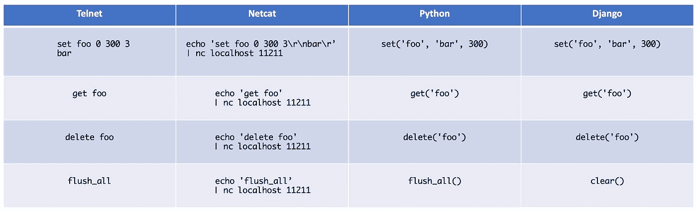**

*   **对于`netcat` ( `nc`)，最好使用我们实现的 **cache_set** 、 **cache_get** 、 **cache_delete** 、 **cache_clear** shell 函数，尤其是真正方便的 **cache_get** 和 **cache_clear** 。**
*   **为了简洁起见，我们在本文中只使用了`'foo': 'bar'`作为示例键值对。但是即使使用更复杂的对象/结构，原理仍然是相同的。**

**感谢您的阅读。如果你发现了一些有价值的东西，请关注我，或者给文章鼓掌/评论，或者[请我喝杯咖啡](https://ko-fi.com/ranelpadon)。这对我意义重大，鼓励我创作更多高质量的内容。**