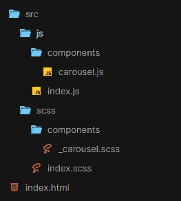
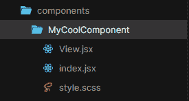
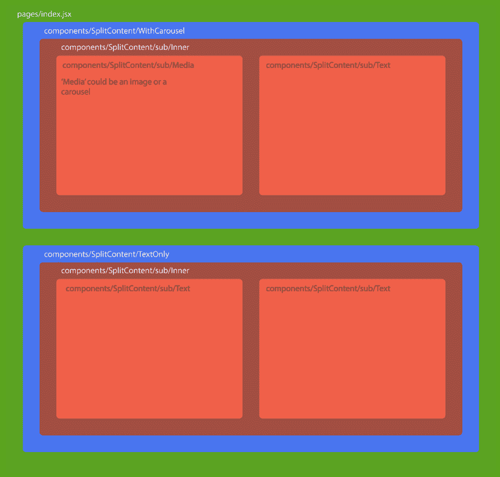
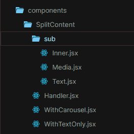

# 如何保持顺风干燥

> 原文：<https://medium.com/codex/how-to-keep-tailwind-dry-5116cbfbb839?source=collection_archive---------8----------------------->


我在网上看到很多关于 Tailwind 的抱怨:它是湿的，不是干的，它和内联样式一样，你不能进行全局更改，它很难阅读。我理解当你第一次开始使用 Tailwind 时，这种情况可能会出现。需要记住的是 **Tailwind 与传统的 CSS 完全不同，你不应该这样对待它**。

Tailwind 有很多方式可以让我们受益，比如它极小的包大小和超快的原型制作能力。但我们只有在正确的情况下使用它，才能获得这些好处；用在错误的上下文中，顺风只会给你带来头痛。

# 什么时候使用 Tailwind CSS 是错误的？

我首先会推荐**反对**使用 Tailwind，因为它是普通的 HTML 静态网站。当你构建一个静态站点时，你不可避免地要复制和粘贴 HTML，因为在一个页面上可能不止一次出现相同的组件/部分。

如果你使用传统的 CSS 方法，比如 [BEM](http://getbem.com/) ，这完全没问题:你的 CSS 和 HTML 完全独立存在，所以你可以依赖你的 CSS 作为你网站外观的唯一来源。如果你改变了一个 CSS 类，这个改变将会在这个类被使用的任何地方被反映出来，而不需要更新 HTML。通过这种方式，如果你已经复制并粘贴了一些 HTML，这并不太重要。

```
// you can copy and paste these classes anywhere
<button class="button button--negative"></button><button class="button button--negative"></button>// but you could also break rules like this
<div class="button"></div>
```



对于 CSS 和普通 HTML 来说，这是你能做的最多的事情了。就我个人而言，我仍然认为这种方法不太合适，因为你在多个地方复制和粘贴相同的代码，但这是你用基本的 HTML 所能做到的最好的了——在我学习 CSS 的时候，这种方法从来都不适合我。为了使这个系统真正的干燥，你需要使用某种形式的模板或者基于组件的框架，这样你就可以一次只为一个部分编写 HTML，然后在任何你喜欢的地方重用这个组件。这让我想到了…

# 什么时候使用 Tailwind CSS 比较合适？

很高兴你问了！如果你不想在用 Tailwind 构建网站时重复自己的工作，你可能会想使用某种 JavaScript 框架。无论是 React、Vue 还是其他一些新奇的框架，重要的是你可以构建可以反复重用的 JS 组件。你也许可以让它和 PHP 模板一起工作，但是我认为这种方法最适合 JavaScript，因为你可以把 HTML、JS 和 CSS 都保存在同一个文件中。

这才是真正应该使用 Tailwind 的方式:作为一个完全不同的范例，关注点的分离并不意味着分离 HTML、CSS 和 JS，而是意味着分离整个组件，并将与该组件相关的所有内容保存在一个文件或文件夹中。这是一种与我们习惯的应对挑战的方式截然不同的工作方式，但这种方法有一些很大的好处:

*   组件可以彼此独立地运行，并且可以毫无争议地跨不同的项目使用
*   组件可以独立测试，所以您不需要担心以后会发生变化
*   原型开发要快得多，因为您不需要为每个元素编写一个定制的类
*   使用 JavaScript 进行比常规 HTML 更高级的条件样式化的完全访问权限
*   鼓励组件组合——一旦你有了一堆组件，就很容易通过组合你已有的组件来构建页面，甚至是组件的新变体

# 拥抱基于组件的架构

一旦你把 HTML、JavaScript 和 CSS 都放在一个地方，你会意识到把组件放在它们自己的文件夹中比把资源分散在不同的文件树中更容易。以这种方式工作开辟了新的机会，比如能够使用 JavaScript 来规定您的样式，并为视图构建更复杂的逻辑。



以下是一些帮助您适应基于组件的开发的技巧:

# 1.将组件分解成小的、可重复使用的部分

你有没有注意到，在看一个设计时，往往有许多重复的模式？你可以在课堂作文中利用这一点。常见的是一面是文本，另一面是某种媒体的 50/50 布局。我倾向于称它们为`SplitContent`块。这方面经常会有变化，可能有些文本是不同的大小，或者媒体插槽是用一个转盘而不是一个图像来填充的。

您可以创建一个带有 props 和 slots 的容器组件，您可以在其中添加任何类型的内容，而不是构建两个在很大程度上使用完全相同样式的组件。你可以在里面为你的样式设置逻辑——也许你想要一个道具来改变内容将出现在哪一边，或者在某一边添加填充。或者，您可以只添加一个可以传递一串类名的 prop，让您能够定制容器，因为它在不同的上下文中使用。



对于我想使用 SplitContent 作为 CMS(如 Wordpress)的动态内容块的区域，我可能会创建一个`Handler`组件，它分解 CMS 中定义的样式选项，并传递相关的组件组合。

例如，您可能希望您的客户端只能访问 CMS 中的一个 SplitContent 组件，但可以选择使用该组件创建许多不同的布局。一些选择可能包括:

*   您希望每一面都包含哪种类型的内容？
*   每种内容类型应该在哪一边？
*   这个组件需要不同的配色方案吗？

组件处理程序可以接受这些选项，它将返回正确的布局，同时保持所有这些逻辑包含在它自己内部，以便其他组件仍然可以跨不同的组件使用。

我通常将与 SplitContent 相关的所有内容保存在一个文件夹中，并添加一个由组成主要组件的较小部分组成的子文件夹:



这只是一个例子；本质上，您的组件应该都有一个单一的目的，这样使用您已经创建的组件来构建更大更复杂的组件就更容易了。

# 2.使用 JS 构建类列表

如果你觉得《顺风》很难读懂，你并不孤单。这是最常见的抱怨之一，我可以理解为什么:你必须阅读每个类才能理解发生了什么，这并不适用于每个人。

依靠 JavaScript 来构建类名可能会有所帮助。我通常更喜欢这种方法，而不是为了它而编写新的 CSS 类，尤其是当它们可能只在一个地方使用时。有些人可能会说这与使用@apply 指令是一样的，但是如果这个类不会在其他任何地方使用，就没有理由为它编写一个全新的类。像这样用 JavaScript 编写类有助于将与该组件相关的所有内容放在一个相似的地方，而不是放在几英里之外的 CSS 文件夹中。

```
// components/Modal/View.jsxexport default function ModalView () {
  const modalContainerClass = "bg-white p-4 rounded shadow";
  const modalHeadingClass = "heading-1 text-darkgrey"; return (
    <aside className={modalContainerClass}>
      <h1 className={modalHeadingClass}>...</h1>
    </aside>
  );
}
```

将类存储在 JavaScript 变量中可以让我们更清楚地了解它要完成的任务，同时也为我们提供了使用比 CSS 更高级的逻辑的机会。

# 3.使用道具来扩展组件

与普通 CSS 相比，我们在使用 Tailwind 时遇到的一个问题是，我们失去了将组件的基本版本扩展为带有类的新修改版本的能力:

```
// _button.scss.button {
  padding: 20px;
  border: 1px solid black;
}
.button--negative {
  border-colour: red;
}// index.html<button class="button">Accept</button>
<button class="button button--negative">Cancel</button>
```

当然，我们可以手动将`border-red` Tailwind 类添加到任何我们想要设置为负的按钮中，但是如果有不止一种样式呢？如果背景和文本颜色也改变了怎么办？

```
// this would be a nightmare if the negative styles ever changed<button class="p-5 border-red bg-red text-white">Cancel</button>
```

**解决方案:使用 JavaScript 扩展你的组件**

当我们切换到基于组件的开发时，我们获得了使用 JavaScript 代替 CSS 来创建组件的能力。因为您不再受限于单独的样式表，所以您可以通过将组件抽象到不同的文件来创建组件的变体，使用您的基本组件作为起点。

最灵活的方法之一是将类名作为道具传递下去，并将它们与组件上现有的类合并。这是一个[将被破坏的道具与其他值](https://reactpatterns.com/#merge-destructured-props-with-other-values)合并的例子，如神奇资源[reactpatterns.com](https://reactpatterns.com/)所示。

下面是使用这种方法时我们的按钮变体的外观:

```
// components/Button/index.jsxexport default function Button = ({ classnames, handleOnClick, label }) {
  const buttonClass = [
    "p-5 border-1", // default button styles
    classnames      // any additional styles
  ].join(' ');

  return (
    <button className={buttonClass} onClick={handleOnClick}>
      {label}
    </button>
  )
}// components/Button/Negative.jsxexport default function ButtonNegative = (props) {
  return (
    <Button
      classnames="border-red bg-red text-white"
      {...props}
    />
  )
}
```

现在我们可以使用`index.jsx`作为按钮的基础层，并保持所有的逻辑都在这个层次上，同时也清楚地定义了按钮的变体，而没有任何功能上的改变。这样，如果以后样式改变了，任何使用`<ButtonNegative />`的地方都会反映出文件中的改变。

# 4.将视图逻辑和业务逻辑移动到单独的文件中

对于使用 JavaScript 框架来说，这是一个非常通用的技巧，但是在 Tailwind 中，它可以提供更多的帮助，因为它将您的风格与您的业务逻辑分开，而不会将它们放到一个完全不同的文件夹中。你可以进入你的按钮文件夹，知道那个文件夹里的所有东西都会和按钮有关。

一旦你把所有东西都放在一个地方，你就可以开始进一步分解它:在 React 中，你可以把组件的外观和行为分开。这里有一个例子:

```
// components/Carousel/View.jsx (view logic only)
export default function CarouselView ({ slides }) {
  return (
    <SomeCarouselPlugin>
      {Array.isArray(slides) && slides.map(slide => (
        <CarouselSlide {...slide} />
      ))}
    </SomeCarouselPlugin>
  )
}// components/Carousel/Jobs.jsx (business logic only)
export default function JobsCarousel () {
  const [jobs, setJobs] = useState(null);

  const fetchJobs = async () => {
    const res = await request({
      url: 'my-api-url.com/jobs?limit=16',
      method: 'GET'
    })
    setJobs(res.data)
  }

  useEffect(() => {
    fetchJobs();
  }, [])

  return !!jobs ? (
    <CarouselView slides={jobs.map(job => ({
      title: job.title,
      description: job.description,
      salary: 'Up to ' + job.salary.max
    }))} />
  ) : <>Loading...</>
}
```

如果我们想制作另一个使用相同风格的转盘，也许我们想让转盘装满职员而不是工作，我们可以通过在`Carousel/Staff.jsx`中创建一个新的容器组件来实现。

这极大地有助于分解具有数百甚至数千行的巨大组件，这种方法意味着如果你想进行更多的定制，你还可以包括额外的层。这个扩展系统使得分解一个组件应该做什么变得更加容易，同时确保你不会重复自己。

# 5.对容器、文本样式和组件之间使用的任何东西使用类组合

没错:即使组件是真理的来源，定制类仍然有一席之地。例如，您可能会在许多不同的组件上使用一个容器类，具有最大宽度、margin: auto 和一些侧边填充。因为这些不太可能改变，所以使用@apply 指令构造一个新的定制类是有意义的。

就个人而言，我也喜欢包含排版类，比如标题、标准内容块等等。为这些东西创建一个新的 JavaScript 组件并没有太大的意义，但是它们在很多地方结合了相同的风格。

```
.page-wrap {
  @apply max-w-page mx-auto px-4 tablet:px-5 laptop:px-6;
}.paragraph {
  @apply text-16 font-body leading-loose;
}// we can still create variants of .paragraph
<p class="paragraph text-white">Hello world!</p>
```

# 6.编写类时，避免使用边距

通过使类与位置无关，可以提高类的可重用性。如果您忽略了仅影响元素位置的属性(如边距),您可以更频繁地重用它。

```
// _typography.scss.heading-2 {
  @apply text-black text-24 bold;
}<h2 className="heading-2 mb-4">Hello world!</h2>
```

这可能不是你在每种情况下都想要的——也许你*确实*想要每个标题都有一定的边距。但是在很多情况下，这是一个值得记住的技巧，它使你的组件更加灵活，更少依赖于它们在页面上的位置。

# 7.将 tailwind.config.js 视为您的真理来源

在 SCSS 或更小的版本中，你可以为常量创建变量，比如颜色、字体和最大宽度。您可以在 CSS 中的任何地方重用这些变量，如果您更改了变量，这种更改将在使用它的任何地方得到反映。

顺风的工作方式也差不多，除了*一切都是由变量定义的。这不仅意味着你可以使用的文本或背景颜色，还包括间距、大小、边框和几乎任何你能想到的属性。您可以通过`tailwind.config.js`中的`theme`对象来利用这一点，或者通过`extend`对象来扩展默认主题。*

这个文件定义了你的整个应用程序的外观:如果你的设计者使用了一个通常使用像`4, 8, 12, 16, 32`等数字的设计系统。您可以将该系统直接构建到您 CSS 中:

```
spacing: {
  1: '4px',
  2: '8px',
  3: '12px',
  4: '16px',
}
```

然后这些类就可以直接使用了，在`spacing`属性的情况下，这些类将被应用到`padding`、`margin`和`relative`定位类，比如`left`和`right`。

不要忘记，您也可以使用常规的 JavaScript 来生成这些属性，这样可以节省一点时间并清理文件。我喜欢制作一个`const`，包含一个类似于上面的数组，并使用它作为`spacing`、`width`、`height`和任何其他类似的属性——甚至是`font size`。

我还考虑过使用[黄金比例](https://grtcalculator.com/)生成这样一个间距/字体系统的想法，这可能是快速原型制作的一个很好的选择，同时也保持了很好的视觉效果。

# 8.使用工具找出重复的模式

关于构造类的主题，有一些很棒的工具可以帮助您在类列表中找到重复的模式，这样您就可以将它们重构为自己的泛型类。

其中最有用的一个是 Refactor CSS，这是一个 VS 代码扩展，可以自动找到并呈现非常相似的类字符串，这有助于找到通用模式以抽象成新的类。如果类字符串有 3 个以上的类，并且这 3 个类在当前文档中重复 3 次以上，则它们将被突出显示。类的顺序被忽略，所以你不需要担心维护一个[属性排序顺序](https://www.matuzo.at/blog/ordering-css-properties/)来确保工具工作。

如果你*担心属性排序顺序*(如果你担心的话，顺风更易读)，那么你可以使用另一个工具来解决这个问题:[逆风](https://github.com/heybourn/headwind)。这个 VS 代码扩展将在保存时格式化你的 Tailwind 类，并根据它们的功能对它们进行分组，确保一切都在你期望的地方。

```
// before saving
<div class="bg-red container mb-6 text-white"></div>// after saving
<div class="container mb-6 text-white bg-red"></div>
```

你也可以改变逆风的正则表达式，这样你就可以完全按照你喜欢的方式定制排序顺序。

# 结论

我不会假装转移到这种工作方式是特别容易的，并且有许多问题仍然需要解决。我们仍然处于实用优先的框架和基于组件的开发的早期，所以一切都还没有搞清楚。

尽管如此，我相信我们会开始看到新的工具、软件包和方法来解决我们可能面临的任何问题。我们从这种方法中得到的是轻量级的、快速的、真正干燥的应用程序。隔离的、独立的组件非常适合跨不同平台构建，所以我认为我们会看到很多构建无头系统的公司采用这种工作方式。

我在我的博客 [npm run dev](https://npmrundev.wordpress.com/) 上写了更多类似这篇关于无头系统和基于组件的开发的文章。如果你想的话，可以去看看，我很乐意得到一些关于我的想法和写作风格的反馈。感谢阅读！