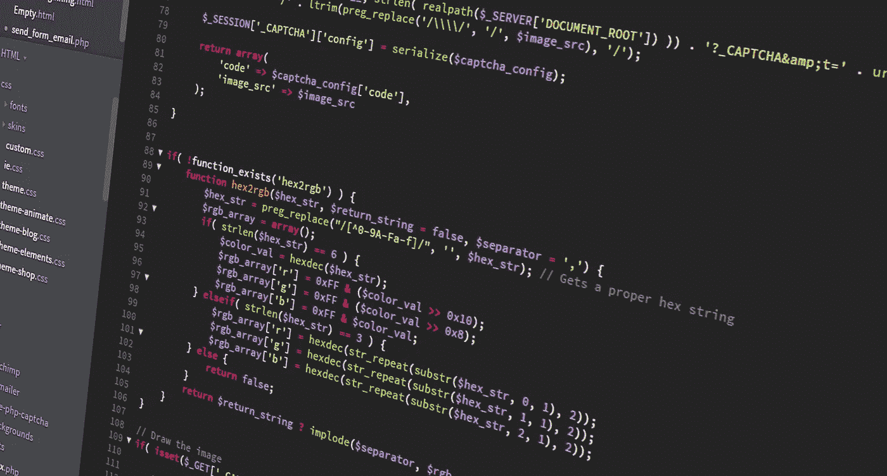

# 如何保持你的代码整洁

> 原文：<https://medium.com/codex/how-to-keep-your-code-clean-90995bd4a3fe?source=collection_archive---------1----------------------->

你是否曾经在 GitHub 上写了一段代码或者提交了一个 Pull 请求，而你得到的回复是“代码是干净的”?

你有没有想过这到底意味着什么？

在这里，我将列出一些使代码“干净”的准则。

## 干净的代码不是污垢