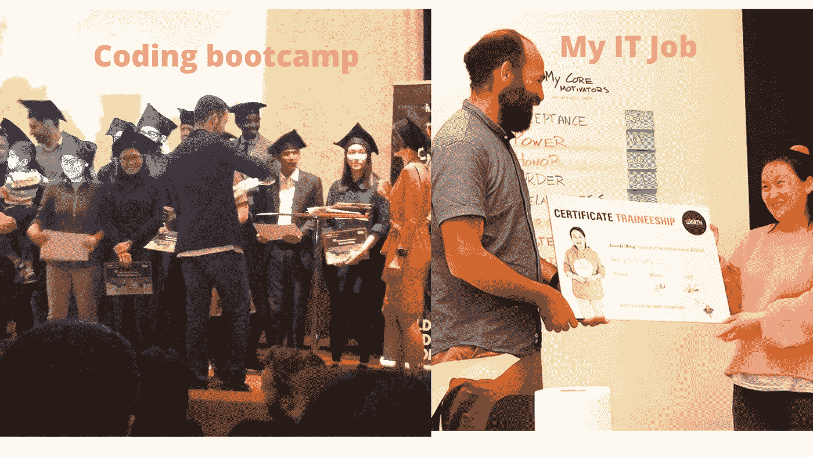

# 从训练营到工作:获得第一个开发者角色的逐步指南

> 原文：<https://medium.com/codex/how-to-land-a-job-after-a-coding-bootcamp-4fc0382e90c9?source=collection_archive---------13----------------------->

(左)毕业于某编码训练营；(右)并在一家荷兰 IT 公司获得了我的第一份开发工作。(图片由[李冠仪](https://medium.com/u/9f2dc23bfffa?source=post_page-----4fc0382e90c9--------------------------------)拍摄)

从一名编码训练营的毕业生到一家公司的专业开发人员的转变是非常可能的，但不一定是没有痛苦的。在密集的编码训练营中生存和成功需要几个月的努力和奋斗。所以，你的编码能力在训练营期间已经显现出来，你肯定学得更多更快…