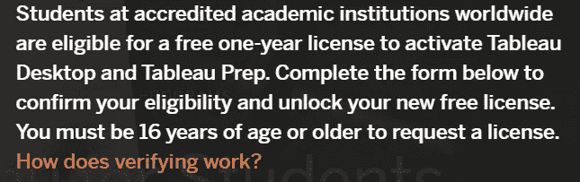

# 如何学习数据可视化并免费获得认证？

> 原文：<https://medium.com/codex/how-to-learn-data-visualization-and-get-certified-for-free-27728c0eee66?source=collection_archive---------17----------------------->

## 作为学生学习 Tableau 并获得认证而无需付费！

由 [Unsplash](https://unsplash.com?utm_source=medium&utm_medium=referral) 上的 [Luke Chesser](https://unsplash.com/@lukechesser?utm_source=medium&utm_medium=referral) 制作的图表和图形可视化数据

# 背景

最近，在公司列出的职位描述中，短语**‘数据驱动决策’**越来越受欢迎。但这意味着什么呢？

> 数据驱动的决策是在行动之前利用数据来验证行动过程的过程。
> 
> ——来自哈佛商学院在线[的 Tim Stobierski】](https://online.hbs.edu/blog/post/data-driven-decision-making)

然而，数千或数百万的数据行真的很难解释，它们无法清楚地传达隐藏的见解，*这就是为什么你需要学习数据可视化的原因，数据的图形表示(*[*Tableau*](https://www.tableau.com/learn/articles/data-visualization)*、2022】*)。事实上，根据 [LinkedIn Learning](https://www.linkedin.com/business/learning/blog/top-skills-and-courses/the-skills-new-grads-are-learning-the-most?trk=lilblog_05-13-19_data-visualization-must-learn-skill_learning) (2019)进行的研究，与数据分析和数据讲故事相关的技能已经成为大多数大学应届毕业生学习的趋势性硬技能。

# 什么是 Tableau？

对于那些数据领域的新手来说，Microsoft Excel 可能是你的首选数据分析工具，因此，让我向你介绍 [Tableau](https://www.tableau.com/) 。简而言之，Tableau 是一个广泛使用的分析平台，它具有多样化的数据源选择、可视化类型和人工智能/机器学习能力。

Tableau 提供了该平台的免费版本， [Tableau Public](https://public.tableau.com/en-us/s/) ，但与每月 70 美元的产品， [Tableau Desktop](https://www.tableau.com/pricing/individual) 相比，它有一些局限性。

# 如何免费获得 Tableau 桌面？

图像显示通过 [Tableau](https://www.tableau.com/academic/students#form) 免费注册 Tableau 的条件

对学生来说幸运的是，Tableau 有一个学术项目，他们提供一年的许可证，当然，如果你仍然是一个活跃的学生，可以每年更新！

要注册，只需进入他们的[网站](https://www.tableau.com/academic/students)，填写个人和学校信息进行注册。

成功注册后不久，**您将收到一封主题为“附上您的 Tableau 桌面产品密钥”**的电子邮件，其中包含产品密钥和下载软件的步骤。恭喜你！您可以开始探索软件成为下一个数据摇滚明星。

# 如何免费获得认证？

作者提供的 Tableau 证书样本

有很多方法可以在线学习 Tableau 的功能，例如通过阅读媒体帖子，观看 Youtube 视频，在线课程和新兵训练营。Tableau 本身也有其[**电子学习在线自定进度课程**](https://elearning.tableau.com/) ，这些课程也不是免费供公众访问的。然而，Tableau 也为学生提供了这一功能，访问密钥可以在同一封电子邮件中找到。

与外部课程相比，本课程的一个主要优势是学习路径和课程直接由 Tableau 提供，完成后会提供证书，非常适合展示您新获得的技能！

# **结论**

总之，随着时间的推移，求职竞争变得越来越激烈，我们需要更积极地学习按需技能，其中之一就是数据可视化。不管你获得了多少视频和证书，请记住最重要的因素是投入的实际练习时间！

*如有任何疑问，可通过*[*LinkedIn*](https://www.linkedin.com/in/sharon-regina/)*联系我。希望这个技巧对许多对数据驱动感兴趣的学生有用:)*