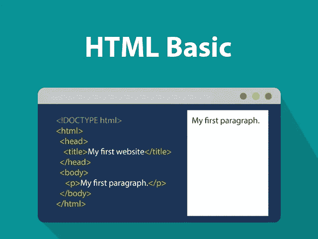
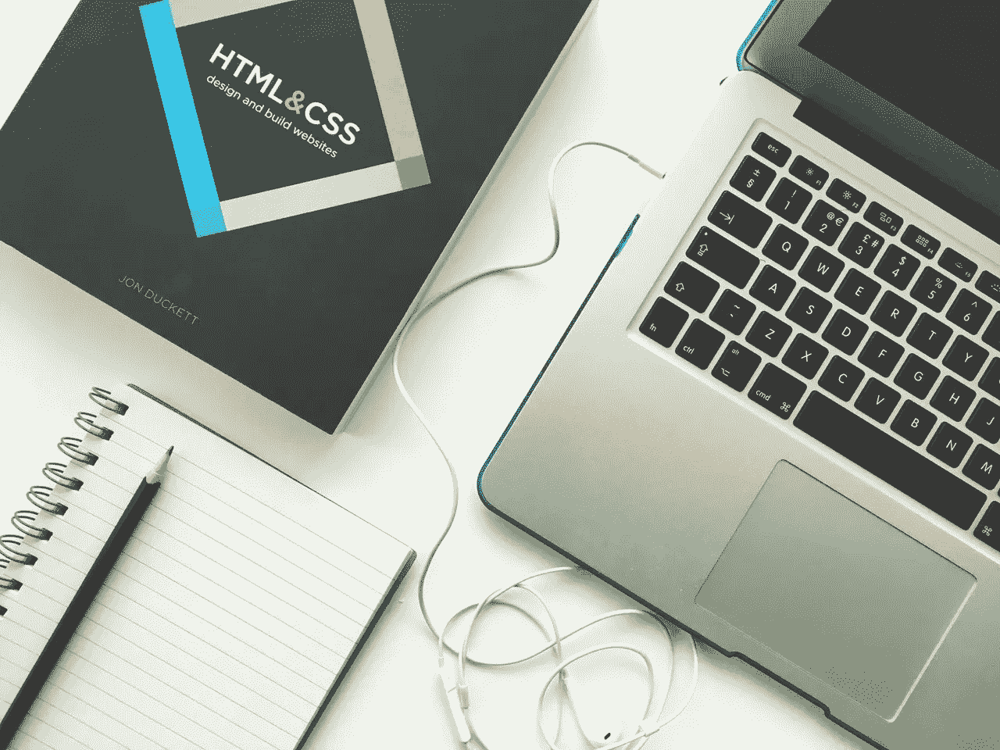

# 2023 年如何学习 HTML:综合指南

> 原文：<https://medium.com/codex/how-to-learn-html-in-2023-a-comprehensive-guide-54813d5ca496?source=collection_archive---------2----------------------->

# 简介:

HTML(超文本标记语言)是互联网和万维网的基本构件。它是一种标记语言，用于构建和组织网页上的内容，以及创建交互式动态网站。HTML 易于学习和使用，对于任何想要开始创建网站或 web 应用程序的人来说都是必不可少的。

在这篇文章中，我们将提供一个关于如何在 2023 年学习 HTML 的全面指导。我们将介绍 HTML 的基础知识、您需要的工具和资源，以及如何创建您的第一个网页的分步指导。

# HTML 的基础知识:

HTML 是一种标记语言，这意味着它使用标签和元素来描述网页的内容和结构。它是一种分层的语言，具有嵌套元素的树状结构。每个元素都有一个开始标记、内容标记和结束标记，它还可以有提供元素附加信息的属性。

## 一些常见的 HTML 元素包括:

*   `<h1>`至`<h6>`为标题
*   `
`为段落
*   `<ul>`和`<ol>`用于无序和有序列表
*   ``用于图像
*   `<a>`用于链接
*   `
`和``用于容器和内联元素

# 工具和资源:

要学习 HTML，你需要一个文本编辑器和一个网络浏览器。有许多免费和付费的文本编辑器，如 Notepad++、Sublime Text、Atom 或 Visual Studio Code。这些编辑器提供了语法突出显示和自动完成功能，这使得编写和理解 HTML 代码变得更加容易。

你还需要一个网络浏览器，比如谷歌 Chrome、Mozilla Firefox 或微软 Edge，来查看和测试你的 HTML 页面。这些浏览器提供了开发工具，允许您检查和调试 HTML 代码，并查看它在页面上的呈现方式。

除了这些工具，还有很多在线资源可以帮助你学习 HTML。一些最好的包括:

*   W3Schools([https://www.w3schools.com/html/](https://www.w3schools.com/html/))——这个网站提供了一个全面的 HTML 教程，有例子和练习，还有一个参考部分，里面有所有的 HTML 元素和属性。
*   Mozilla 开发者网络([https://developer.mozilla.org/en-US/docs/Web/HTML](https://developer.mozilla.org/en-US/docs/Web/HTML))—这是 HTML 的官方文档，由 Mozilla 基金会提供。它涵盖了 HTML 的最新标准和特性，还包括教程、示例和参考部分。
*   codecademy([https://www.codecademy.com/learn/introduction-to-html](https://www.codecademy.com/learn/introduction-to-html))——这是一个在线平台，提供各种编程主题的互动课程，包括 HTML。它提供了一步一步的指导和测验，并允许您在一个实时的编码环境中练习您的技能。
*   freeCodeCamp([https://www . freeCodeCamp . org/learn/responsive-we b-design/basic-html-and-html 5/](https://www.freecodecamp.org/learn/responsive-web-design/basic-html-and-html5/))—这是一个非营利组织，提供关于 web 开发和其他主题的免费在线课程。它的 HTML 课程涵盖了 HTML 和 HTML5 的基础知识，还包括让你应用知识的挑战和项目。

# 创建您的第一个网页:

现在您已经有了工具和资源，可以开始创建您的第一个网页了。以下是您需要遵循的步骤:

1.  打开文本编辑器，创建一个新文件。
2.  将下面的代码添加到文件中，这是一个 HTML 页面的基本结构:
    `<!DOCTYPE html>
    <html>
    <head>
    <title>My First Web Page</title>
    </head>
    <body>
    <h1>Hello, World!</h1>
    
This is my first web page.

    </body>
    </html>`
3.  以`.html`扩展名保存文件，例如`my-first-web-page.html`。
4.  用 web 浏览器打开该文件。您应该会看到带有标题和段落的页面，如代码所示。
5.  试验一下代码，添加更多的元素，改变它们的属性，看看它们是如何在页面上呈现的。
6.  使用前面提到的在线资源和教程来学习更多关于 HTML 的知识，并练习您的技能。
7.  随着您的进步，您可以尝试创建更复杂的页面，使用不同的布局、样式和交互元素。您还可以学习其他技术，如 CSS 和 JavaScript，以增强您的网页，使其更具动态性和吸引力。

# 结论:

HTML 是一种简单而强大的语言，它允许任何人创建网页和 web 应用程序。它易于学习和使用，并且有许多工具和资源可以帮助您入门。通过专注和练习，你可以掌握 HTML 并建立自己的网站和应用程序。

希望这篇文章能为 2023 年如何学习 HTML 提供有益的指导。编码快乐！