# 如何制作一个谷歌搜索机器人？GUI 自动化系列 I

> 原文：<https://medium.com/codex/how-to-make-a-google-search-bot-gui-automation-series-i-9eb5618d3a27?source=collection_archive---------1----------------------->

## [法典](http://medium.com/codex)

今天我们将介绍一系列教程。这第一个是初学者友好的，任何人有电脑和互联网连接应该能够通过它。一定要让我知道这个节奏是太慢，太快，信息太多，还是信息不够。我会在接下来的课程中考虑任何反馈。如果你已经安装了 Python 和 PyAutoGUI，并且只想要代码，你可以在我的 [Github](https://github.com/wwidjaja1/GUI) 上获得这个文件。

我们这个系列的第一个项目很有趣，如果不是有点傻的话:它可以控制你的鼠标，启动谷歌浏览器，打开一个新标签，输入随机搜索，然后保存一个截图。

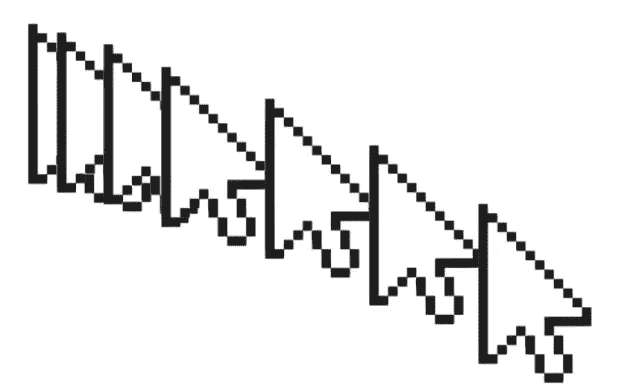

维基百科用户“Lordalpha1”的原始指针在谷歌幻灯片中被复制了 7 次

首先，如果你还没有下载 Python，你需要下载它。如果有，请跳到“安装 PyAutoGUI”一节

可以直接从官方[网站](https://www.python.org/downloads/)下载 Python。设置向导应该可以正确安装所有东西，但是为了确保你不会遇到打开 IDLE 或运行 pip install 命令这样的问题，我建议你打开 YouTube 教程，搜索“如何在 Mac OS 上安装 Python”或“如何在 Windows 7 上安装 Python”Python for Windows 的默认位置是“程序文件”目录。因此，如果您在那里看到 Python 文件，那么您可能安装正确。您也可以通过在命令提示符下输入“python”来直接检查，它应该会告诉您版本并启动一个 shell。然后，您可以通过键入“quit()”返回常规 cmd

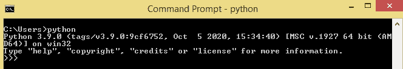

键入“python ”,如果您看到类似这样的内容，那么您已经正确安装了

至于错误信息，谷歌任何出现。通常堆栈溢出上的某个人已经覆盖了它。这个[站点](https://docs.python.org/3/using/windows.html)也很适合在 Windows 上进行故障诊断。对于本教程，我使用的是 Windows 操作系统，但是如果差异足够大并且很多人问我，我也可以制作 Mac 操作系统教程。

Python 安装的常见问题:

1.  未设置路径变量。这在旧版本中是个问题，但我相信最新的 Python 版本会在 Windows 中自动设置 PATH 变量。若要设置路径变量，请查看类似于此 [one](https://datatofish.com/add-python-to-windows-path/) 或此 [one](https://geek-university.com/python/add-python-to-the-windows-path/) 的教程。

## 安装 PyAutoGUI

好了，现在 Python 已经安装好了，我们需要安装 PyAutoGUI。去软件包网站并遵循他们对你的操作系统的指导。安装 Python 包通常通过输入“pip install[包名]”来完成它的作用是从本地(如你的计算机或网络)或互联网(通过 URL)安装文件。如果你好奇的话，pip 官方网站上的[这里有一个解释。](https://pip.pypa.io/en/stable/reference/pip_install/)

常见错误:

1.  Pip 不是可识别的命令。这意味着没有安装 pip，或者您运行终端窗口的目录不能访问文件中的 pip 位置。您可能需要在这里手动安装 pip。
2.  "名称错误:未定义名称“pip”. "你试图在 Python shell 或 IDLE 中输入这个，而不是在你的计算机终端上。确保您处于 cmd 模式，并且在 Windows 上以管理员身份运行。只需点击“开始”图标并输入“cmd”即可打开 cmd。当它弹出时，右键单击命令提示符并选择“以管理员身份运行”现在输入您的命令来检查 pip 的安装和版本

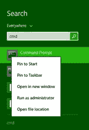

现在已经安装了 PyAutoGUI，创建一个新文件夹。记住这个文件夹的位置。将该文件夹称为“guiTutorials”

在新文件夹中，创建一个新的 txt 文件(默认情况下可能会在记事本中打开)。在这个新的 txt 文件中写入任何内容之前，将其保存为“auto searcher . py”——如果您在 guiTutorials 文件夹中按类型对文件进行排序，它现在应该显示为“Python 文件”。如果没有，它很可能被称为“autoSearcher.py.txt”

要解决这个问题，请转到文件浏览器中的“查看”选项卡，并确保选中“文件扩展名”框:

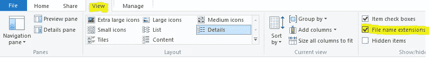

现在删除了"。txt ”,它应该显示为 Python 文件，如下所示:

注意，如果“类型”选项卡不可用，只需右键单击“名称”选项卡并从下拉菜单中选择“类型”。

现在右击文件名，选择“用空闲编辑”，然后选择“用空闲编辑[版本]”，其中[版本]与您安装的 Python 版本相匹配。应该会出现一个空的编辑窗口:

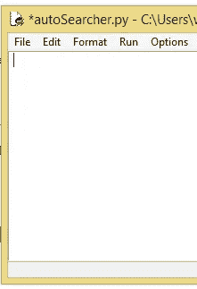

如果安装所有的软件需要一些时间，不要气馁。这很正常。

## 编写代码

从我们之前提到的高级概念开始:“控制你的鼠标，启动谷歌浏览器，打开一个新标签，输入随机搜索，然后保存截图”，我们可以很容易地将描述分成几个步骤:

1.  控制鼠标
2.  启动谷歌浏览器
3.  打开一个新标签
4.  键入随机搜索
5.  截图

现在让我们考虑一下每一步实际需要发生什么。也许我们会发现“隐藏的”我们没有想到的步骤或需求。也许我们会发现有些东西我们并不需要。

**控制鼠标/触摸板:**鼠标驱动程序是一块硬件代码。另一段代码可以通过 win32 API 访问它。我们可以自己调用 win32 或者使用 PyAutoGUI 的内置方法。在未来的教程中，我们将看到两者的例子。

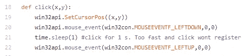

使用 win32api 控制鼠标和点击的辅助功能。我最初认为我们需要这个。我们现在没有使用它，但是将来的教程可能会用到！

**定义主体**:这个很简单。我们想做一个 try/except 块(像 Java 里的 try/catch 块)。我们的代码将运行“try”部分中的内容，除非 KeyBoardInterrupt 变为 true。此时，运行“except”块中的代码。如果用户按下“中断”键(默认情况下，这是 ctrl+c 或 delete 键)，我们将在那里放置一个简单的 print 和 sys.exit()来停止程序。

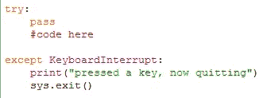

我们的主代码放在“try”块中

**制作话题清单:**制作话题清单是最简单的部分。只需定义一个名为“topicList”的新数组，然后放入我们想要的任何字符串。以下是我的一个例子:

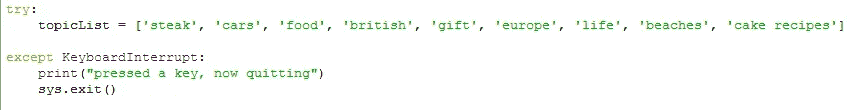

键入任意数量的字符串或短语

启动谷歌 Chrome: 现在这有点有趣了。我们不能在代码中的某个地方声明“启动谷歌浏览器”或“点击浏览器”我们需要定位 Chrome 在系统中的位置并命令它启动，或者模仿用户会采取的相同动作。让我们模仿用户的动作。既然我们有 PyAutoGUI，我们有两种方法可以做到这一点:扫描屏幕上的谷歌浏览器图标，或者:通过“开始”菜单或“Windows”键访问它。由于图标在每个桌面上可能看起来不同(或者甚至在给定时间不存在于屏幕上)，较少出错的方法是使用“Windows”键，因为任何 Windows 用户都可以使用该键。好了，这一步实际上是"*按下 Windows 键，键入短语“谷歌浏览器”，然后按下“回车”键。*”

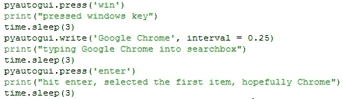

这三个子步骤之后是用于调试和确认到达第行的打印语句。我增加了延迟，让系统能够跟上。请注意 write()函数中 0.25 秒的延迟。有时电脑打字太快，会漏掉一些字符。此外，这给了一个看起来很酷的打字效果。

现在 Chrome 已经打开了，我们的下一个任务是打开一个新的标签页。也有可能我们导航到了一个已经打开的 Chrome 窗口，或者我们重新打开了一个保存的标签页会话。我们正在打开一个新标签，以确保我们不会“覆盖”和搜索已经打开的标签。在 Chrome 上，这是一个简单的“ctrl + T”快捷键。PyAutoGUI 非常酷，因为我们甚至可以用 hotkey()函数对这些快捷组合进行编程。然而，我们需要推迟。这是因为电脑按这两个键的速度太快了，以至于它不会记录为单独的按键。使用 0.5 秒的间隔。

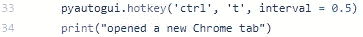

用快捷键慢慢打开一个新标签页

**输入查询:**由于 Chrome 已经默认谷歌搜索，剩下的就是输入随机搜索。我们可以使用 PyAutoGUI.write()从随机字符串数组中选择要输入的字符串，然后点击“enter”进行搜索。通过从 0 到数组的最后一个索引(数组-1 的长度)取一个随机整数来获得这个数组的随机条目。然后我们可以选择一个随机字符串传递给 write()函数:

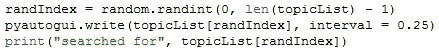

从列表中随机选择一个主题，然后使用 PyAutoGUI 进行搜索。

现在我们只需要点击回车，然后截图。因为我们正在进行实际的互联网搜索，所以我们想在截图之前延迟一段时间等待结果加载。我为此选择了 4 秒。我还给了 2 秒钟时间在 Chrome 搜索栏中输入查询。⁴

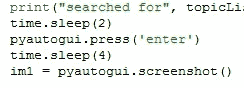

点击回车键，然后保存截图

我们将截图存储在一个名为“im1”的变量中然后我们可以使用“保存”功能。但是，我们希望创建唯一的文件字符串，而不是创建一堆 im1 (1)、im1 (2)、im1 (3)文件。在单台计算机上运行的每次搜索最有可能具有的一个特征是日期和时间。我们还想包括我们搜索的主题。我们可以通过用 datetime 库检索时间，并在“save”函数中连接(组合)字符串来完成这两项工作:

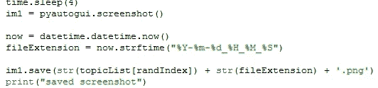

我们调用 datetime 函数，然后将当前时间保存在一个字符串中。我们将主题和时间结合起来，形成一个唯一的文件名。

我们把截图保存到 Python 代码文件所在的文件夹中，然后退出程序。现在我们完成了！要运行您的程序，请按“f5”或单击“运行”选项卡，然后单击“运行模块”选项。

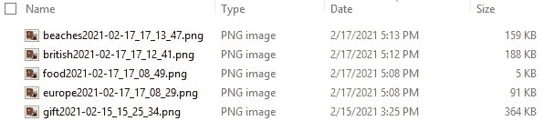

一些搜索结果图像会自动以唯一的名称保存

和任何代码一样，总有改进的空间。我甚至在这里和 Github 的评论中提出了一些方法。希望用 PyAutoGUI 把这个系列做的有趣一点。我可能还会强调一些其他的 Python 库来增加趣味。如果你想看另一个 Python 包或编程主题，请告诉我，我可能会考虑为它制作一个新的教程。

1.  如果你很好奇，触摸板的工作原理是因为任何接触它的导电材料都会在某些点改变它的电容(电容是一种类似质量的物理属性)。电容的这些变化被映射到移动命令。你也可以使用一系列的柔性电阻。但是对于另一个教程系列来说，制作触摸板已经足够复杂了。
2.  从技术上来说，我们可以。我们需要编写完成这些事情的代码，然后解析用户输入的字符串。这就是命令行的工作方式，如果有很多需求的话，我们可以在将来做一个用户输入/输出终端教程，就像那些文本冒险小游戏一样。
3.  这实际上也容易出错。如果 Google Chrome 浏览器没有出现在搜索结果的第一位，那么我们将不会打开正确的程序(例如，如果一个名为“Google Chrome”的文本文件碰巧被突出显示在第一位)
4.  随机延迟并不是最好的方法，但是现在很方便。一种更干净的方法是跟踪计算机上的事件或任务，只有当事件条件触发时才运行下一步。