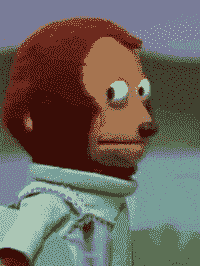
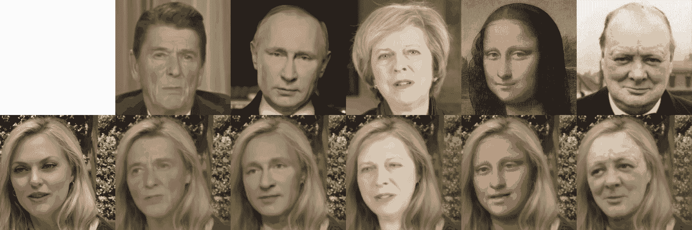
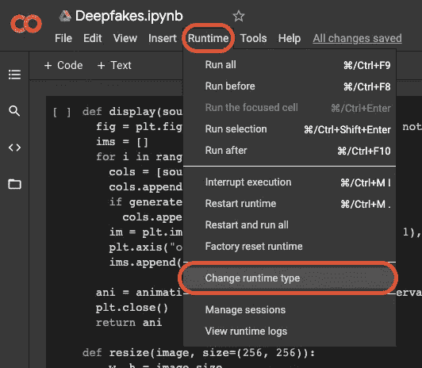
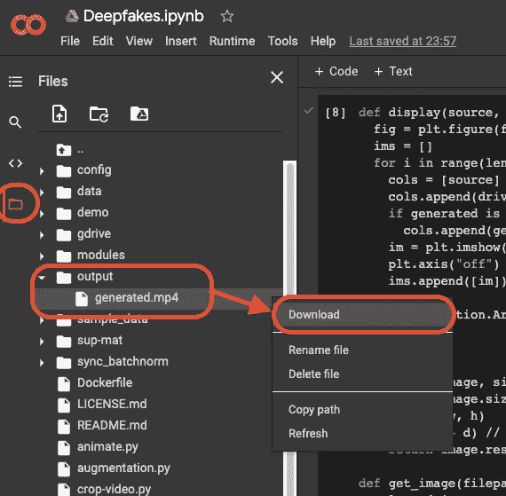

# 如何免费制作 Deepfakes！

> 原文：<https://medium.com/codex/how-to-make-deepfakes-for-free-e61a3329e77d?source=collection_archive---------1----------------------->

## 用 Google Colab 把你的漂亮脸蛋钉在你最喜欢的名人上。


图片来自 com break from pix abay[[链接](https://pixabay.com/photos/robot-woman-face-cry-sad-3010309/)

> *⛔*dis calimer*⛔:*deep fakes 极具争议性，不应该以传播错误信息为目的而制造出来。本教程仅用于教育目的。

# Deepfake 到底是什么？

如果你看到了这篇文章，我想你已经知道什么是 Deepfake 了。但是以防万一你没有:

*deep fake 是一种媒体形式，其中现有图像、视频或 GIF 中的人被扭曲成类似于某物或某人。这些通常是通过使用生成神经网络架构的机器学习方法创建的。~维基百科"*

# 深度假货很棘手

当人工智能(AI)在 20 世纪 50 年代首次成为一门学术学科时，研究人员可能认为我们可能正在迎来人类发展的新时代。近 70 年来，人工智能极大地改变了我们生活和体验周围世界的方式，但不一定是以我们想象的方式。

```
**FUNFACT:** When the term “deepfake” was first coined at the end of 2017, most of the deepfakes being circulated were of celebrity faces being (unfortunately) swapped onto pornstars. The non-pornographic deepfake content that was swirling on the internet was primarily made from Nicolas Cage’s face swapped into various movies.
```

那些研究人员中的任何一个都不会预言的最后一件事是，今天，一个 12 岁的孩子现在可以下载一个应用程序，然后点击一个按钮，把他们的脸贴在唐纳德·特朗普的身上。

今天，deepfakes 继续在争议中扎根，就像它们在娱乐媒体中变得令人难以置信地流行一样。看看这个由一个匿名用户制作的视频，他在大卫·莱特曼的*周六夜现场上制作了一个比尔·哈德尔变形为汤姆·克鲁斯和其他名人的深度假像。*

来自卫报的视频[ [链接](https://www.youtube.com/watch?v=2daN4eRTs4A)

**所有这些都是为了说明一件事:** Deepfakes 玩起来很有趣，但当恶意使用时，它们可能具有极大的破坏性。

> 已经警告过你了。

# 为什么不用 app？

如果你研究过制作 deepfakes，你可能首先遇到的是一大堆 deepfake 制作应用，比如 *Reface* 和 *DeepFaceWeb、*等等。如果这些符合您的需求，那就开始吧！也就是说，以下是我选择在没有第三方应用帮助的情况下制作 deepfakes 的一些原因:

1.  **成本。谢天谢地，很多 deepfake 手机应用/网络应用都是免费的。最有说服力的服务通常包括加入平台的订阅费。这些应用中的一些甚至可能会做一个普通的面部交换，看起来很难是真实的，(你想要真实的交易，不是吗？)**
2.  **安全。**当你使用这些第三方应用时，它们中的许多会泄露你的数据和图片。知道自己的内容被一个 ***专门做 deepfakes*** 的平台持有，我感觉不是最舒服的。



图片来自 GIPHY [ [链接](https://media.giphy.com/media/cJMlR1SsCSkUjVY3iK/giphy.gif)

最后， **那有什么好玩的？如果你处于中等水平，很有可能你喜欢学习新事物。为什么要使用第三方应用程序为你创建一个 deepfake，而你实际上可以自己做，并在这个过程中学习一些新的东西？**

> 还想自己做 deepfakes？继续读！

# 旧笔记本电脑？别担心

在正常情况下，创建自己的 deepfakes 需要使用一些强大的 GPU。为了使本教程尽可能容易理解，(*特别是对于像我这样使用了十年的笔记本电脑仍然奇迹般地工作的人来说？？？)*我们将使用 [Google Colab](https://colab.research.google.com/notebooks/intro.ipynb?utm_source=scs-index#scrollTo=2fhs6GZ4qFMx) 。

> Google Colab 是由(你猜对了)Google 提供的一个不可思议的平台，用于民主化对强大 GPU 的访问。它甚至允许你把你的 Google Drive 文件安装到编码环境中，让你可以方便地从你的云存储中访问任何你想使用的媒体。

**注意:*****Google Colab 上的 GPU 使用并不是无限制的！*** 对于免费用户来说，Google Colab 的内存和磁盘空间有限。然而，免费层足以让我们通过本教程。

说了这么多，让我们开始吧！

# 入门指南

> 注意:在这篇文章中，我将只讲述如何用预先训练好的模型创建你自己的 deepfakes。对于如何为 deepfakes 训练自己的模型，敬请关注！

**出于本教程的目的，将引用 Github 上的** [**本资源库**](https://github.com/AliaksandrSiarohin/first-order-model) **，将一张静态源照片制作成一段行车视频。**



由阿利亚克山大·西亚罗欣、[斯特凡·拉苏利埃](http://stelat.eu/)、[谢尔盖·图利亚科夫](http://stulyakov.com/)、[伊莉莎·里奇](http://elisaricci.eu/)和[尼库·塞贝](http://disi.unitn.it/~sebe/)、[链接](https://github.com/AliaksandrSiarohin/first-order-model/blob/master/sup-mat/face-swap.gif)开发

在 Google Colab 中创建新笔记本后，进入**运行时>更改运行时类型**并确保选择了 **GPU** 。这将把 deepfake 的所有计算都交给谷歌提供的 GPU。



确保运行时设置为 GPU

接下来，我们将运行下面的每个 Python 代码块，以启动并运行我们的笔记本。只需复制并粘贴下面的块，然后在 Google Colab 上运行它们！

## 1.克隆存储库并安装其他依赖项

```
!pip install ffmpy &> /dev/null
!git init -q .
!git remote add origin [https://github.com/AliaksandrSiarohin/first-order-model](https://github.com/AliaksandrSiarohin/first-order-model)
!git pull -q origin master
!git clone -q [https://github.com/graphemecluster/first-order-model-demo](https://github.com/graphemecluster/first-order-model-demo) demo
```

## 2.导入所需的库

```
import os
import imageio
import PIL.Image
import numpy as np
import matplotlib.pyplot as plt
import matplotlib.animation as animation
import skimage.transform.resize as ski_resize
from skimage import img_as_ubyte
from demo import load_checkpoints, make_animation
from ffmpy import FFmpeg
from IPython.display import HTML
from google.colab import drive
```

## 3.下载模型检查点

在我们进一步讨论之前，请从[这个链接](https://drive.google.com/drive/folders/1PyQJmkdCsAkOYwUyaj_l-l0as-iLDgeH)下载 tar 文件，并保存在您的 google drive 上。这些是我们的 AI 模型将用来实际创建我们的 deepfake 的检查点文件。这样，我们可以利用预先训练好的模型，而不是自己进行训练！对于本指南，我们将使用来自名为***vox-cpk.pth.tar****的 [*Vox Celeb* 数据集](https://www.robots.ox.ac.uk/~vgg/data/voxceleb/)的检查点。*

```
**ADDITIONAL:** The link provided has several other checkpoint files for models trained with different datasets and slightly different purposes. Give them a shot for some different results! 
```

## 4.挂载你的 Google Drive 文件并加载检查点。

要让你的笔记本可以访问 Google Drive 中的文件，运行下面一行代码:`drive.mount(‘/content/gdrive’)`。在执行时，你应该提供一个谷歌认证目的的链接。继续，并按照要求的说明进行操作。

之后，运行命令`ls`并检查是否有一个名为`gdrive/`的文件夹，如果你看到它，你的文件现在可以从你的笔记本中获得，你可以执行下面的块来加载检查点文件。

```
generator, kp_detector = load_checkpoints(
    config_path = 'config/vox-  256.yaml',
    checkpoint_path = "/content/gdrive/My Drive/{PATH TO FILE}/vox-cpk.pth.tar")
```

> 当执行上面的块时，确保指定检查点文件的确切位置！例如，如果文件存储在名为“deepfake-checkpoints”的文件夹中，您的 checkpoint_path 将如下所示:`*".../My Drive/deepfake-checkpoints/vox-cpk.pth.tar"*`

```
**ADDITIONAL:** Google has also added mounting as an in-built feature within Colab. Expand the folder directory on the left and you should see a button with the google drive logo. Click on it to mount your Google Drive files. 
```

## 主代码(Python-pun-intended)

```
def resize(image, size=(256, 256)):
    w, h = image.size
    d = min(w, h)
    r = ((w - d) // 2, (h - d) // 2, (w + d) // 2, (h + d) // 2)
    return image.resize(size, resample=PIL.Image.LANCZOS, box=r)def get_image(filepath):
  selected_image = resize(PIL.Image.open(filepath).convert("RGB"))
  source_image = ski_resize(np.asarray(selected_image), (256, 256))
  return source_imagedef get_video(filepath):
  selected_video = filepath
  reader = imageio.get_reader(
     selected_video, mode='I', format='FFMPEG')
  fps = reader.get_meta_data()['fps']
  frames = []
  for frame in reader:
    frames.append(frame)
  driving_video= [ski_resize(frame, (256, 256)) for frame in frames]
  return driving_video, fpsdef display(source, driving, generated=None):
  fig = plt.figure(figsize = (8+4*(generated is not None), 6))
  ims = []
  for i in range(len(driving)):
    cols = [source]
    cols.append(driving[i])
    if generated is not None:
      cols.append(generated[i])
    im = plt.imshow(np.concatenate(cols, axis = 1),animated = True)
    plt.axis("off")
    ims.append([im])
 ani = animation.ArtistAnimation(
   fig, ims, interval = 50,repeat_delay=1000)
 plt.close()
 return ani
```

以上是将处理生成我们的 deepfake 所需的所有工作的函数。对于那些渴望知道发生了什么的人，这里有一个简短的概述:

*   *Resize()&Get _ image()*→处理提供的源图像，并将其调整为 256 x256 的形状
*   *Get_video()* →检索提供的驾驶视频，并确保其大小也调整为 256 x256 的形状
*   *Display()* →在您的笔记本中创建源图像、驾驶视频和生成的 deepfake 的简单 HTML 显示

## 5.选择您的源图像和驾驶视频

**注意:**为了创建尽可能令人信服的 deepfake，我们提供的图像和视频的尺寸非常重要。**尽可能坚持使用 256 x 256 像素大小的媒体。**

为了创建一个特定大小的视频，我使用了带缩放功能的 [Screencast-o-Matic](https://screencast-o-matic.com/screen-recorder) 。这是一个直观的屏幕录制工具，允许您指定录制窗口的大小。

## 6.制作深度假货

```
if not os.path.isdir("output"): os.mkdir("output")source_image = get_image(
    "gdrive/My Drive/{PATH TO YOUR SOURCE IMAGE}")driving_video,fps = get_video(
    "gdrive/My Drive/{PATH TO YOUR DRIVING VIDEO}")predictions = make_animation(
  source_image, driving_video, generator, kp_detector,relative=True)imageio.mimsave('output/Deepfake.mp4',
  [img_as_ubyte(frame) for frame in predictions],fps = fps)HTML(display(source_image, driving_video, predictions).to_html5_video())
```

在上面的代码中分别提供 source_image 和 driving video 的路径(为了方便起见，我将它们存储在我的 Google Drive 中)并运行代码块。瞧吧！在你的 Colab 笔记本的输出文件夹里应该有一个名为*“deepfake . MP4”*的 deep fake。然后，您可以将 deepfake 下载到您的计算机上(如下所示)。



下载你生成的 deepfake

## 参考资料:

*   [https://github.com/AliaksandrSiarohin/first-order-model](https://github.com/AliaksandrSiarohin/first-order-model)
*   [https://en.wikipedia.org/wiki/Deepfake](https://en.wikipedia.org/wiki/Deepfake)
*   https://www . Forbes . com/sites/tommy beer/2020/09/20/trump-threats-to-issue-executive-order-preventing-Biden-be-elected-president/？sh=7cc379676f6e