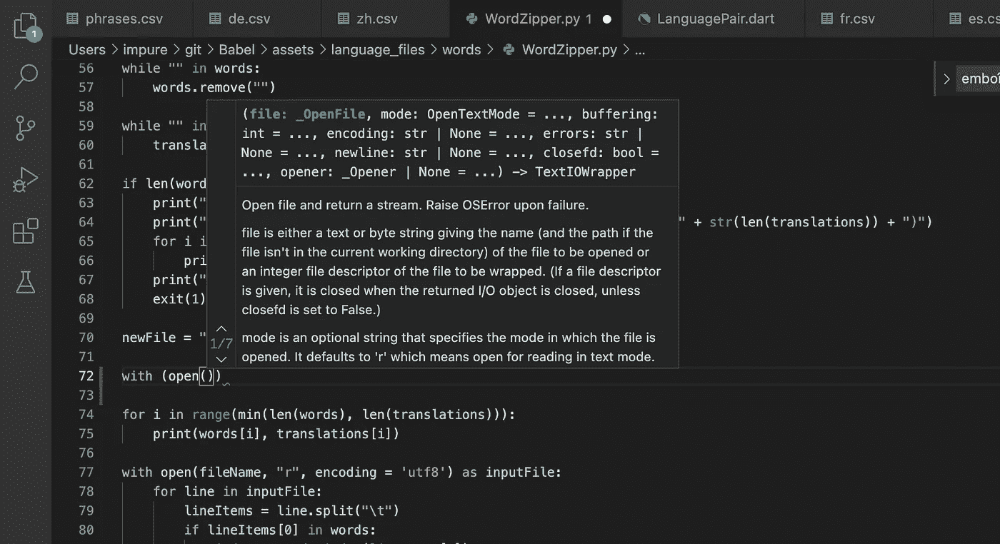

# 如何让 Visual Studio 代码不烂

> 原文：<https://medium.com/codex/how-to-make-visual-studio-code-not-suck-866d4585e3c7?source=collection_archive---------3----------------------->

## 语言服务器简介

所以我不久前写了这篇文章，主要是为了回应很多人向初学者推荐 Visual Studio 代码。