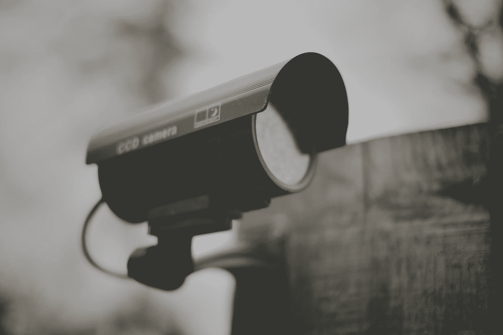

# 如何让 Windows 11 不那么令人毛骨悚然

> 原文：<https://medium.com/codex/how-to-make-windows-11-less-creepy-7238b717f490?source=collection_archive---------3----------------------->

## 说真的，微软。你令人毛骨悚然。

乔·加德在 [Unsplash](https://unsplash.com?utm_source=medium&utm_medium=referral) 上的照片

自从 2021 年 10 月 Windows 11 发布后不久，我就一直在使用它。它有一些不错的功能，总体来说，它比 Windows 10 有了很大的改进。但它肯定不会赢得隐私倡导者的任何赞扬。尽管它有许多视觉上的调整和用户界面的更新，但它本质上仍然是一个隐私噩梦。