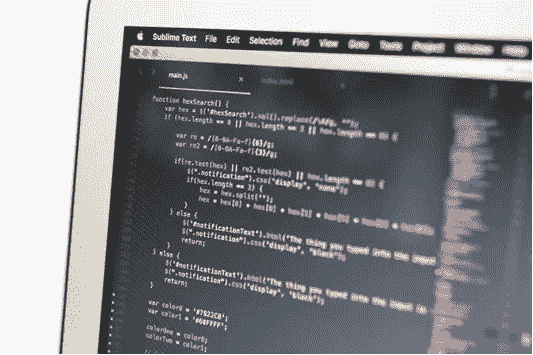

# 如何让你的代码易于扩展

> 原文：<https://medium.com/codex/how-to-make-your-code-easy-to-extend-637ee5bb84db?source=collection_archive---------19----------------------->

让-保罗·萨特(Jean-Paul Sartre)在他的名著《ANSI C 编程》(Programming in ANSI C)中认为，每一行代码都是在没有理由的情况下编写的，维护是出于弱点，删除是出于偶然。这听起来像是对软件开发现状的悲观展望，但萨特的观点是程序员必须接受过程固有的随机性，并学会与之共存。

# **1。如何做某事** …