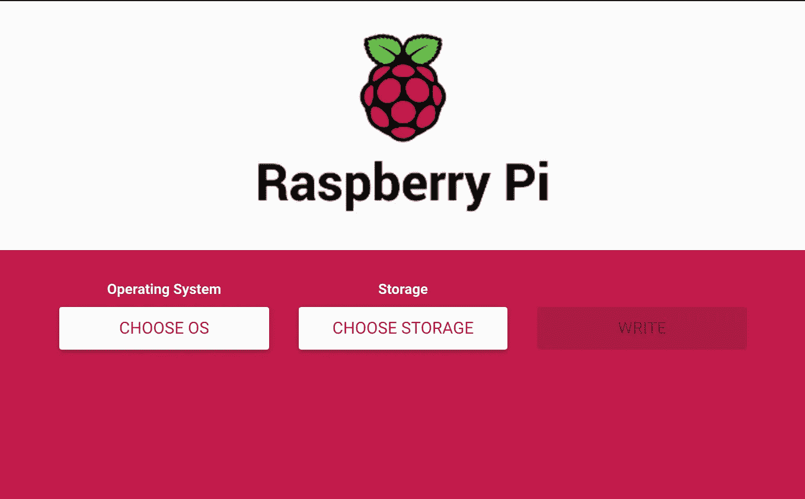
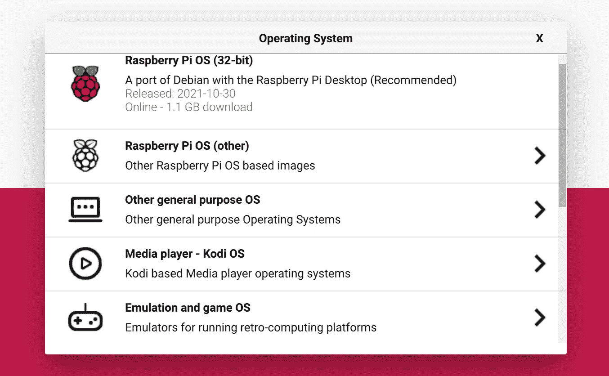
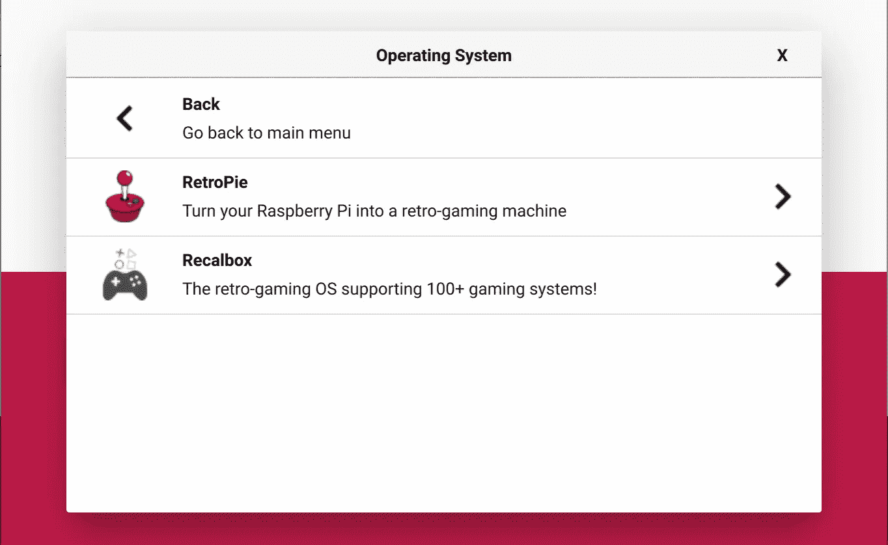
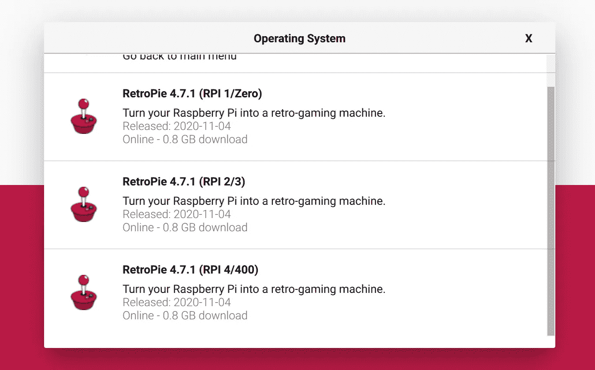
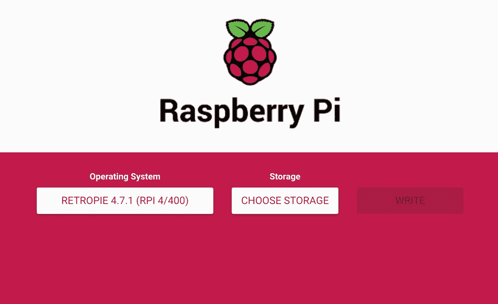
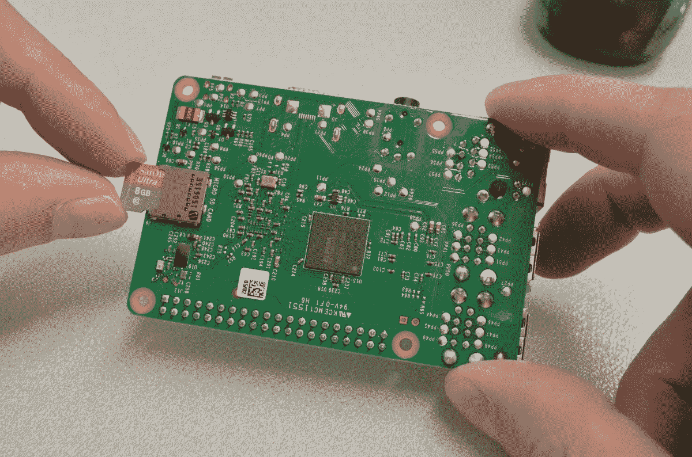
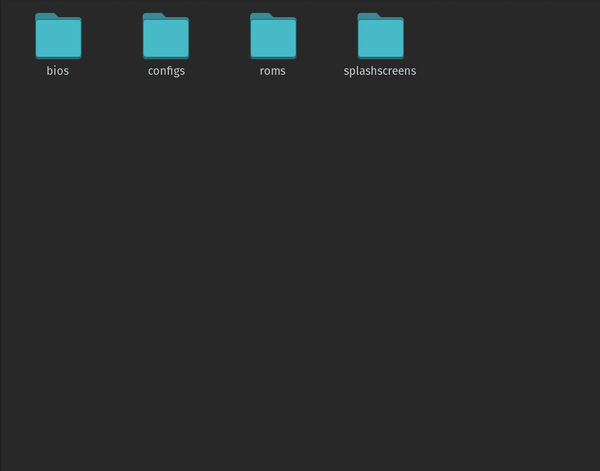

# 如何用树莓派制作自己的复古游戏机

> 原文：<https://medium.com/codex/how-to-make-your-own-retro-console-with-a-raspberry-pi-dad43c016bcf?source=collection_archive---------5----------------------->

照片由[西格蒙德](https://unsplash.com/@sigmund?utm_source=medium&utm_medium=referral)在 [Unsplash](https://unsplash.com?utm_source=medium&utm_medium=referral) 上拍摄

# 这个项目需要的东西

对于这个项目，您需要:

1.  Raspberry Pi 4GB 内存
2.  树莓 Pi 4 官方电源
3.  HDMI 显示器(电视也可以)
4.  微型 HDMI 转 HDMI 电缆
5.  一个或多个控制器
6.  sd 卡(16GB 或更大)

# 步骤 1:刷新 SD 卡

要 Flash，先把 OS 转到 SD 卡[从 raspberry pi 网站下载](https://www.raspberrypi.com/software/) rpi-imager 并打开程序。

然后按选择操作系统

向下滚动并按仿真和游戏操作系统按它

现在选择复古派

然后为本教程选择合适的图像，即 RPI 4/400 图像

按下选择存储，选择您的 SD 卡后，你按下写。

# 步骤 2:安装和配置复古派

将 SD 卡插入 SD 卡插槽，插入 raspberry pi 并连接显示器

如果你做了所有的事情，你应该在 5 秒钟后看到这个(在彩色图像和所有文本之后)

# 连接有线控制器

然后应该有一个文本提示说欢迎，并按下控制器上的 A 按钮进行配置。然后你必须配置每个按钮，如果你想跳过一个按钮，双击任何按钮。

# 连接蓝牙控制器

如果你有蓝牙控制器，那就有点复杂了。首先，你必须连接一个键盘，导航到复古派标志，然后按下回车键。下到蓝牙部分，连接你的控制器，然后你会被提示配置它，如果你想跳过一个选择，因为你的控制器没有那个按钮，然后双击任何按钮。

# 第三步:添加游戏

如果你不知道 raspberry.local 可以在某些网络上工作，在你的文件管理器中输入\\然后输入 raspberry pi 的 IP。

打开 ROMs 文件夹，并在其中打开用您想要模拟的控制台命名的文件夹。现在你必须从网上下载 rom 或者从你自己的游戏中提取。我不能在这篇文章中推荐任何 ROM 网站，因为它们违反了版权法，但你可以在互联网上搜索并很容易找到它们。如果你想要一台游戏机的多个 rom，你可以从软件部分的[https://archive.org](https://archive.org)下载。

当你有了你的 rom，你可以把它们拖到控制台文件夹中，然后重启你的 retropie，然后你就可以玩你新添加的游戏了

# 最终注释

我希望你玩复古游戏玩得开心，并喜欢这篇文章。如果你留下了掌声，如果你没有让我知道为什么。