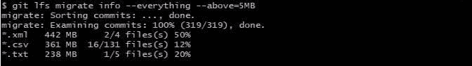

# 如何将 SVN 迁移到 Git

> 原文：<https://medium.com/codex/how-to-migrate-svn-to-git-b625a21575b2?source=collection_archive---------5----------------------->


马库斯·温克勒在 [Unsplash](https://unsplash.com?utm_source=medium&utm_medium=referral) 上的照片

我最近在做一个迁移项目，包括将我们的代码库从 SVN 迁移到 GitHub。经过几次尝试和错误，花了大量时间在网上搜索最佳实践，我终于成功开发了一个系统，在这个过程中不会引起任何问题，我想与你分享它会很好。

我将这个迁移过程分为 4 个简单的步骤:

1.  准备您的环境
2.  将您的 SVN 存储库转换为本地 git 存储库
3.  将任何大文件转换为 lfs 对象(如果需要)
4.  将新的 git 存储库推送到 GitHub

# 准备您的环境

在您的本地机器上创建一个 GitMigration 文件夹，它将存放您的新 git repo: `mkdir -p ~/GitMigration`

在另一个命令行更新 SVN 回购，以确保您有最新的修订。明智的做法是通知您的团队，您正在开始迁移，在迁移过程完成之前，不允许将更多的提交推送到 SVN。

完成后，您需要创建一个 authors.txt 文件。这将把 SVN 用户名映射到所需的 Git 用户名，格式如下:

```
jdoe = John Doe <john.doe@gmail.com>
esmith = Emma Smith <emma.smith@gmail.com>
```

如果您不想手动查找 SVN 中的所有作者，您可以使用以下命令从 SVN 存储库中提取数据，只要确保最终格式遵循与上面相同的结构即可:

```
svn log -q | awk -F '|' '/^r/ {gsub(/ /, "", $2); sub(" $", "", $2); print $2" = "$2" <"$2">"}' | sort -u > authors.txt
```

# 将您的 SVN 存储库转换为本地 git 存储库

如果您只想迁移某个时间段的提交，您需要在 SVN repo 中找到修订号。为此，请在 svn repo 文件夹中执行以下命令:

```
svn log -r {YYYY-DD-MM}:HEAD --limit 1
```

在 GitMigration 文件夹中，执行以下命令:

```
git svn clone <svn-repo>/<project> <git-repo-name> --authors-file=authors.txt -r <revision-number>:HEAD
```

其中是您想要迁移的 svn 存储库的 URI， **< project>** 是您想要导入的项目的名称，**<revisions-number>**是您想要迁移的版本号(如果需要的话)。 **<git-repo-name></git-repo-name>**是新 git 存储库的目录名。这个过程可能需要一段时间，具体取决于 SVN 提交的大小。

现在是清理的时候了，将标签和任何远程 refs 转移到本地分支。要将标记移动到正确的 Git 标记，请在 git repo 目录中执行以下操作:

```
for t in $(git for-each-ref --format='%(refname:short)' refs/remotes/tags); do git tag ${t/tags\//} $t && git branch -D -r $t; done
```

接下来，移动 refs/remote 下的任何引用，并将它们转到本地分支

```
for b in $(git for-each-ref --format='%(refname:short)' refs/remotes); do git branch $b refs/remotes/$b && git branch -D -r $b; done;for p in $(git for-each-ref --format='%(refname:short)' | grep @); do git branch -D $p; done;
```

# 将任何大文件转换为 LFS 对象

GitHub 有一个 100MB 的文件限制，超过这个大小的文件将被拒绝放入 GitHub。这就是 [Git 大文件存储(LFS)](https://git-lfs.github.com/) 的用武之地。Git LFS 在 Git 内部用文本指针替换任何大文件，同时将文件内容存储在远程服务器上。使用 LFS 有许多好处，例如

*   大型文件版本控制
*   更多存储空间
*   更快的克隆和获取
*   相同的 Git 工作流程
*   相同的访问控制和权限

要找出超过 100MB 限制的文件数量，请运行以下命令:

```
git lfs migrate info --everything --above=99MB
```

这将打印出您的回购中高于 99MB 标记的不同文件类型的信息(如下所示)。



要将文件转换为 LFS 文件对象，请运行以下命令:

```
git lfs migrate import --everything --above=99MB
```

这将重写包含任何大于 99MB 的文件的 git repo 的历史，并将它们转换为 LSF 对象。

# 将新的 git 存储库推送到 GitHub

最后一步是添加远程 git 服务器并推送更改。

```
git remote add origin git@my-git-server:myrepository.gitgit push origin --all;git push origin --tags;
```

就是这样！恭喜，您已经将您的 SVN repo 迁移到 Git 中了。下一步是通知您的团队迁移已经完成，并为他们提供对新的远程 git 服务器的访问。