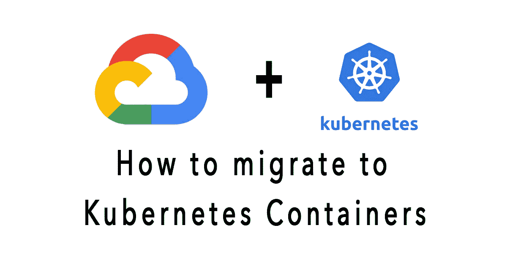

# 如何将您的应用迁移到 GCP 的 Kubernetes 容器

> 原文：<https://medium.com/codex/how-to-migrate-your-app-to-kubernetes-containers-in-gcp-e5df69f5f665?source=collection_archive---------0----------------------->

## [法典](http://medium.com/codex)

容器正迅速成为软件应用程序部署的行业标准。容器化工作负载的业务和技术优势促使许多团队将他们的应用程序转移到容器中。

使用容器部署应用程序有很多优点。其中包括: