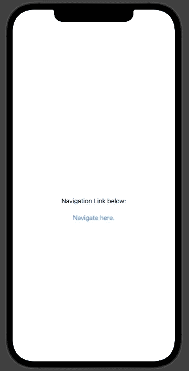
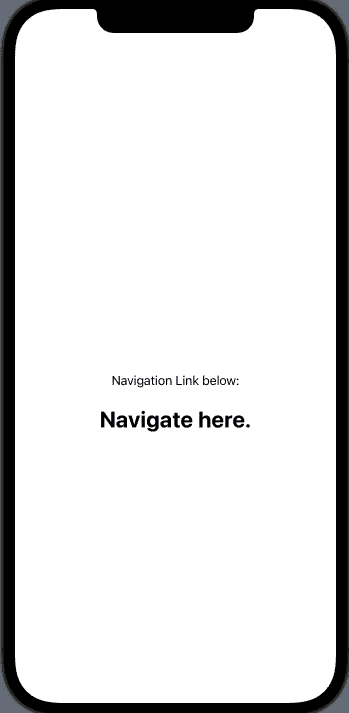
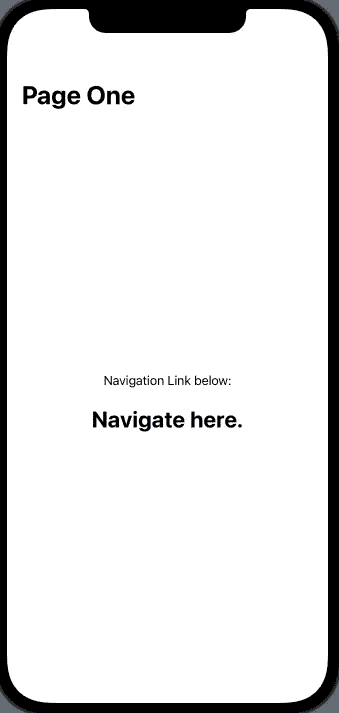
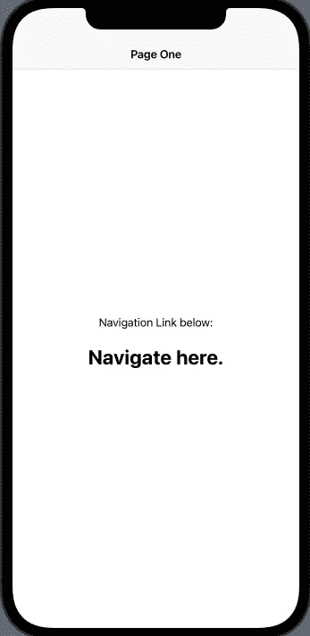

# 如何在 Swift UI 中的视图间导航？

> 原文：<https://medium.com/codex/how-to-navigate-between-views-in-swift-ui-46cf62ef6df5?source=collection_archive---------3----------------------->


照片由[杰米街](https://unsplash.com/@jamie452?utm_source=medium&utm_medium=referral)在 [Unsplash](https://unsplash.com?utm_source=medium&utm_medium=referral)

今天，我们将介绍使用 Swift UI 开发应用程序的一个重要流程，即如何在视图之间导航。当使用 UIKit 开发应用程序时，开发人员通常利用 segues 在视图之间导航。在 Swift UI 中，我们使用一种不同的导航方法，称为导航链接。

**导航链接入门:**

要使用导航链接，您需要做的第一件事是将视图包装在导航视图中。您可以通过使用以下示例中的语法来实现这一点:

```
struct SomeView: View {
   var body: some View {
      NavigationView {
         Text("Hello.")
      }
   }
}
```

值得注意的是，您只需要在一个视图上声明一个导航视图，在这个操作完成之后，与其相关联的其余视图也将是导航视图类型。如果你最终在多个视图上声明了一个导航视图，你将会得到疯狂的嵌套导航链接，看起来不太好，并且使你的应用导航变得困难。

创建导航视图后，您就可以开始使用导航链接在视图之间导航了。您可以非常轻松地创建导航链接，如下例所示:

```
struct SomeView: View {
   var body: some View {
      NavigationView {
         VStack {
            Text("Navigation Link below:")
            NavigationLink(destination: SecondView()) {
               Text("Navigate here.")
            }
         }
      }
   }
}struct SecondView: View {
   var body: some View {
      Text("Now on the second view.")
   }
}
```



导航链接示例

从上面的例子可以看出，导航链接将充当标准链接。单击后，应用程序将导航到并显示设置为目标的视图。

导航链接中包含的一个很酷的东西是 Swift UI 自动在二级视图上添加了一个后退按钮，并知道在被选中时导航回上一个视图。导航链接通过 Swift UI 使连接视图变得轻而易举！

**定制导航视图和链接:**

如果你不希望你的导航链接是默认的蓝色呢？无需担心，因为您可以像在 Swift UI 中定制文本对象一样轻松定制您的导航链接！看看下面的例子，看看定制导航链接有多简单:

```
struct SomeView: View {
   var body: some View {
      NavigationView {
         VStack {
            Text("Navigation Link Below:")
            NavigationLink(destination: SecondView()) {
               Text("Navigate Here")
                  .foregroundColor(.black)
                  .font(.system(size:30))
                  .fontWeight(.bold)
            }
         }
      }
   }
}
```



风格化导航链接

与样式化导航链接类似，您也可以样式化导航视图本身。样式化导航视图的一个常见用法是添加 navigationBarTitle。你可以在下面看到一个例子:

```
struct SomeView: View {
   var body: some View {
      NavigationView {
         VStack {
         Text("Navigation Link Below:")
         NavigationLink(destination: SecondView()) {
            Text("Navigate Here")
               .foregroundColor(.black)
               .font(.system(size:30))
               .fontWeight(.bold)
            }
         }.navigationBarTitle("Page One")
      }
   }
}
```



导航栏标题

您还可以将导航栏标题设置为不同的显示模式，以便进一步定制！为此，你可以参考下面的例子:

```
struct SomeView: View {
   var body: some View {
      NavigationView {
         VStack {
         Text("Navigation Link Below:")
         NavigationLink(destination: SecondView()) {
            Text("Navigate Here")
               .foregroundColor(.black)
               .font(.system(size:30))
               .fontWeight(.bold)
            }
         }.navigationBarTitle("Page One", displayMode: .inline)
      }
   }
}
```



嵌入式导航栏标题

**结论:**

正如你从这篇文章中看到的，导航链接和视图在你的应用中非常容易使用。您还可以定制导航视图和导航链接的外观，以适应应用程序的主题。希望本文已经让您对如何在 Swift UI 应用程序中的不同视图之间成功导航有了很好的基本了解！如果您喜欢我的文章，请务必关注我的页面，以便将来讨论 Swift UI。