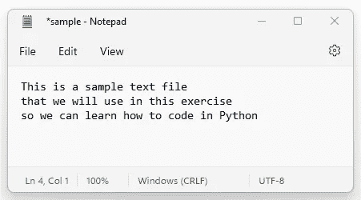
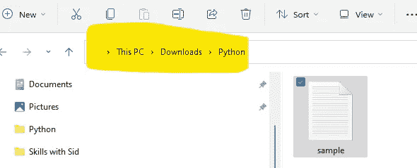
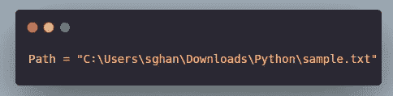
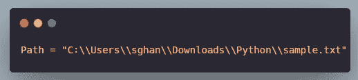
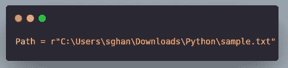
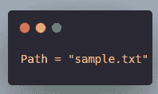
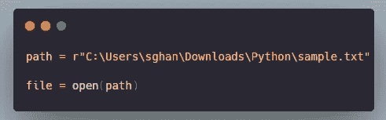
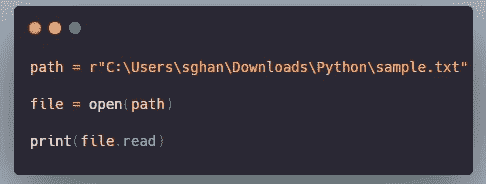
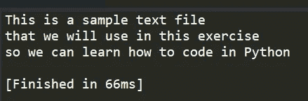

# 如何在 Python 中打开/读取文件

> 原文：<https://medium.com/codex/how-to-open-view-files-in-python-e77e3e9d3f1d?source=collection_archive---------5----------------------->

当我第一次开始用 Python 练习编码时，我总是在第一关失败，我甚至不能打开一个文件！我现在知道的我希望我那时就知道，所以这里有一些关于在 Python 中打开文本文件的提示和指针(这是一种更容易打开的文件，我们稍后将使用 Pandas 来查看 Excel 和 CSV 文件)。

# 1.首先让我们创建一个. Text 文件

将以下文本复制并粘贴到记事本中，并将文件名保存为“ **Sample** ”，确保将其保存为文本文档(*。txt)

*这是一个样本文本文件
，我们将在这个练习
中使用，这样我们就可以学习如何用 Python 编码*

它应该是这样的

我们的文本文件应该是这样的

现在把这个放好。文本文件到你的下载文件夹的一个名为“Python”的子文件夹中，我们将打开这个文本文件，并学习如何使用 Python 写它

# 2.现在指定一个路径

在您使用的几乎每一个 Python 脚本中，您都需要告诉 Python 您的文件/数据/源的路径。

为此，只需将文件路径复制并粘贴到 Windows 文件夹中:

采用此文件路径

现在，在您的编码编辑器(IDE)中创建一个名为 *Path* 的变量，并作为值粘贴到您的文件路径中，最后以文本“\sample.txt”结束，如下所示:

确保你使用语音标记

我们还没有完成。不幸的是，在 Python 中单个反斜杠意味着转义字符，所以如果我们用上面的文件路径运行一些代码，它会给我们一个错误。我们有两个选择来纠正这个问题:

**使用双反斜杠**

我们可以把反斜杠加倍，这样 Python 就清楚它是什么了

**在文件路径**前添加一个“r”

通过使用“r ”,我们告诉 Python 将它作为原始字符串读入

选择权在你，但是对于本教程，我们将使用“r”方法，因为它比键入多个反斜杠简单。

重要！大多数 Python 教程会告诉你用简短的代码编写路径，前提是你把工作目录设置到同一个文件夹。但是我认为实际上写出完整的工作路径是一个很好的实践，这样你就可以在将来自信地处理错误。这就是我刚开始时的感受。

如果你不知道你的工作目录在哪里，短代码路径会引起麻烦，所以我建议你避免使用它们。

将我们的文件路径设置为名为“path”的变量后，我们就可以继续前进了

# 3.使用打开功能

我们现在想使用*打开*功能来打开我们的文本文件。为此，我们需要分配一个新变量，我们将调用*文件*并编写以下代码:

在上面的代码中，我们现在将文件路径赋给了一个名为 path 的变量，我们还指示 Python 通过调用 *Open* 函数打开我们的文件，并将它赋给另一个名为 *File* 的变量

# 4.使用打印功能查看文件内容

现在，为了确认我们已经正确映射到我们的文件并显示其内容，我们只需要添加一个 *Print* 函数和 *Read* 函数来读取我们的文件:

打印将允许我们显示我们的结果

我们代码的输出应该类似于以下内容:

您的打印声明应该如下所示

就是这样！在我们的下一篇文章中，我们将探讨如何使用 Python 代码将额外的文本行修改为文本文件并删除文件

请订阅更多 Python 操作指南！

下面是一些以前的文章:

 [## 初级 Python 学习者的最佳 ide

### 像许多第一次开始编写 Python 代码的人一样，我不知道从哪里开始，我来自商业背景，有…

medium.com](/@sghani77/the-best-ides-for-beginner-python-coders-9f844ca3c054)