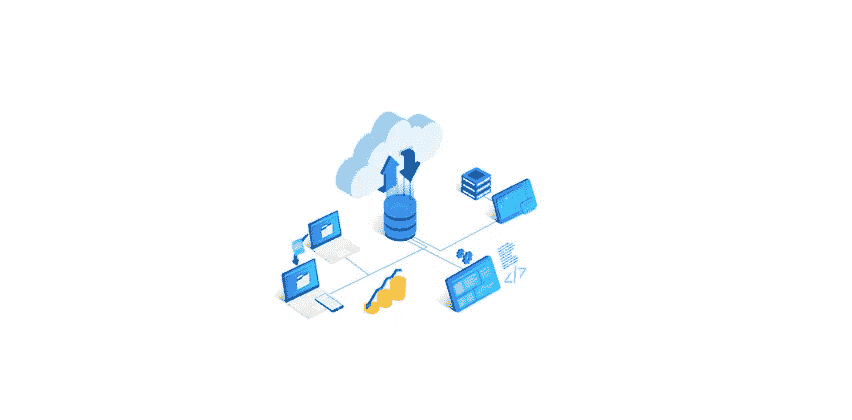
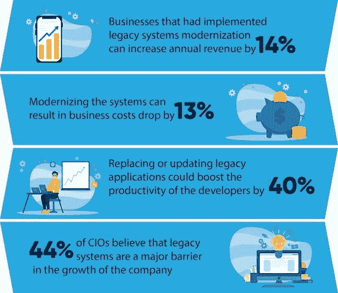
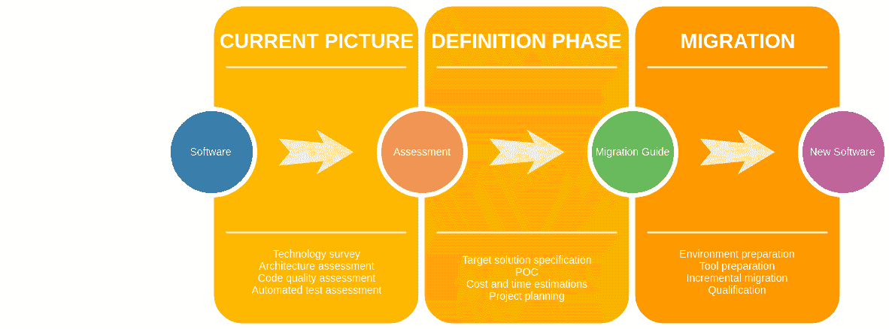
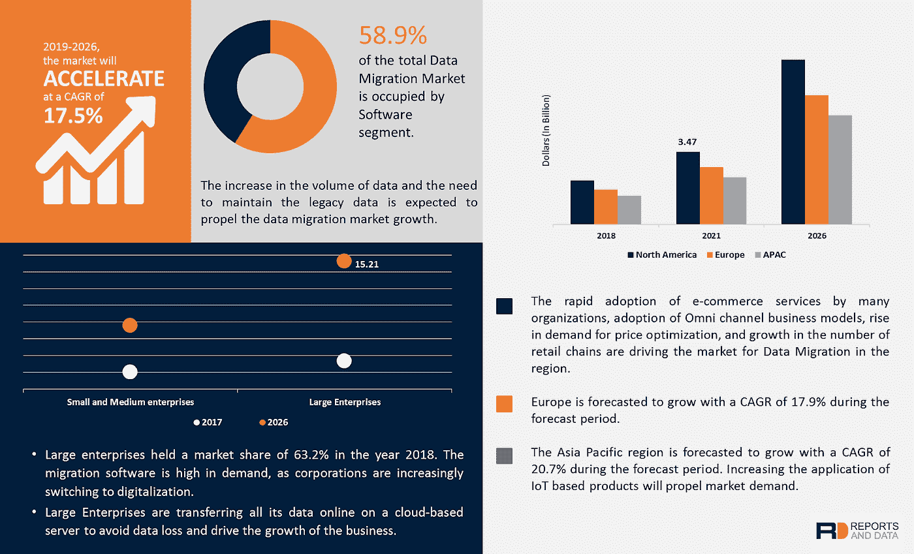

# 如何克服软件迁移中的五大挑战

> 原文：<https://medium.com/codex/how-to-overcome-the-top-5-challenges-in-software-migration-bc3d2904b863?source=collection_archive---------28----------------------->

软件迁移确保公司在当前系统上工作。通常，传统技术不足以跟上市场的步伐。软件迁移计划包括迁移到不同的环境以更好地管理操作。这可能包括从内部系统迁移到云、从服务器迁移到服务器，甚至从云迁移到云。

替换或更新遗留系统可以将[开发人员的工作效率提高 40%](https://www.datasciencecentral.com/profiles/blogs/the-true-value-of-legacy-systems-modernization-for-businesses) 。旧的学校应用程序面临滞后和瓶颈，导致整个组织遭受损失。无论是 ERP 软件还是[以消费者为中心的应用](https://www.botreetechnologies.com/web-application-development)，向最新技术的迁移对繁荣至关重要。

**来源:**数据科学中心

遗留系统迁移有几个优点。首先，它提供了竞争优势。许多公司仍然喜欢使用导致严重损失的现有应用程序，而现代化有助于最小化这些损失。

其次，现代技术进步提高了效率，因为它们更快。公司可以通过最新的系统实现无缝输出。

第三，利用更新的技术和软件有助于更好地理解数据——这是传统[应用](https://www.botreetechnologies.com/mobile-app-development)所不具备的功能。

这些好处随着软件迁移策略的成功实施而逐渐显现。迁移过程看起来有点像这样

**来源:** DZone

> ***阅读更多:***[***2021 年 15 大定制软件开发公司***](https://botreetechnologies.medium.com/top-15-custom-software-development-companies-2021-14a3909083b5)

# 软件迁移的类型

软件迁移的好处也因迁移的类型而异。软件迁移的一些基本类型包括-

**ERP 迁移**

*   经过多年的使用，现有 ERP 系统的许多功能变得相关。它会对 ERP 解决方案的性能产生负面影响。除此之外，软件标准的全球合规性也要求 ERP 迁移。

**数据库迁移**

*   它包括更改数据的物理位置、迁移到另一个数据库软件或更改数据格式。[数据迁移](https://www.botreetechnologies.com/blog/understanding-data-migration-strategy-and-best-practices/)对于服务器维护或数据整合也很重要。

**基础设施迁移**

*   [IT 系统](https://www.botreetechnologies.com/blog/what-does-it-consulting-company-actually-do/)迁移包括迁移您的整个基础设施。可能是当你外包业务的时候。它包括迁移到不同的软件用于日常使用，仍然获得效率和无缝工作。

**云迁移**

*   它包括从您的内部数据中心迁移到基于云的数据中心。云迁移使公司能够实现实时结果和产出。它还包括从一个云提供商迁移到另一个云提供商。

**操作系统迁移**

*   更新整个系统并提高所有应用程序的性能是操作系统迁移的主要目的。公司可能会从 Windows 转移到 Mac OS 以获得更好的性能。

**CMS 迁移**

*   另一种类型的软件迁移是从您现有的 CMS 升级或迁移到另一个 CMS。这可能是由于您的内容的结构或功能可能无法以最佳方式提供您的内容。

**版本升级**

*   Ruby on Rails 升级服务是软件从一个版本迁移到另一个版本的典型例子。它帮助公司利用最新的更新，并相应地更新他们的后端技术。

**来源:**报告和数据

> ***结帐:*** [***为什么在医疗保健应用中使用 Python***](https://www.botreetechnologies.com/blog/python-in-healthcare-application/)

# 软件迁移的五大挑战

软件迁移伴随着一系列挑战。从遗留系统迁移到新技术并不是一件美妙的事情。既然人都习惯了，变化总是有的。除此之外，价格、承诺和可能的利益也是一个挑战。让我们看看 5 大挑战以及如何克服它们。

**没有迁移路线图**

*   组织经常面临的最大挑战是缺乏软件迁移路线图。过程总是零零碎碎的。当团队有时间迁移软件时，他们会专注于迁移。然而，这样的策略是灾难性的。
*   自发迁移根本不可行。公司需要一个概括整个迁移过程的具体路线图。它包括何时执行不同步骤的时间框架、对标准的遵从性以及对最终迁移结果的审查。

**员工抵制**

*   软件迁移中最大的挑战之一是来自员工的抵制。团队和[开发人员](https://www.botreetechnologies.com/blog/guide-to-hiring-ruby-on-rails-developers/)通常不喜欢新系统的更新——主要是因为他们有使用遗留系统的良好经验。如果存在高度分歧，迁移过程可能会被延迟。这也是人们在孤岛中工作的原因，因为有些人支持迁移，有些人反对迁移。
*   最好的方法是逐渐进行迁移。员工培训是整个软件迁移策略的重要组成部分。最高管理层需要展示最新的[发展](https://botreetechnologies.medium.com/top-python-development-companies-b6d56a0c5757)如何帮助整个团队。

**迁移时间**

*   不用说，在迁移过程中会有很多停机时间。正在进行软件迁移的组织通常会延迟该过程，因为一些或其他活动正在进行中，无法面对停机时间。除此之外，高级利益相关者必须花时间监督流程，以确保迁移顺利快速地完成。
*   这里的解决方案是为迁移分配特定的时间段。软件迁移清单可以帮助公司理解迁移中涉及的不同任务。之后，他们可以在多个时间间隔内完成这些活动。

**迁移成本**

*   统计数据表明，迁移成本远低于维护现有遗留系统的成本。但是许多公司经常认为他们需要花很多钱来购买新的软件、培训人员以及管理整个迁移过程。这涉及到时间、金钱和努力的成本，公司过分强调了这一点。
*   组织需要放弃软件迁移的一次性投资，并了解维护遗留系统的缺点。旧软件会带来长期成本。因此，软件迁移模式对于公司获取经济利益是至关重要的。

**系统共存**

*   公平地说，迁移过程不是即时的。 [IT](https://www.botreetechnologies.com/blog/it-consulting-solutions-for-midsize-enterprises/) 是渐进的，需要很多时间，这意味着新旧系统将并存。因此，数据会重叠，在团队成员中造成混乱。大量的功能差异也会存在，这会导致很多问题。存在数据重复和冗余的可能性。
*   团队应该意识到他们对这两个系统的操作。随着旧软件的逐渐淘汰，他们必须适应现代软件。制定明确的行动计划，强调避免数据冗余和重复的步骤。

> ***点击此处:***[***2021 年 10 家最佳定制软件开发公司***](https://www.botreetechnologies.com/blog/top-custom-software-development-companies/)

# 结论

软件迁移不是一件容易的事情。在这个过程中有很多挑战。但是拥有正确的软件迁移策略可以帮助组织无缝升级他们的系统。

BoTree Technologies 是一家领先的[软件开发公司](https://www.botreetechnologies.com/)，提供完整的软件迁移和升级服务，帮助组织从遗留系统中迁移出来，并获得现代化的优势。

[今天免费咨询](https://www.botreetechnologies.com/contact)！

*原载于 2021 年 7 月 29 日 https://www.botreetechnologies.com**T21*[。](https://www.botreetechnologies.com/blog/how-to-overcome-the-top-5-challenges-in-software-migration/)