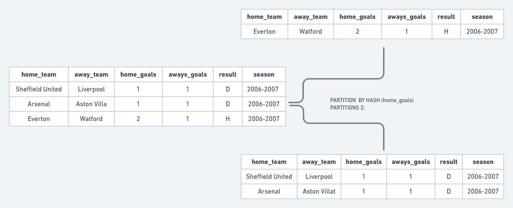

# 如何划分 MySQL 表

> 原文：<https://medium.com/codex/how-to-partition-mysql-tables-fc2c2fcb6108?source=collection_archive---------8----------------------->


# 水平和垂直分区

有两种类型的数据库分区—垂直的和水平的。

## 垂直分割

垂直分区依赖于最初创建较少列的表，然后使用额外的表来存储剩余的列。因为行是根据它们的列来拆分的，所以垂直分区也称为行拆分(与水平分区相反)。到目前为止，MySQL 的数据库不支持垂直分区，T2 不支持。

## 水平分割

分区逻辑将行分成多个表。在整个分区中，列数保持不变，而行数可以变化。我的 SQL 目前支持水平分区。在这篇文章中，我们将看看 MySQL 中三种不同的水平分区。

# 范围划分

实现范围分区时，如果列值在特定分区的指定范围内，则该行将被添加到该分区。

## 实现范围分区

1.  创建样本表:

```
CREATE TABLE arctype.range_crypto(
  timestamp INT,
  open DOUBLE,
  close INT,
  high DOUBLE,
  low DOUBLE,
  volume DOUBLE,
  );
```

2.*(可选)*用样本数据填充表格。在这种情况下，[下载这个数据集](https://gist.github.com/Bamimore-Tomi/54b34a36a2a4f4e895cdd1081f4f4798#file-forex-csv)。然后，将 CSV 数据导入表中。

3。使用`ALTER TABLE`表达式创建范围分区:

```
ALTER TABLE arctype.range_crypto
  PARTITION BY RANGE (close) (
      partition p0 VALUES LESS THAN (10000),
      partition p1 VALUES LESS THAN (20000),
      partition p2 VALUES LESS THAN (30000),
      partition p3 VALUES LESS THAN (40000),
      partition p4 VALUES LESS THAN (50000),
      partition p5 VALUES LESS THAN (60000),
      partition p6 VALUES LESS THAN  MAXVALUE
  )
```

4.现在，您可以从您创建的任何分区中查询数据:

```
SELECT * 
  FROM arctype.range_crypto PARTITION (p3) 
  WHERE close BETWEEN 35000 and 38000;
```

相反，如果您运行以下查询:

```
SELECT * 
  FROM arctype.range_crypto PARTITION (p0) 
  WHERE close BETWEEN 35000 and 38000;
```

那么结果将是空的。指定分区显示 MySQL 在哪里查找，使您的查询运行得更快(如果您有数百万行)。

范围分区的另一个变体是`RANGE COLUMNS.`,它允许您指定多个分区列。让我们创建一个区间分区，在一段时间内保持一个区间的收盘价。

```
ALTER TABLE arctype.range_crypto 
  PARTITION BY RANGE COLUMNS (timestamp, close) (
    PARTITION from_2018_10k VALUES LESS THAN (1533127192, 10000),
    PARTITION from_2019_20k VALUES LESS THAN (1564663192, 20000),
    PARTITION from_2020_30k VALUES LESS THAN (1596285592,30000),
    PARTITION from_2021_40k VALUES LESS THAN (1627821592,40000 ),
    PARTITION from_latest_highest VALUES LESS THAN (MAXVALUE, MAXVALUE)
  );
```

如果您想要查询时间戳在 2018 年和 2019 年之间的所有行，其中价格收盘在 13500 和 11600 之间，您可以运行如下查询:

```
SELECT * 
  FROM arctype.range_crypto PARTITION(from_2019_20k) 
  WHERE close BETWEEN 11600 AND 13500
```

## 列表分区

在列表分区中，对行进行分组的前提是它们在用于分区的列中的值与定义的列表(离散值集)中的值相似。为了客观地看待问题，当您创建分区列表时，MySQL 会检查“这一行中的某一列是否有与列表中的值相似的值？”。如果值相同，MySQL 会将该行添加到列表中该值的分区中。

## 实现列表分区

1.  使用以下内容创建示例表:

```
CREATE TABLE arctype.football(
  home_team TEXT,
  away_team TEXT,
  home_goals INT,
  away_goals INT, 
  result TEXT,
  season TEXT
  );
```

2.可选-用示例数据填充表格。在这种情况下，[下载这个数据集](https://gist.github.com/Bamimore-Tomi/54b34a36a2a4f4e895cdd1081f4f4798#file-football-csv)。

1.  现在可以使用`ALTER TABLE`表达式创建列表分区。

```
ALTER TABLE arctype.football
  PARTITION BY LIST (home_goals) (
  PARTITION odd VALUES IN (1,3,5,7,9),
  PARTITION even VALUES IN (0,2,4,6,8)
  );
```

我们现在可以使用刚刚创建的分区编写查询:

```
SELECT * FROM arctype.football PARTITION(odd) WHERE (home_goals=3);
```

## 哈希分区

在定义前面的分区时，您必须说明哪个列值、范围或列值属于特定的分区。使用哈希分区，您必须为列(或表达式)指定所需的分区数量。MySQL 使用`MOD(expression, number of partitions)`来确定任何一行属于哪个分区。要理解这是如何工作的，请看这个例子；



对于第一行，使用`MOD(1,2)=1`确定基于`home_goals`列它所属的分区。将使用`MOD(2,2)=0`选择第三行的分区。如果你和`9 home_goals`、`MOD(9,2)=1`有虚排。

## 实现范围分区

您可以使用相同的`ALTER TABLE`语句在 MySQL 中实现范围分区。

```
ALTER TABLE arctype.football
PARTITION BY HASH (home_goals)
PARTITIONS 2;
```

# 结论

一般来说，分区可以加快你的搜索速度。虽然这是正确的，但分区的效果在较小的表中并不明显。因此，如果您的查询执行缓慢，并且您的数据库表不包含数百万行，那么您应该在拆分表之前考虑其他优化方法。

## 进一步阅读

1.  [https://en . Wikipedia . org/wiki/Partition _(database)](https://en.wikipedia.org/wiki/Partition_(database))
2.  [https://dev.mysql.com/doc/refman/8.0/en/partitioning.html](https://dev.mysql.com/doc/refman/8.0/en/partitioning.html)
3.  [https://www.w3resource.com/mysql/mysql-partition.php](https://www.w3resource.com/mysql/mysql-partition.php)