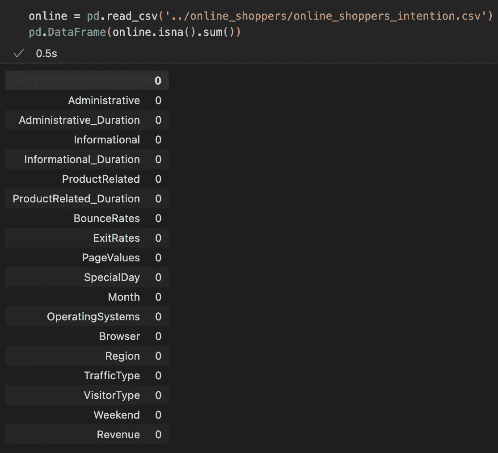
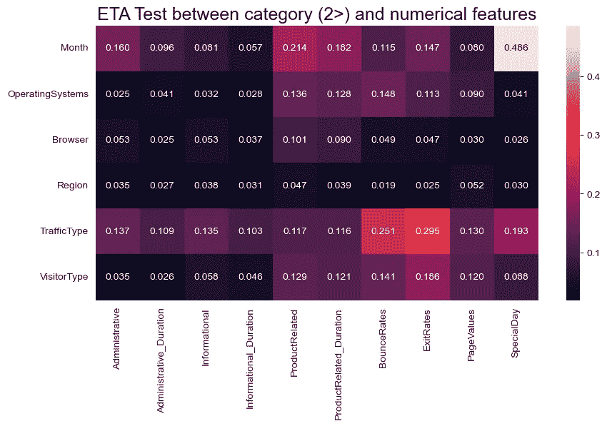
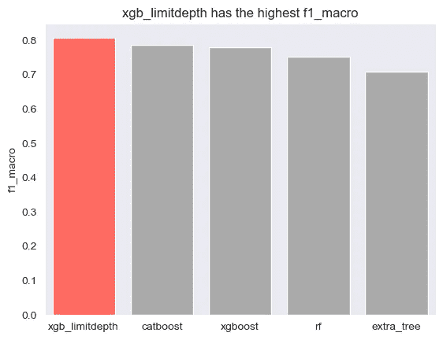

# 如何用 FLAML 在 Python 中执行分类

> 原文：<https://medium.com/codex/how-to-perform-classification-in-python-with-flaml-f2cf7f68ef92?source=collection_archive---------6----------------------->

你做的很多决定都不可避免地与分类联系在一起。例如，午餐吃什么或在哪里使用有限的资源。在这篇文章中，我将展示使用 Python 和 FLAML 从头到尾解决一个分类问题的步骤。

在 [Unsplash](https://unsplash.com?utm_source=medium&utm_medium=referral) 上由 [Deon Black](https://unsplash.com/@deonblack?utm_source=medium&utm_medium=referral) 拍摄的照片

# 问题理解和数据收集

使用分类有效分配有限资源的方法之一是正确识别您的客户。例如，当你能够识别一个网站访问者是否是潜在客户时，你就可以决定是否为该访问者使用有限的资源来增加收入。在这篇文章中，这是我将试图解决的问题。

最好是创建我自己的数据集，但是没有所有的工具来收集这样的数据是很难的。所以这一次，我将使用 UCI 机器学习库中上传的[网购者购买意向数据集](https://archive-beta.ics.uci.edu/ml/datasets/online+shoppers+purchasing+intention+dataset#Descriptive)。

# 数据清理

如果我自己收集数据，它不会是一个整洁的表格格式。所以我必须花相当多的时间来清理它。幸运的是，奥莰·萨卡尔提供的数据集已经被清理过了，没有任何缺失值。

数据集中没有缺失值

# 探索性数据分析

首先，让我们看看数据的大致情况。

数据集中随机 5 行的转置版本

从上面的图像中，列和行被调换，只是为了使它们适合一个图像。请记住，最左边的一列是特性变量和收入的列表，这是目标。最上面一行的数字是从总体中取样的随机观察指数。为了理解每个变量代表什么，我们可以看看 UCI ML 知识库网站的[描述](https://archive-beta.ics.uci.edu/ml/datasets/online+shoppers+purchasing+intention+dataset#Descriptive)。

目标变量“收入”表示访问者在离开网站前是否购物，真假。

“管理”、“管理持续时间”、“信息”、“信息持续时间”、“产品相关”和“产品相关持续时间”表示不同类型页面的数量以及访问者在每种类型页面上花费的总时间。如你所见，“管理”、“信息”和“产品相关”是整数，而其余的是浮点数。

“跳出率”是在没有触发任何其他请求的情况下进入和离开网站的访问者的百分比。“退出率”是所有页面视图中最后一个页面视图的百分比。“页面价值”是用户在完成电子商务交易之前访问的网页的平均值。“特殊日”表示探访时间与特殊日(如母亲节或情人节)的接近程度，值介于 0 和 1 之间(含 0 和 1)。

其余的特征是具有两个或更多级别的分类特征。

但是来自网站的描述与每一列的数据类型不匹配。

每列的数据类型

## 一键编码

从第 11 列到第 14 列，它们应该是 categorical 而不是 int64。因此，我们应该改变这些。有两种可能的方法:标签编码或一键编码。在这种情况下，one-hot 编码更合适，因为这些列中的不同类型之间没有数字关系。例如，浏览器类型 1 不大于浏览器类型 2。

转换数据类型和应用一键编码

上面代码的一个问题是这 4 个分类列有很高的基数。这意味着有些值是唯一的，因此数据集中只有少数值存在。因此，当我对所有这些应用一键编码时，它将维度从 18 增加到 75，这很容易导致维度的诅咒。

显示一些变量具有高基数

这可以通过对唯一值进行分组或将其从特征选择步骤中移除来解决。由于当我们保留那些特征时，一个模型可能在特征选择期间学习噪声，当某个值不超过总数的 3%时，我决定首先将它们分组到“其他”中。

将相对唯一的值分组到其他值中

对于月份变量，有几种方法可供选择。您可以对每个月应用一键编码，按季度对它们进行分组，将每个月转换为数值，或者应用正弦/余弦以便数值形成一个循环。对于这个项目，我对每个月应用了 one-hot 编码，因为有两个月缺失，所以我不能形成一个循环，并且值不是均匀分布的。

月份是如何分配的

对一些值进行分组后应用一键编码的代码

## 分割数据集和特征分布

然后，在绘制图表以查看点是如何分布的之前，我将数据集分为训练集和测试集，以便在最终测试模型性能之前，测试集中的信息不会泄漏。

用于将数据集分成训练、验证、测试数据的代码

分割数据集时，分层参数是必要的，因为目标是不平衡的，如下所示。

目标变量是如何不平衡的

下一张图是连续变量的分布。

连续变量的分布

正如你从上面的图表中看到的，观察结果极度向右倾斜。记住这一点很重要，因为根据我最终使用的模型，我可能不得不[转换](https://stackoverflow.com/questions/41609711/does-a-dataset-need-to-be-a-normal-distribution-for-every-parameter)它以获得更好的收敛性。

## 相关性和多重共线性

下一个关联。由于数据集既有数字特征又有分类特征，我们需要使用[几种方法](https://www.researchgate.net/post/Can_I_use_Pearsons_correlation_coefficient_to_know_the_relation_between_perception_and_gender_age_income)来检查它们之间的相关性。首先，对于数字变量，我使用了皮尔森的相关系数。接近 1 的值意味着它们是相关的。

皮尔逊相关系数热图

对于分类变量之间的相关性，我可以使用卡方检验或克莱姆的 v。

卡方检验的热图

在这种情况下，因为样本量很大，卡方检验很可能[返回一个低 p 值](https://www.semanticscholar.org/paper/Research-Commentary-Too-Big-to-Fail%3A-Large-Samples-Lin-Lucas/7241c748932deb734fff1681e951e50be0853a39?p2df)，即使是一个很小的差异。如您所见，许多特征组合的 p 值都低于 0.05。因此，使用克莱姆的 V 是一个更好的主意。对于克莱姆的 V，接近 1 的值意味着强关联。没有硬阈值，因为强关联的含义[取决于两个特征之间的较低自由度](https://www.statology.org/interpret-cramers-v/)。

克莱姆 V 的热图

对于超过 2 个级别的数值和分类，使用 eta 相关性，0 表示没有关联，1 表示完全关联。

ETA 相关测试的热图

对于正好有两个级别的数字和分类，使用点双列相关。下面的热图是点-双列相关系数的 p 值。因此，低于 0.05 的值意味着存在关联。

点-双列相关 p 值的热图

最后，为了检查多重共线性，我对数字特征使用了方差膨胀因子。就像其他指标一样，没有硬门槛。有人说是 3。但也有人建议 5 或 10。所以看你的选择了。

数值变量的 VIF

# 型号选择

对于模型选择，我运行 FLAML 来自动找出哪个模型更适合。FLAML 用于分类的估计量列表可以大致分为两种类型:树模型和逻辑模型。

对于树和逻辑模型，正态分布不是一个假设。但是，在使用逻辑模型之前，还需要检查其他假设。值得一提的是，没有多重共线性，没有极端异常值，并且样本量足够大。关于这些的更多信息可以在找到[。](https://www.statology.org/assumptions-of-logistic-regression/)

连续变量的箱线图

如您所见，异常值非常多，将其转换为平均值或中值等其他值是不合适的，因为异常值几乎是某些要素的整个可能值范围。即使是经过对数变换的数据也是如此。

对数变换后连续变量的直方图和箱线图

因此，我决定在这个项目中使用基于决策树的模型。我没有包括 Light GBM，因为我没有足够的观察数据来使用 Light GBM。没有硬性阈值，但建议超过 10，000 行。

型号选择的初始代码

因为不想让自己的模型过拟合，所以添加了带有 X_val 和 y_val 的 eval_method= "holdout "，retrain_full=False，early_stop=True。为了处理不平衡的目标变量，我为每个模型添加了“weight”或“balanced”以及 metric="macro_f1 "。

通过运行上面的代码，结果证明 xgb_limitdepth 效果最好。所以我决定深入研究这个模型。

每个型号的 f1 宏分数

在继续之前，xgb_limitdepth 是“xgboost”的一个子类，具有有限的深度以避免过度拟合。这个描述可以在 FLAML 软件开发工具包中找到。

来自 [FLAML SDK](https://microsoft.github.io/FLAML/docs/reference/model/) 的截图

# 处理过度拟合

即使我试图通过设置一些参数来处理过度拟合，这还不够。如下所示，模型在验证数据上的表现比在训练数据上的表现差得多。

用于验证和训练以显示过度拟合的混淆矩阵

因此，我需要采取进一步的行动来消除模型中的过度拟合。我尝试了几种方法，有效的方法是使用交叉验证递归特征消除(RFECV)选择特征，并使用 XGBClassifier 中的子样本参数增加一些随机性。

## 使用 RFECV 选择功能

即使特征选择被[嵌入到](https://towardsdatascience.com/why-how-and-when-to-apply-feature-selection-e9c69adfabf2)决策树模型中，也不足以阻止模型学习数据中的噪声。所以我决定使用一种包装方法 RFECV 来选择将哪些特性输入到模型中。顾名思义，它递归地删除性能最差的特性。例如，当有 4 个特性 a、b、c、d，并且 c 是性能最差的特性时，RFECV 将在第一轮后返回 a、b、d。

在我的例子中，运行一次 RFECV 是不够的。模型仍然过拟合。所以我运行了 RFECV，直到没有更多的特性被再次运行 RFECV 所消除，这是 3 次。

运行 RFECV 3 次(直到运行 RFECV 后不再有功能被删除)

## 子样品

模型中的子样本参数限制了模型在训练时可以使用的训练数据的比例。在我的例子中，我将其设置为 0.7。因此，模型中的树在拟合时只能使用 70%的训练数据。

可以用来避免过度拟合的其他参数有 max_depth、min_child_weight、gamma 和 colsample_bytree，如 XGBoost [文档](https://xgboost.readthedocs.io/en/stable/tutorials/param_tuning.html)中所示。

在应用这些之后，验证和训练数据之间的 f1 宏观差异不太严重。

运行 RFECV 3 次后运行 FLAML

# 没有成功的事情

## 重击

处理不平衡数据的另一种方法是过采样。其中一种方法是使用 SMOTE 包，该包利用 KNN 算法为少数类创建合成数据。但是在这种情况下，使用 scale_pos_weight 为 minority 类赋予更高的权重比过采样效果更好。

## 全体

为了提高模型性能，我尝试使用软投票和硬投票来组合几个不同的模型。我还尝试在 FLAML 中使用系综参数。但是对于这两种方法，它只会降低性能。

## 其他模型的特征选择

在对每个模型应用特性选择之后，为了防止其他模型可能比 xgb_limitdepth 工作得更好，我对其他树模型尝试了相同的过程。但是 xgb_limitdepth 仍然比其他的稍微好一点。

# 模型评估和结论

FLAML 的一个有用特性是，当您设置 log_file_name 参数时，它会保存其训练历史。通过这个日志文件，您可以看到评估指标是如何随着时间的推移而改进的，以及 FLAML 是如何调整超参数的。例如，下图显示了 f1 宏观分数在训练过程中的变化。

f1 宏分数在验证数据中如何变化

有了这个模型，我能够对测试数据进行分类，而与验证数据没有太大的差异。正如下面的混淆矩阵所示，该模型正确识别了大约 78%的购物访客，但大约 42.58%的积极标签访客被错误识别。

模型如何处理测试数据

对于默认的 predict()，区分假(0)和真(1)的阈值是 0.5。但是在很多情况下，第一类和第二类错误的代价是不一样的。在这种情况下，第 1 类错误是假阳性，从上面的输出来看是 221，这意味着我将访问者分类为那些没有购物的人。因此，犯这种错误的代价将是浪费有限的资源或增加不满。

另一方面，第二类错误是假阴性，与上面的输出相比是 84。所以这个错误的代价是收入的减少，因为模型不能识别购物的访问者。

因此，犯一个第一类错误和犯一个第二类错误是不同的。根据什么和多少是可接受的，您可以根据需要更改阈值。例如，如果第二类错误比第一类错误花费更多，我可以降低阈值，这样模型就可以分类更多的积极因素，如下所示。以 0.47 为阈值，我能够将 13 个以上的真阳性与 18 个以上的假阳性分类为其成本。

由于类型 1 和类型 2 错误之间的成本差异，应用不同的阈值

# 参考

[1][https://archive-beta . ics . UCI . edu/ml/datasets/online+购物者+购买+意向+数据集#Descriptive](https://archive-beta.ics.uci.edu/ml/datasets/online+shoppers+purchasing+intention+dataset#Descriptive)

[2][https://www . research gate . net/post/Can _ I _ use _ Pearsons _ correlation _ coefficient _ to _ know _ the _ relation _ between _ perception _ and _ gender _ age _ income](https://www.researchgate.net/post/Can_I_use_Pearsons_correlation_coefficient_to_know_the_relation_between_perception_and_gender_age_income)

[3][https://www . semantic scholar . org/paper/Research-Commentary-Too-Big-to-Fail % 3A-Large-Samples-Lin-Lucas/7241 c 748932 deb 734 fff 1681 e 951 e 50 be 0853 a 39？p2df](https://www.semanticscholar.org/paper/Research-Commentary-Too-Big-to-Fail%3A-Large-Samples-Lin-Lucas/7241c748932deb734fff1681e951e50be0853a39?p2df)

[https://www.statology.org/interpret-cramers-v/](https://www.statology.org/interpret-cramers-v/)

[5][http://online help . IHS . com/Energy/AnalyticsExplorer/AE _ 6.0/web help/content/AnalyticsExplorer/Vif . htm](http://onlinehelp.ihs.com/Energy/AnalyticsExplorer/AE_6.0/Webhelp/content/analyticsexplorer/VIF.htm)

[6][https://www . statology . org/assumptions-of-logistic-regression/](https://www.statology.org/assumptions-of-logistic-regression/)

[7][https://towards data science . com/why-how-and-when-to-apply-feature-selection-e 9c 69 adfabf 2](https://towardsdatascience.com/why-how-and-when-to-apply-feature-selection-e9c69adfabf2)

[8][https://xgboost . readthedocs . io/en/stable/tutorials/param _ tuning . html](https://xgboost.readthedocs.io/en/stable/tutorials/param_tuning.html)