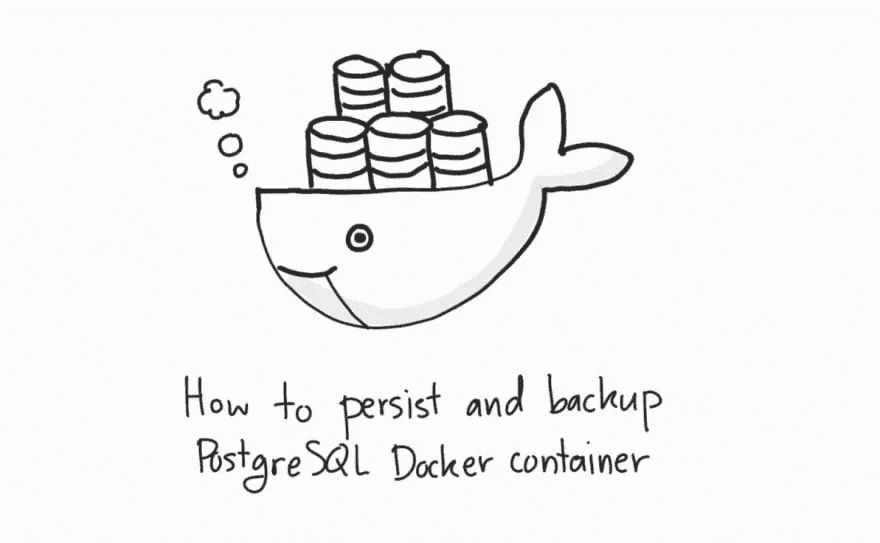

# 如何持久化和备份 PostgreSQL Docker 容器的数据

> 原文：<https://medium.com/codex/how-to-persist-and-backup-data-of-a-postgresql-docker-container-9fe269ff4334?source=collection_archive---------0----------------------->

## 再也不会丢失您的数据库信息了！



# 目录

*   介绍
*   用装入的卷保存数据库信息
*   转储和恢复数据库信息

# 介绍

您曾经在使用 PostgreSQL docker 容器时丢失过数据库信息吗？我们都知道不应该使用 docker 容器来保存数据库数据，因为一旦删除，数据就会随之消失，对吗？对吗？？？

天哪，你做到了。

我也是。当时，我忘了考虑容器在哪里保存信息。我曾经使用 PostgreSQL 容器作为我的应用程序的数据库实例。在部署用于生产之前，我想我应该重启一次来刷新它。(Idk why but yea……)我输入了`docker-compose down`后面跟着`docker-compose up`。然后，一阵恐慌袭来。我打开我的应用程序，发现我所有的表和配置都被遗忘了。结果是我不得不重新配置一切。我花了很长时间才把它修好。好的一面是，至少在制作过程中没有发生。

在本文中，我将向您展示如何持久化 PostgreSQL Docker 容器的数据以及如何恢复它们。

# 用装入的卷保存 PostgreSQL 数据库信息

我们将首先使用 docker-compose 创建数据库。请将以下脚本复制到 docker-compose 文件中，然后运行`docker-compose up`。

```
# docker-compose.yml
version: '3.1'
services:
  db:
    image: postgres
    restart: always
    environment:
      POSTGRES_USER: myuser
      POSTGRES_PASSWORD: mypassword
      POSTGRES_DB: mydb
    volumes:
       - ./data:/var/lib/postgresql/data
```

请注意体积块。您可以看到我们将主机中的卷`data/`挂载到 PostgreSQL 容器的`/var/lib/postgresql/data`目录中。这是在主机上持久保存数据的必要步骤。因为当容器被删除后，这个目录将继续存在。

启动容器后，您会看到一个`data/`目录出现在您的主机上。这个目录是所有 PostgreSQL 信息所在的位置。

```
$ ll
total 16
drwxr-xr-x  3 ubuntu ubuntu 4096 Nov 21 16:29 ./
drwxr-xr-x  4 ubuntu ubuntu 4096 Nov 21 16:26 ../
drwx------ 19    999 root   4096 Nov 21 16:29 data/     
-rw-r--r--  1 ubuntu ubuntu  232 Nov 21 16:28 docker-compose.yml
```

让我们检验一下我们的理论是否正确。Shell 到数据库容器中。

```
$ docker exec -it <your-postgres-container-id> bash
```

进入容器后，运行以下命令连接到 PostgreSQL 控制台。

```
$ psql -d mydb -U myuser
```

让我们创建一个表并插入一些数据。

```
CREATE TABLE IF NOT EXISTS accounts (
    id serial PRIMARY KEY,
    username VARCHAR (255) UNIQUE NOT NULL
);INSERT INTO accounts(username) VALUES 
('rick'), ('morty') RETURNING *;
```

如果您从 accounts 表中选择行，您将看到以下结果。

```
mydb=# select * from accounts;
  1 | rick
  2 | morty
```

之后，从容器中退出。并运行 docker-compose down 来停止并删除容器。技术上来说，一切都应该消失了。但是正如您所看到的，数据/目录仍然存在。

```
# stop and remove container
$ docker-compose down
Stopping pg-persist-ex_db_1 ... done
Removing pg-persist-ex_db_1 ... done
Removing network pg-persist-ex_default# container is gone
$ docker ps
CONTAINER ID   IMAGE     COMMAND   CREATED   STATUS    PORTS     NAMES
# data directory still persists
$ ls
data  docker-compose.yml
```

接下来，再次运行 docker-compose up 来启动数据库容器。如果您使用 shell 进入容器并登录到 PostgreSQL 控制台。您可以看到您的表数据没有丢失。

```
mydb=# \dt
         List of relations
 Schema |   Name   | Type  | Owner
--------+----------+-------+--------
 public | accounts | table | myuser
(1 row)
mydb=# select * from accounts;
 id | username
----+----------
  1 | rick
  2 | morty
(2 rows)
```

这就是如何持久化 docker 容器的数据库信息。

# **转储和恢复 PostgreSQL 数据库信息**

备份数据库信息的另一种方法是将其转储出来。数据库转储是一个导出实用程序，可以帮助您将数据库元数据和数据行导出到一个文件中。转储文件可以在以后导入到新的数据库中。

转储允许您只导出元数据(模式、表、关系)或元数据和数据行。在这种情况下，我将向您展示如何从数据库中导出所有信息。

要从 docker 容器备份 Postgres 数据库，请运行以下命令。

```
$ docker exec -t <your-postgres-container-id> pg_dumpall -c -U postgres > dump_`date +%d-%m-%Y"_"%H_%M_%S`.sql
```

如果您打开转储文件，向下滚动，您会看到其中有我们的数据库信息。

```
# file opened in vim
179 CREATE TABLE public.accounts (
180     id integer NOT NULL,
181     username character varying(255) NOT NULL
182 );
183
184
185 ALTER TABLE public.accounts OWNER TO myuser;
...
216 --
217 -- Data for Name: accounts; Type: TABLE DATA; Schema: public; Owner: myuser
218 --
219
220 COPY public.accounts (id, username) FROM stdin;
221 1   rick
222 2   morty
223 \.
```

如果要从转储文件中恢复数据库信息，请运行以下命令。

```
$ cat your_dump.sql | docker exec -i <your-postgres-container-id> psql -U myuser
```

你可以在一个新的 Postgres 容器上自己尝试一下，看看效果如何。

今天就到这里。现在，您再也不会丢失数据库信息了。编码快乐！