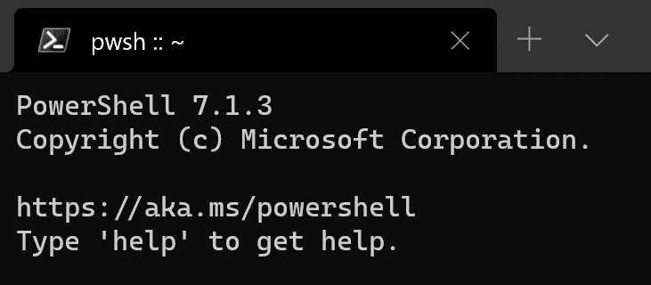

# 如何:在 PowerShell 中为我的电力线拉皮条

> 原文：<https://medium.com/codex/how-to-pimp-my-powerline-in-powershell-156f4e4936e?source=collection_archive---------8----------------------->

## [法典](http://medium.com/codex)

## 想让基本的 PowerShell 窗口具有视觉吸引力吗？那么这本指南是给你的。


PowerShell 电源线在应用 oh-my-posh 主题“slim”后

*注:我假设你使用的是****Windows 10****，我建议你继续安装最新版本的* [***Windows 终端***](https://docs.microsoft.com/en-us/windows/terminal/get-started)**(最好从微软商店购买)*[***PowerShell 7***](https://github.com/PowerShell/PowerShell)*(向下滚动 GitHub 网页至他们只是让生活变得更容易。我们将使用 Oh-my-Posh，一个“* [提示主题引擎用于任何 shell](https://ohmyposh.dev/) ”。*如果你遇到问题，在本文的最后有一个* ***故障排除章节*** *。**

*首先，让我们通过单击任务栏上的 Windows 终端按钮打开 Windows 终端。*

**

*单击红色箭头旁边的 Windows 终端按钮*

*您应该会看到类似下面的内容。如果您的当前 Shell 不是 PowerShell，请点击上方窗口栏上的向下箭头并选择 PowerShell。*

**

*无聊的 PowerShell 界面*

## ***安装书呆子字体***

*如你所见，视觉上的吸引力并不存在。有点凄凉。我们要改变这种状况。让我们从安装一种更有趣的字体开始，这种字体允许显示整洁的符号，并且与电力线字形兼容。虽然[本教程](https://docs.microsoft.com/en-us/windows/terminal/tutorials/powerline-setup)推荐使用卡斯卡迪亚代码 PL 或卡斯卡迪亚单色 PL 字体，他们没有为我渲染字形。我发现那些自命不凡的开发人员设计他们的软件时使用的是 T2 书呆子字体 T3。你可以免费下载和安装任何书呆子字体，但我会坚持使用提升卡斯卡迪亚代码字体。如果你想关注我，请下载“卡斯卡迪亚代码”获取**卡斯卡迪亚代码书呆子字体**提供[这里](https://github.com/AaronFriel/nerd-fonts/releases/tag/v1.2.0)。Nerd.Font.Complete.ttf "。打开文件，您应该会看到一个新的窗口弹出:*

**

*安装“卡斯卡迪亚代码书呆子字体完成”*

*单击安装。或者，转到下载。ttf 文件，右击它并选择“安装”或“为所有用户安装”。*

## *更改 Windows 终端设置*

*现在您已经安装了 nerd 字体，我们希望 PowerShell 使用 Cascadia Code Nerd 字体显示文本。最好的方法是通过点击上方窗口栏上的向下箭头或在 Windows 终端中按[Ctrl+，]进入设置。这将在默认代码编辑器中打开一个“ **settings.json** ”文件。我的情况是 [VS 代码](https://code.visualstudio.com/)。*

**

*更改默认字体*

*如您所见，我已经取消了默认字体“Consolas”的注释。我们将把默认字体替换为“ **CascadiaCode Nerd 字体**”。重要的是你省略了“Cascadia”和“Code”之间的空格——这不是打字错误。当您保存文件[Ctrl+S]时，您应该看到您的 PowerShell 字体发生了变化。*

## *安装并导入 Posh-Git 和 Oh-My-Posh*

*在 PowerShell 中，执行下面两条命令，这两条命令将**安装 posh-git 和 oh-my-posh 模块**。如果您想知道 posh-git 是做什么的:" [Posh-git 为您的提示添加 Git 状态信息，以及 Git 命令、参数、远程和分支名称的制表符补全](https://docs.microsoft.com/en-us/windows/terminal/tutorials/powerline-setup) " —当您使用 Git 版本控制时，这是一个不错的选择。*

```
*Install-Module posh-git -Scope CurrentUser
Install-Module oh-my-posh -Scope CurrentUser*
```

*可能会在您按下 enter 键后要求您批准安装。在这种情况下，选择“是”或“全是”。*

*接下来，您需要**导入**这些模块来实际使用它们。在 PowerShell 中，输入:*

```
*notepad $profile*
```

*其中竟然打开了一个名为**的微软文件。PowerShell_profile.ps1** ”。如果该文件尚不存在，请创建它。然后，将以下三行复制粘贴到记事本文件中，如下所示:*

```
*Import-Module posh-git
Import-Module oh-my-posh
Set-PoshPrompt -Theme slim*
```

**

*做出更改后，不要忘记保存。*

## *完美的主题*

*太好了！您已经成功设置了“我的天哪”。然而，很有可能我个人最喜欢的“苗条”主题并不是你真正喜欢的。幸运的是，还有许多其他主题可供选择。只需输入*

```
*Get-PoshThemes*
```

*到 PowerShell 中，以便更好地了解可用的主题。以下是输出:*

**

*“我的天哪”主题概述*

**注意:我已经初始化了一个 Git 存储库，也显示了电力线 Git 符号。**

*要永久设置一个主题，您需要像以前一样使用*

```
*notepad $profile*
```

*并替换当前主题，例如:*

```
*Set-PoshPrompt -Theme jandedobbeleer*
```

**

## *最后一击(可选)*

*您可能想知道我是如何将我的**本地用户帐户名**从“jcchu”更改为 [SonGoku](https://dragonball.fandom.com/wiki/Goku) ，将我的**计算机名**更改为**[Kamehameha](https://dragonball.fandom.com/wiki/Kamehameha)。***

*****更改用户名:*****

******

1.  ***[Windows 键+R]***
2.  ***输入“netplwiz”***
3.  ***在新窗口中，选择要更改的用户帐户名***
4.  ***单击“属性”***
5.  ***在新窗口中，输入新的用户名***
6.  ***点击“应用”***
7.  ***为了使更改生效，通常需要重新启动***

*****更改电脑名称:*****

******

1.  ***[Windows 键]***
2.  ***开始键入“关于您的电脑”,然后输入***
3.  ***在新窗口中，单击“重命名这台电脑”***
4.  ***输入新的计算机名***
5.  ***重启电脑***

*****删除 PowerShell 启动文本*****

***您可能还想删除 PowerShell 开始文本:***

******

***PowerShell 开始文本***

1.  ***打开 Windows 终端设置[Ctrl+，]***
2.  ***将“源”属性替换为以下内容:***

```
***"commandline": "pwsh.exe -noLogo"***
```

******

***取消源代码的注释并将“noLogo”参数添加到命令行中***

***你完了！欣赏风景！😍***

## ***额外:故障排除***

*****启用运行脚本*****

***您可能会遇到一条错误消息，告诉您**无法运行. ps1** 脚本文件。一种解决方案是以**管理员**的身份将 [**执行策略**](https://docs.microsoft.com/en-us/powershell/module/microsoft.powershell.core/about/about_execution_policies?view=powershell-7.1) 设置为“无限制”或“远程签名”，如下所示:***

```
***Set-ExecutionPolicy Unrestricted***
```

*****快捷方式问题*****

***有时，您可能会看到以“**无法修改快捷方式**”开头的错误。这里，一个潜在的解决方案是走捷径[给自己完全的许可](https://www.reddit.com/r/PowerShell/comments/g7klxr/unable_to_modify_the_powershell_shortcut_error/)。***

******

***太美了。🙌***