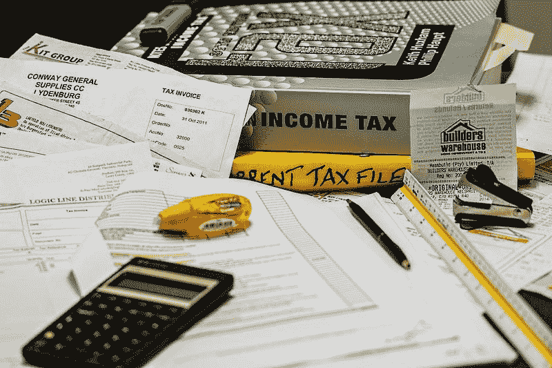

# 如何用 Python 编写收支表

> 原文：<https://medium.com/codex/how-to-prepare-a-statement-of-income-expenses-in-python-97cc1cb0281e?source=collection_archive---------2----------------------->

大约二十年前，我学习会计，试图改善我的就业前景。虽然我从未做过会计，但我担任过需要对会计和财务原则有基本理解的工作。此外，我帮助我的男朋友，他是自由职业者，准备他的账目，提交给英国税务海关总署，或者 HMRC，还有当地的…