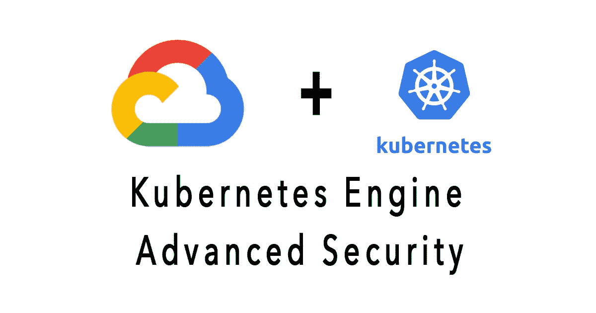

# 如何防止 Kubernetes pod 逃逸的多路径

> 原文：<https://medium.com/codex/how-to-prevent-multiple-paths-of-kubernetes-pod-escape-3e43e567c5f4?source=collection_archive---------3----------------------->

## [法典](http://medium.com/codex)

本教程演示了默认 GKE 集群配置的一些安全问题以及相应的强化措施，以防止多条路径的 pod 转义和集群权限提升。这些攻击途径与以下场景相关:

1.  面向外部的 pod 中的应用程序缺陷允许…