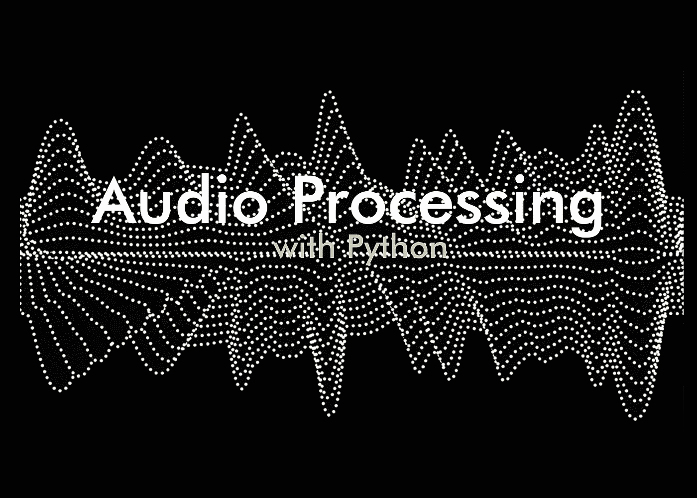

# 如何用 Python 处理和绘制音频数据

> 原文：<https://medium.com/codex/how-to-process-audio-data-with-python-5e61c6e66bc8?source=collection_archive---------1----------------------->

creativemarket com/ CC 1.0 公共领域

# 声音中有什么信息？🔊

在物理学中，声音是一种振动，通过气体、液体或固体等传输介质以声波**的形式传播。**