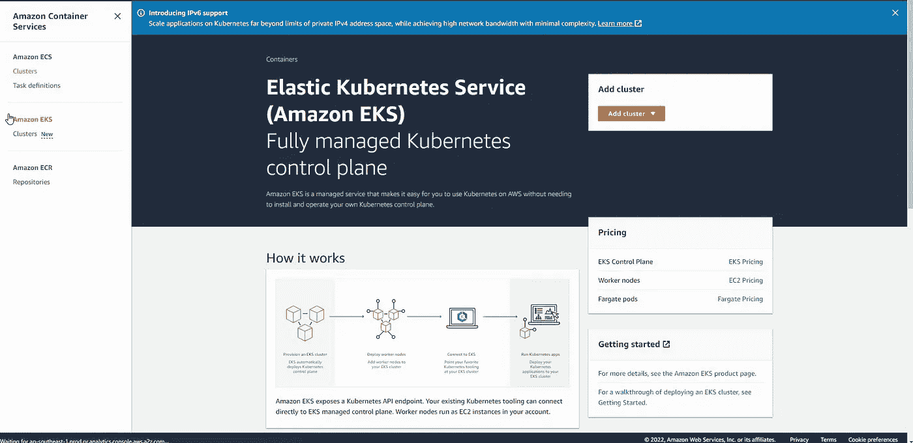
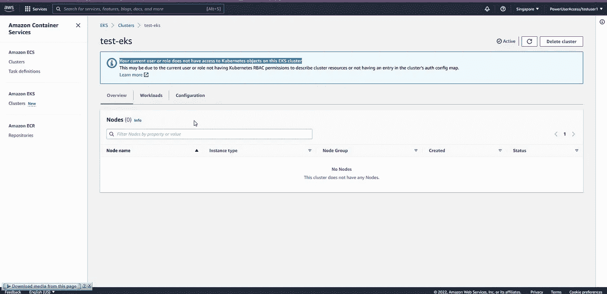
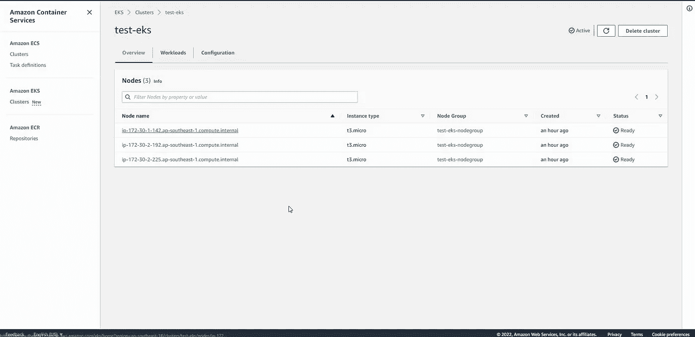
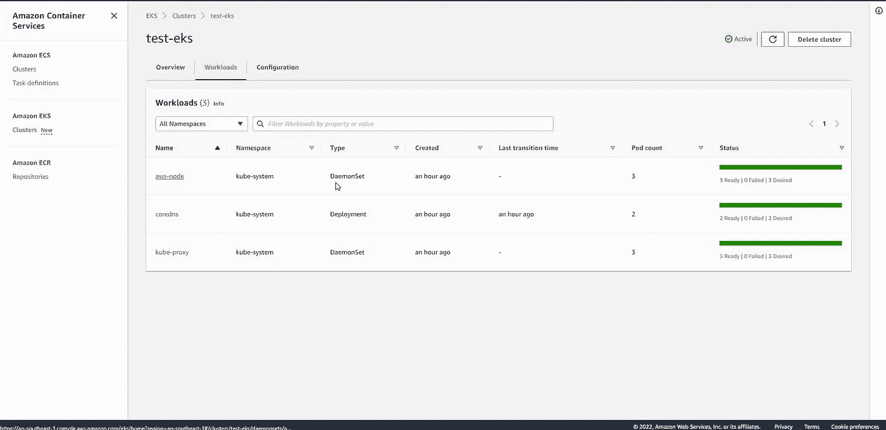
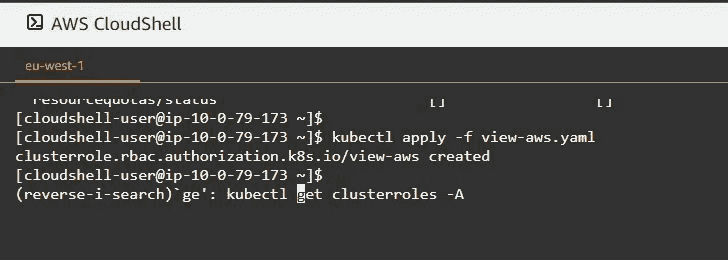
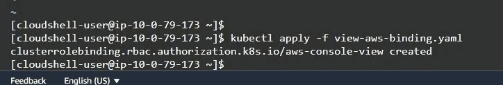
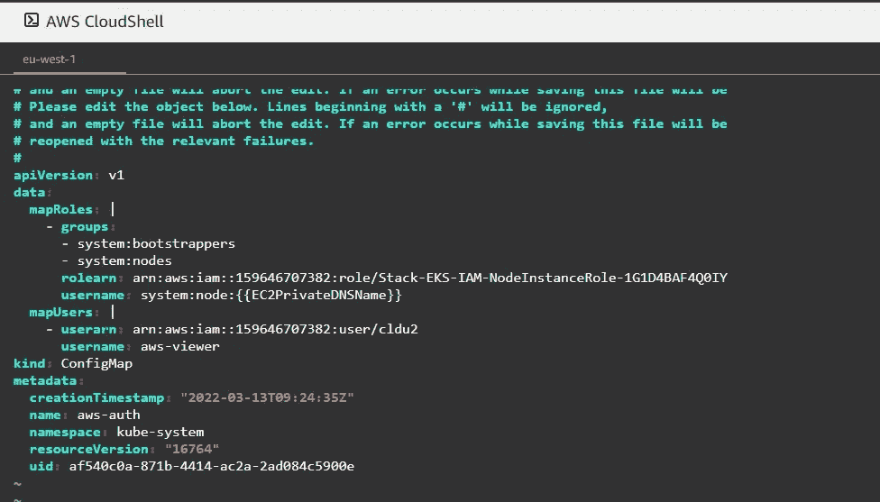
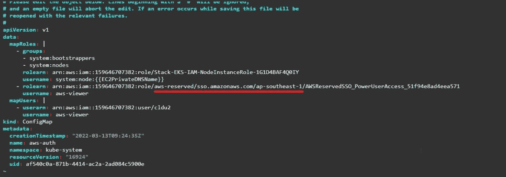
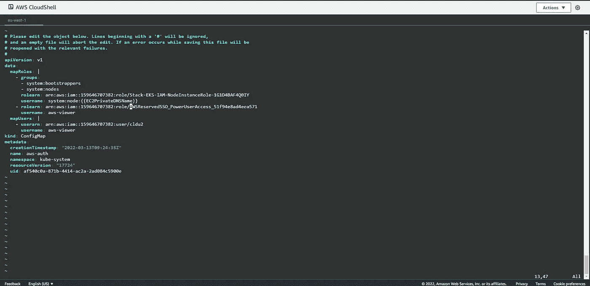

# 如何为用户和角色提供对 AWS EKS(AWS IAM/SSO)的访问，以及从 AWS EKS 控制台查看信息。

> 原文：<https://medium.com/codex/how-to-provide-access-to-aws-eks-for-sso-users-via-aws-sso-to-view-and-manage-the-cluster-17e2acfd6a35?source=collection_archive---------0----------------------->

Kubernetes 是一种非常流行的在云中托管应用程序的方法。由于 Kubernetes 使其平台独立，许多公司将其在 Kubernetes 的内部工作负载直接转移到云。Kubernetes on cloud 让开发人员和系统工程师的生活变得更加轻松，因为它可以由云提供商自己管理管理计划，并让用户只需担心工作节点和将要在其中部署的应用程序。



AWS EKS 控制台

创建 EKS 集群时，创建 EKS 集群的用户或角色会隐式继承对该集群的完全管理权限。这是特意设计的，最初访问群集和允许其他用户访问时需要用到。在本文中，我们将讨论如何授予用户或角色对 EKS 集群的访问权限，以便可以从 AWS EKS 控制台查看工作负载信息，而无需登录到 Kubernetes 集群并使用 kubectl 命令。然后，我们还将研究如何为通过 AWS SSO 而不是 AWS IAM 访问 AWS 的用户提供访问权限。

# 为所有资源提供对群集的查看权限

通常，当创建 EKS 集群时，只有能够访问该集群的用户才能在 EKS 控制台中查看信息。但是，如果我们提供默认的 Kubernetes " **View** "集群角色，它将不会提供可以从 AWS EKS 控制台视图查看的所有信息的可见性。

例如，下面是一个用户的 AWS EKS 控制台视图，该用户在 Kubernetes 级别上对 EKS 集群没有任何访问权限。



AWS 用户/角色没有访问 Kubernetes 信息的权限

下面是 AWS EKS 控制台将如何提供信息，如果一个用户或具有默认“查看”Kubernetes 集群权限的假定角色的用户访问 EKS 控制台。



AWS EKS 控制台-工作节点信息



AWS EKS 控制台—工作负荷信息

如上所示，如果使用默认的“查看”Kubernetes 集群角色向 AWS 用户或角色提供只读访问权限，那么 EKS 节点信息将不可见。为此，需要手动创建具有查看/只读权限的群集角色。

## 库伯内特斯的 RBAC

Kubernetes 中有两种类型的角色，即“角色”和“集群角色”。角色特定于名称空间，集群角色影响整个集群，而不管名称空间或工作负载如何。在定义它们时，可以用相同的方式(类似的 YAML 文件)完成，除了应该在“角色”中的附加行，它是名称空间。基于角色类型，可以使用“RoleBinding”或“ClusterRoleBinding”将创建的角色绑定到用户或组。

你可以从[这里](https://kubernetes.io/docs/reference/access-authn-authz/rbac/)详细了解库伯内特 RBAC。

提供集群访问的 AWS 文档可以在[这里](https://docs.aws.amazon.com/eks/latest/userguide/add-user-role.html)找到。

在我们的用例中，我们需要创建一个 ClusterRole 并将其绑定到用户名，以便在 ***AWS-Auth*** 配置映射中，我们可以将它们指定给特定的 AWS 用户或角色。

## 逐步指南

本指南假设您已经创建了一个 AWS EKS 集群，并且拥有对该集群的管理员用户访问权限。如果您需要如何以简单的方式创建 EKS 集群的指导，请观看下面的视频。

1.  **创建集群角色 YAML 文件**
2.  **在 EKS 集群中创建集群角色。**
3.  **为用户/组创建一个 ClusterRoleBinding。**
4.  **编辑 AWS-Auth 配置映射，并将 AWS 用户映射到 ClusterRoleBinding 中给定的用户名。**
5.  **从 AWS 控制台测试新的视图角色访问。**

**创建集群角色 YAML 文件**

下面是通过 AWS EKS 控制台查看 Kubernetes 集群的给定信息所需的权限。

```
apiVersion: rbac.authorization.k8s.io/v1
kind: ClusterRole
metadata:
  annotations:
    rbac.authorization.kubernetes.io/autoupdate: "true"
  name: view-aws
rules:
- apiGroups:
  - '*'
  resources:
  - nodes
  - namespaces
  - pods
  - events
  verbs:
  - get
  - list
- apiGroups:
  - apps
  resources:
  - deployments
  - daemonsets
  - statefulsets
  - replicasets
  verbs:
  - get
  - list
- apiGroups:
  - batch
  resources:
  - jobs
  verbs:
  - get
  - list
```

让我们浏览一下 YAML 文件，以了解我们正在创建什么。

注释***rbac.authorization.kubernetes.io/autoupdate:“真”*** *通知集群，对此集群角色所做的更改需要在 Kubernetes 级别中自动更新。否则，除非我们发起更新请求，否则我们对集群所做的任何更改都不会得到实时更新。*

“ ***名称*** ”部分定义了 ClusterRole 的名称。你可以根据需要改变它。“ ***规则*** ”部分定义了 ClusterRole 的权限。 ***APIGROUPS*** 扩展了 API，允许轻松管理 Kubernetes APIs。对于权限的第一部分，我们需要与提到的资源相关联的所有 Kubernetes APIs，这些资源允许在“ ***动词*”**部分下列出的查看信息操作。在接下来的两个部分中，给出了查看部署的工作负载(pod)所需的权限。

将上述 YAML 代码保存在一个文件中，并根据需要提供一个正确的名称。角色创建也可以使用直接命令行输入来完成，但如果您正在创建一个定义了大量权限(行数)的角色，则不建议这样做，因为这样更容易出错。下面是一个如何使用命令行创建的示例。

```
kubectl create clusterrole test --verb=get,list,watch --resource=pods,pods/status
```

**在 EKS 集群中创建集群角色。**

通过使用 ***kubectl*** 命令行工具将该文件直接应用于您的 Kubernetes 集群，可以创建 ClusterRole。

```
kubectl apply -f view-aws.yaml
```

如果成功应用，它将反映群集角色已创建。



Kubernetes 集群角色创建

**为用户/组创建一个集群角色绑定**

您可以使用声明性 YAML 文件或命令行来创建 ClusterRoleBinding，就像创建 ClusterRole 一样。下面显示的是 ClusterRoleBinding 的 YAML 代码。

```
apiVersion: rbac.authorization.k8s.io/v1
kind: ClusterRoleBinding
metadata:
  name: aws-console-view
subjects:
- kind: User
  name: aws-viewer
  apiGroup: rbac.authorization.k8s.io
roleRef:
  kind: ClusterRole
  name: view-aws
  apiGroup: rbac.authorization.k8s.io
```

在定义 ClusterRoleBinding 时，我们不需要在集群中创建我们将角色绑定到的用户或组。这里提到的用户并不是一个实际的用户，只是一个逻辑名，我们使用***AWS-Auth***config map 来识别和授予我们映射的 AWS 用户权限。因此，用户名或组名可以是所需的任何值，但请注意它是区分大小写的。“ ***roleRef*** ”部分定义了映射到 Kubernetes 逻辑用户的 ClusterRole。

使用下面的 ***Kubectl*** 命令可以执行相同的操作。

```
kubectl create clusterrolebinding aws-console-view --clusterrole=view-aws --user=aws-viewer
```



Kubernetes 集群角色绑定创建

**编辑 AWS-Auth 配置映射，并将 AWS 用户映射到 ClusterRoleBinding 中给定的用户名**

接下来，我们需要编辑“kube-system”名称空间中的 AWS-Auth 文件。该文件用于使用 AWS 凭证验证和授权对 Kubernetes 集群的访问。这可以为 AWS IAM 角色或 AWS IAM 用户完成。

由于我们正在使用上面在 ClusterRoleBinding 中创建的逻辑用户映射对 AWS 用户/角色进行身份验证和授权，因此在我们将要编辑的部分中不需要组条目。

如果您需要授予 AWS 用户访问权限，您需要在 ***mapUsers*** 部分下的“**AWS-Auth”**config map 中创建条目。对于 AWS 角色，应在 ***mapRoles*** 部分下完成。对于这两者，下面的截图给出了例子。



AWS 角色和用户映射— Kubernetes AWS-Auth 配置映射

编辑完成后，保存文件。如果没有错误，文件将被成功保存。如果没有，编辑器将重新打开，重新纠正问题。请注意，不要强行保存或关闭“ **AWS-Auth** ”配置图。这样做将导致 configmap 损坏，并且使用 AWS 凭据的身份验证将不再有效。然后，您必须使用最初创建群集的同一用户/角色来访问群集，并恢复“AWS-Auth”配置图。

**从 AWS 控制台测试新的视图角色访问**

现在，使用您在上述步骤中映射并授予访问权限的用户/角色登录 AWS 控制台。现在，您将能够从 EKS 控制台查看 EKS 集群部署/使用的节点和工作负载信息。


AWS EKS 控制台—工作负荷信息

## 授予 AWS SSO 用户访问权限

AWS SSO 使用 AWS IAM 角色来联合 SSO 用户对 AWS 控制台的访问。因此，为了向 AWS SSO 用户提供访问权限，我们需要向在 AWS IAM 角色中创建的相应 AWS SSO 角色授予访问权限。角色映射在***AWS-Auth***config map 的“ **mapRoles** ”部分下。

仅仅使用 AWS SSO 角色 ARN 是不行的，它偏离了标准的 AWS IAM 角色 ARN 格式。当通过 AWS IAM-Authenticator 向 Kubernetes RBAC 认证 AWS IAM 角色时，它只考虑标准的角色 ARN 格式。下面提到的部分是在 AWS IAM 中创建的 AWS SSO 角色中引入的附加分区。

```
/aws-reserved/sso.amazonaws.com/ap-southeast-1/
```



AWS-授权配置映射 AWS SSO IAM 角色 ARN

此附加部分需要删除，ARN 需要修改为标准角色 ARN 的格式。



SSO ARN 修改

保存配置图，并使用 AWS SSO 用户访问 EKS 控制台。现在，您应该能够通过 AWS EKS 控制台查看 Kubernetes 提供的信息。

下面是一个 YouTube 视频，解释了如何做我们上面讨论的事情的分步指南。

希望本指南和视频能够帮助您踏上云计算之旅。如果你有任何问题，欢迎在评论区提出。我会尽力提供答案或者引导他们自己去寻找答案。请将这篇文章和视频分享给其他可能从中受益的人。