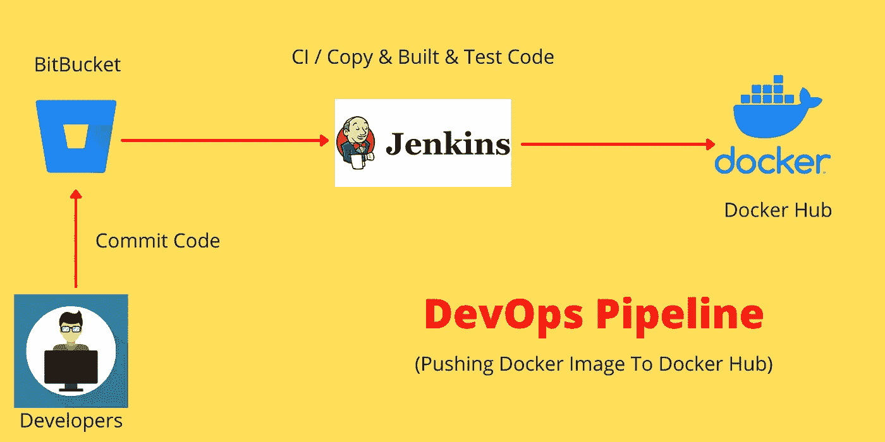

# 如何使用 Jenkins 将 Docker 映像推送到 Docker Hub

> 原文：<https://medium.com/codex/how-to-push-a-docker-image-to-docker-hub-using-jenkins-487fb1fcbe25?source=collection_archive---------0----------------------->

## 使用 Jenkins 自动构建 Docker 映像并将其推送到 Docker Hub。

将 Docker 图像推送到 Docker Hub

您的应用程序通过了所有测试，并准备好进行部署。现在您计划使用 **Docker** 部署应用程序。如果您想使用 Docker 将应用程序部署为容器，那么首先您需要为……创建 **Dockerfile**