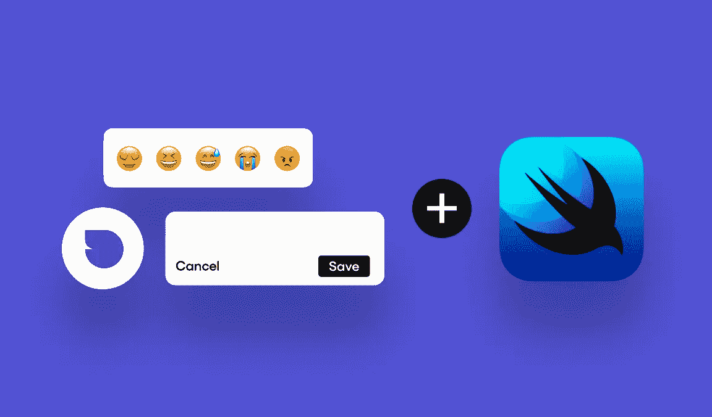
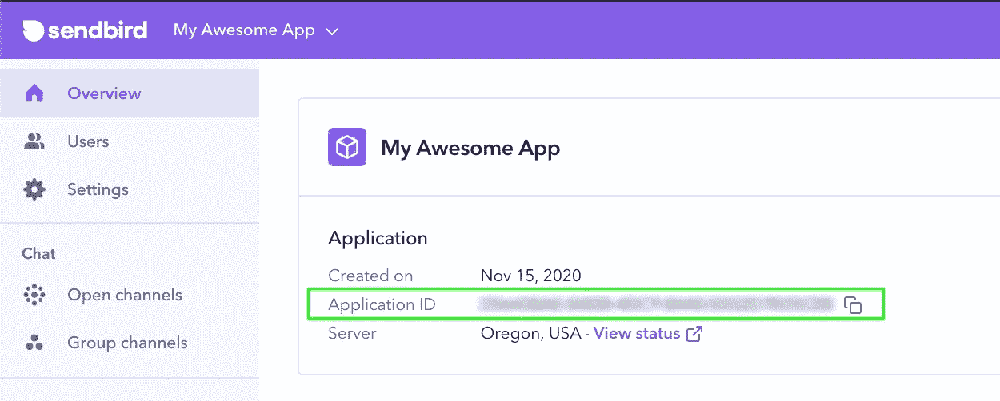
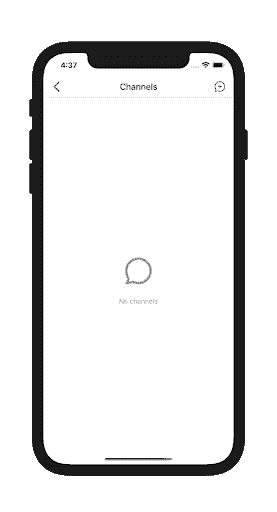
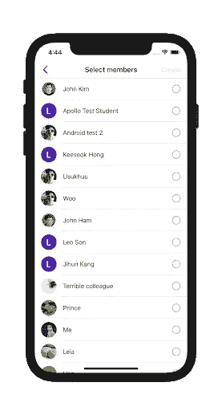
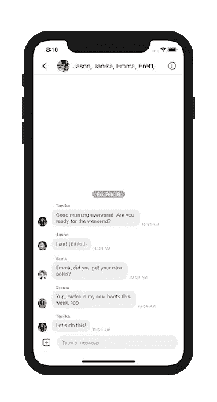

# 如何使用 Sendbird UIKit 快速将聊天添加到您的 Swift 应用程序中

> 原文：<https://medium.com/codex/how-to-quickly-add-chat-to-your-swift-app-with-the-sendbird-uikit-78bcee051743?source=collection_archive---------10----------------------->



仙鸟 2020

## 使用可定制的用户界面组件，在您的 iOS 应用上几分钟内启动并运行应用内聊天

由谷嘉诚
开发商代言| [仙鸟](https://www.sendbird.com/)

*你可能会发现查看 iOS UIKit* [*聊天示例*](https://github.com/SendbirdCommunity/sendbird-uikit-swift-sample) *很有用。有关本教程中材料的其他指导，请参见* [*文档*](https://sendbird.com/docs/chat/v3/ios/quickstart/send-first-message) *。您也可以查看 Sendbird Chat 的* [*演示*](https://sendbird.com/demos/in-app-chat) *并访问我们的* [*网站*](https://sendbird.com/features/chat-messaging/uikit) *以了解更多关于 Sendbird Chat 可以提供的内容。*

# 介绍

本教程讲解如何在一个 iOS 项目中使用 [**SwiftUI**](https://developer.apple.com/xcode/swiftui/) 实现 [**Sendbird 的 UIKit**](https://sendbird.com/docs/uikit) 。

开始之前，请确保您已经:

*   Xcode 版本 12.4 或更高版本
*   14 或更新版本的 iOS 部署版本
*   Cocoapods 1.10.1 或更新版本
*   一个活跃的 [**Sendbird 账号**](https://dashboard.sendbird.com/auth/signup)
*   一个现有的 Sendbird 项目或一个全新的 Swift UI 项目连同 [**这些指令**](https://developer.apple.com/tutorials/swiftui/creating-and-combining-views)

请注意，本教程假设您对 Swift 有基本的了解。

所以让我们开始吧！

# 第一步。将 Sendbird UIKit 添加到 Swift UI 项目

首先，将 Sendbird UIKit 依赖项添加到您的 Cocoapod。podspec 文件(关于使用 Carthage 的说明，参见 [**本页**](https://sendbird.com/docs/uikit/v1/ios/getting-started/install-uikit#2-install-with-carthage) ):

```
pod 'SendbirdUIKit'
```

确保最低平台版本为 10.3 或更高版本:

```
platform :ios, '10.3'
```

然后运行“pod 安装”。

# 第二步。创建 UIKit 容器

因为 Sendbird UIKit 最初是用 Apple UIKit 创建的，所以您需要创建一个返回 UIViewController 类的 UIViewControllerRepresentable 结构。

1.  首先创建一个新的 Swift 文件，并将其命名为“ChannelListView.swift”。
2.  通过导入“SwiftUI”和“SendBirdUIKit”替换默认的“import Foundation”导入语句。
3.  创建名为“ChannelListViewController”的 UIViewController 类。

**3a。**添加 Objective-C 函数，创建 UINavigationController 的实例，以 Sendbird 的 SBUCHannelListViewController 作为根视图控制器。

**3b。**在‘viewdidappear’覆盖块中调用该函数。

4.创建一个名为“ChannelListViewContainer”的 UIViewControllerRepresentable 结构。这将返回一个 ChannelListViewController 的实例。

**4a。**将 UIViewControllerType typealias 设置为上面的 ChannelListViewController 类。

**4b。让所需的 makeUIViewController 函数返回 ChannelListViewController 类的一个实例。**

**4c。**添加所需的 updateUIViewController 函数。如果需要，您可以将其留空。

# 第三步。在 Swift UI 中初始化 Sendbird

在默认的“ContentView.swift”文件中，我们将在 init()块中执行以下操作:

1.  使用' SBUMain.initialize()'初始化 Sendbird SDK，并传入一个应用程序 ID*。
2.  用唯一的用户 ID 指定当前用户。检索或设置这些 id 通常应该与您现有的用户管理过程一起完成。如果你想提前创建一些测试用户，请看 [**本视频**](https://youtu.be/QCS0eyO2Q3U?t=35) 。
3.  使用“SBUMain.connect”功能连接到 Sendbird，该功能将使用**以上的设置。
4.  更新 body 属性以利用我们之前创建的“ChannelListViewController”。

*   您的应用 ID 可以通过 [**Sendbird 仪表盘**](https://dashboard.sendbird.com/) 找到或创建:



* *请注意，如果应用 ID 无效或我们遇到连接错误，则 SBDUser 的实例将不会在完成处理程序中返回。

# 第四步。构建并运行

如果您使用有效的应用程序 id，然后构建它并在模拟器或设备上运行，您将看到以下屏幕:



UIKit 现在已经在您的 SwiftUI 应用程序中启动并运行了！

# 第五步。试车

使用按钮与另一个测试用户创建新的群组频道。在 UIKit 自动创建的 SBUCreateChannelViewController(或 SBUInivteUserViewController 或 SBUMemberListViewController)视图实例中出现任何用户之前，您的应用程序中至少需要有两个用户:



选择几个要创建频道的用户。然后点击“创建”按钮，自动打开一个 SBUChannelViewController 视图的实例。一旦您在用户中发送了一些消息，您将会看到类似这样的内容:



这里介绍的所有代码都可以在 [**这个 demo repo**](https://github.com/SendbirdCommunity/sendbird-uikit-swift-sample) 中找到。

# 结论

恭喜你！现在，您已经在 iOS 项目中实现了 Sendbird UIKit。

在本教程中，我们讲述了如何:

*   将 Sendbird 依赖项添加到 Swift iOS 项目中
*   创建一个 UIViewControllerRepresentable 容器来呈现 Sendbird 的 UIKit
*   在一个有效的 Swift 项目中初始化并运行 Sendbird 的 UIKit

如果您需要更多信息或指导，请不要忘记查看我们的 [**文档**](https://sendbird.com/docs/chat/v3/ios/quickstart/send-first-message) 。

开心聊楼！