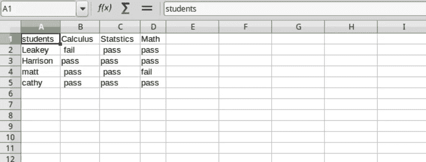

# 如何在 Python 中读写 CSV 文件

> 原文：<https://medium.com/codex/how-to-read-and-write-to-csv-files-in-python-380dabec30b4?source=collection_archive---------3----------------------->

了解如何使用 Pandas 和 CSV 库操作 CSV 文件


米卡·鲍梅斯特在 [Unsplash](https://unsplash.com/s/photos/csv?utm_source=unsplash&utm_medium=referral&utm_content=creditCopyText) 上的照片

CSV 文件是包含行和列的纯文本文件。CSV 文件中的行由换行符分隔，列由逗号分隔。

CSV 提供了一种简单的数据存储方式，通常用于在许多网站上导出表格数据。

## 简单的 CSV 文件

让我们编写一个包含学生数据的 CSV 文件，如下所示。

```
student, calculus,statistics,math
Harrison,pass,pass,pass
Leakey, fail, pass,pass
matt, pass, pass,fail
cathy, pass,pass,pass
```

## Python CSV 库

Python 提供了几种读写 CSV 文件的方法。在本教程中，我们将使用 CSV 模块和 pandas 库来读写 CSV 文件中的数据

## 读取 CSV 文件

让我们从创建 2 个文件开始，即

*   学生. txt
*   学生. py

接下来，将以下数据输入到 students.txt 文件中

```
student, calculus,statistics,math
Harrison,pass,pass,pass
Leakey, fail, pass,pass
matt, pass, pass,fail
cathy, pass,pass,pass
```

现在打开 students.py 文件，开始导入 CSV 模块

```
import csvwith open('students.txt') as my_file: reader = csv.reader(my_file, delimiter =',') for row in reader: print(row)
```

open()文件函数用于打开 Python 文件，支持 3 种文件操作模式

*   读取模式-r
*   写入模式-w
*   附加模式 a

csv.reader 通过遍历 csv 文件中的每一行来读取文件的内容。然后我们得到每一行并打印内容。分隔符指定使用哪个字符来分隔字段，在我们的例子中，它是一个逗号
,结果将是；

```
['student', ' calculus', 'statistics', 'math']
['Harrison', 'pass', 'pass', 'pass']
['Leakey', ' fail', ' pass', 'pass']
['matt', ' pass', ' pass', 'fail']
['cathy', ' pass', 'pass', 'pass']
```

## 使用 CSV 编写 CSV 文件

我们已经学习了如何读取一个 CSV 文件，但是假设我们想要写入一个 CSV 文件；我们该怎么做？。
写入文件的语法将保持不变，但我们将使用写入模式

```
with open('filename","w") as myfile:
    pass
```

让我们将学生数据的副本写入另一个文件

当写入 CSV 时，我们使用 writer 函数和 write 模式。writerow 会将一行数据写入新行。这是我们的新数据。



# 使用熊猫阅读 CSV 文件

Pandas 是一个允许处理表格数据(如 Excel 和 CSV)的模块。要使用 pandas 模块，我们首先需要用 pip 安装它。

```
pip install pandas
```

当 CSV 中有数据时，可以使用 Pandas 模块读取它。read_csv(): pandas 提供了 read_csv()函数来读取存储为 csv 文件的数据。

```
import pandas as pddata = pd.read_csv('students.csv')print(data)
```

在上面的代码中，您使用。read_csv()方法，并将文件作为参数传递。结果将是:

```
students Calculus Statstics  Math
0    Leakey     fail      pass  pass
1  Harrison     pass      pass  pass
2      matt     pass      pass  fail
3     cathy     pass      pass  pass
```

正如你所看到的，使用 pandas 提供了一种简单的方法来读取 CSV 文件。

# 使用熊猫写入 CSV 文件

为了使用 pandas 向 CSV 写入数据，我们使用 Dataframes。Dataframe 是以行和列的形式存储数据的对象。

## 结论

本教程涵盖了开始操作表格数据所需的概念。熊猫图书馆是用于数据科学的强大工具。它也很容易使用，因此节省时间和资源。

享受在媒体上阅读的乐趣，[创建一个帐户](https://essyking.medium.com/membership)以获得全部访问权限。如果你喜欢读这篇文章，你可能会喜欢？

[](https://betterprogramming.pub/how-to-plot-charts-and-graphs-with-matplotlib-using-python-ffb79ec6fd60) [## 如何使用 Python 用 Matplotlib 绘制图表和图形

### 成为用 Python 展示和组织数据的大师

better 编程. pub](https://betterprogramming.pub/how-to-plot-charts-and-graphs-with-matplotlib-using-python-ffb79ec6fd60)