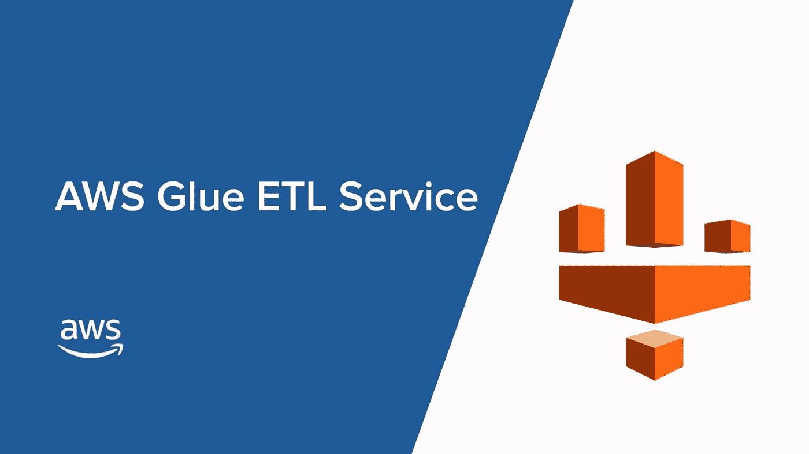

# 如何在不解压的情况下使用 AWS Glue 从亚马逊 S3 桶中读取压缩文件

> 原文：<https://medium.com/codex/how-to-read-compressed-file-in-an-amazon-s3-bucket-by-using-aws-glue-without-decompressing-it-b6515db863df?source=collection_archive---------1----------------------->



**AWS 胶水**

# **AWS 胶水介绍**

[*AWS Glue*](https://docs.aws.amazon.com/glue/latest/dg/what-is-glue.html) 是一个完全托管的提取、转换和加载( **ETL** )服务，使客户能够轻松准备和加载他们的数据进行分析。

您可以在 AWS 管理控制台中通过几次点击来创建和运行 ETL 作业。您只需将 AWS Glue 指向存储在 AWS 上的数据，AWS Glue 就会发现您的数据并将相关的元数据(例如表定义和模式)存储在 AWS Glue 数据目录中。AWS Glue 支持 spark (Pyspark 和 Scala)语言以及 **python shell** 。

一旦编目，您的数据就可以立即被搜索、查询和用于 ETL。AWS Glue 生成代码来执行数据转换和数据加载过程。

# **问题**

从某些来源，我们接收数据压缩格式直接进入我们的 S3 桶。挑战是在不解压缩文件的情况下读取这些压缩数据的内容。

所有在 S3 的压缩文件，无论是 zip 还是 gzip，我们都必须在一个脚本中处理两种不同的文件格式。

别担心，我们已经有了上述问题的解决方案，我们已经使用 python [*boto3*](https://boto3.amazonaws.com/v1/documentation/api/latest/reference/services/s3.html) 库，以及 [*zip*](https://docs.python.org/3/library/zipfile.html) 和 [*gzip*](https://docs.python.org/3/library/gzip.html#gzip.open) 模块来获得解决方案！

# **进场**

第一步是识别文件(或 S3 中的对象)是 zip 还是 gzip，我们将使用文件的路径(使用 Boto3 S3 [资源](https://boto3.amazonaws.com/v1/documentation/api/latest/guide/resources.html)对象)

这可以通过使用 python 的[*ends with*](https://python-reference.readthedocs.io/en/latest/docs/str/endswith.html)*函数来实现。同样在提供的 path 的帮助下，您可以将它分成 Bucket name 和 Key Name，这也可以在以后使用*

*基于压缩对象的标识，在脚本中将调用 zip 和 gzip(或任何其他)各自的块(这里，我使用了 If/Else)*

*一旦确定了文件格式，我们现在必须**读取 zip 文件的内容**。这可以通过将它读入一个**字节数**缓冲区对象来完成，然后我们需要迭代 zip 文件中的每个对象，我们使用 [*名称列表*](https://docs.python.org/3.6/library/zipfile.html#zipfile.ZipFile.namelist) 方法并最终写入 S3，我们可以使用[*meta . client . upload _ file obj*](https://boto3.amazonaws.com/v1/documentation/api/latest/reference/services/s3.html#S3.Client.upload_file)方法或[*client . put _ object*](https://boto3.amazonaws.com/v1/documentation/api/latest/reference/services/s3.html#S3.Client.put_object)*

*同样为了读取 gzip 文件的内容，我尝试了 [***Gzip 构造函数***](https://docs.python.org/3/library/gzip.html#gzip.GzipFile) ***。*** 它将使用 python 的 read 函数读取 S3 对象的内容，然后在 put_object Boto3 命令的帮助下，将这些内容作为文本文件转储到各自的目的地*

*我已经使用了[***AWS Glue—python shell***](https://docs.aws.amazon.com/glue/latest/dg/add-job-python.html)来执行以下代码，我们甚至可以使用 AWS Lambda 来执行相同的代码，但是 AWS Lambda 的唯一问题是执行时间限制，最长为 15 分钟。所以如果你的文件太大，可能会有问题。*

# *代码*

1.  *从 S3 路径返回存储桶和键名的函数:*

```
*def split_s3_path(s3_path):
 path_parts=s3_path.replace(“s3://”,””).split(“/”)
 bucket=path_parts.pop(0)
 key=”/”.join(path_parts)
 return bucket, key*
```

*这将以字符串格式返回提供的路径的存储桶名和键名*

*2.识别 Zip 文件的内容并将其提取到另一个位置*

```
*if path.endswith('.zip'):
 zip_obj = s3_resource.Object(bucket_name=bucket ,key=key_name)
 buffer = BytesIO(zip_obj.get()[“Body”].read())
 z = zipfile.ZipFile(buffer)for filename in z.namelist():
 file_info = z.getinfo(filename)
 s3_resource.meta.client.upload_fileobj(
 z.open(filename),
 Bucket=bucket,
 Key=output_location + filename,
 Config=config
 )*
```

*或者，也可以使用 is_zipfile()函数来代替 path.endswith()。*

*3.最后，我们还需要检查 Gzip 对象*

```
*elif path.endswith(‘.gz’):
 obj = s3.Object(bucket_name=bucket ,key=key_name)
 with gzip.GzipFile(fileobj=obj.get()[“Body”]) as gzipfile:
 content = gzipfile.read()
 client.put_object(Body=content, Bucket=bucket, Key=’newfolder/new_filename.txt’)*
```

*有了它，我们可以很容易地阅读 S3 的 zip 和 gzip 文件。*

# *结论*

*因此，正如我们已经看到的，借助 python 模块，我们可以轻松地读取任何压缩文件(zip/Gzip ),并且可以在 AWS Glue 中执行它，而不用担心任何时间限制。此外，我们可以轻松地创建压缩文件中内容的文本文件，而无需对其进行解压缩。*

*你甚至可以添加块来读取 bz2，tar 和许多其他压缩文件格式，只需使用 endswith 函数。*

*我希望这对开发人员和数据工程师有所帮助。请让我知道你对此的想法和/或任何可能的优化*