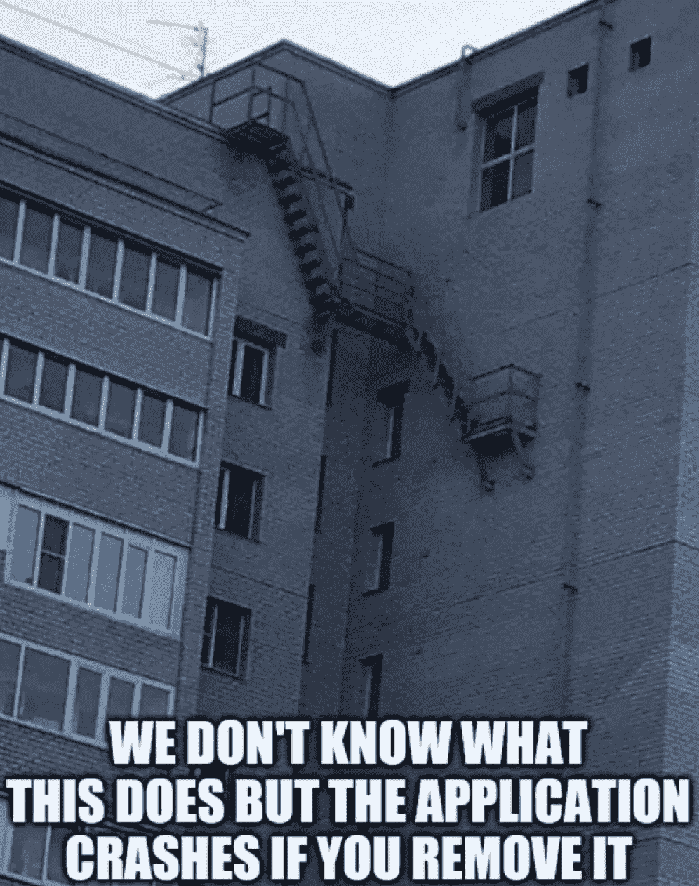
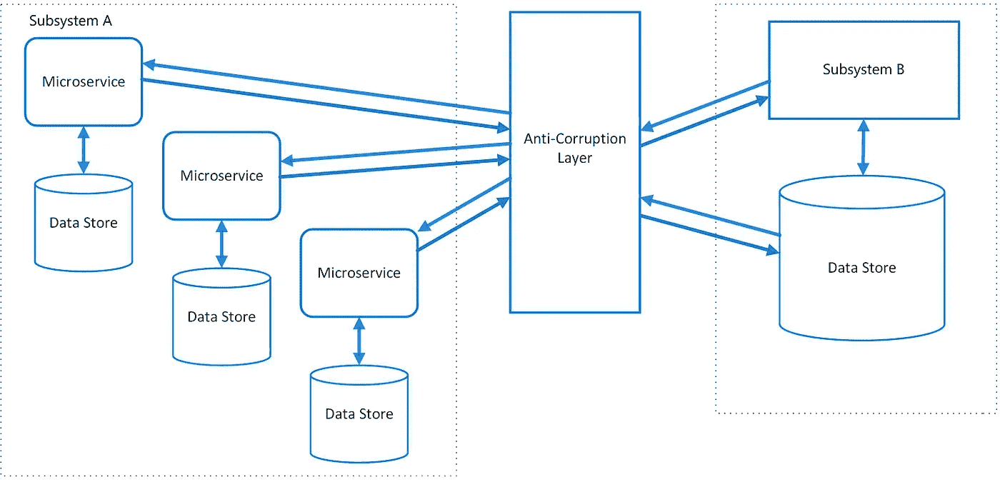
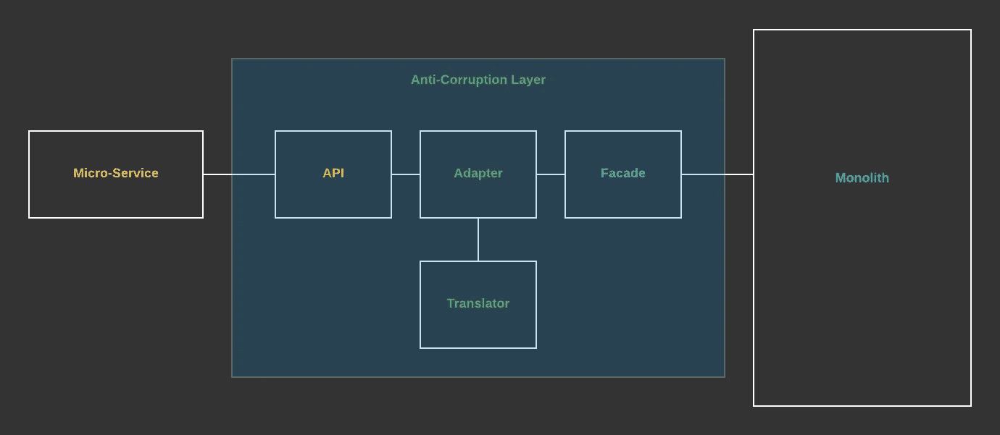

# 如何重构遗留代码

> 原文：<https://medium.com/codex/how-to-refactor-legacy-code-from-the-office-614f4860191d?source=collection_archive---------2----------------------->

## 关于反腐败层的指南

路易斯·汉瑟在 [Unsplash](https://unsplash.com?utm_source=medium&utm_medium=referral) 上拍摄的照片

嗨，我是尼科，

我是伦敦(英国)一家票务经纪公司的高级工程师。

你在办公室看书！

这是我每天(几乎)例行发布的日志，记录我在办公室的日常生活中使用的技术。

**这个帖子是给谁的？**

这里我们讨论 DDD、设计模式和反腐败层。

如果你还没到那一步，你可以这样开始:

[https://anastasionico.uk/blog/learn-php](https://anastasionico.uk/blog/learn-php)

 [## 领域驱动的设计最快{基础}

### 让我对你做一个小小的猜测，你浏览这个网站并正在阅读这句话的原因是…

anastasionico.uk](https://anastasionico.uk/blog/domain-driven-design-quickest-the-basics) 

# 问题是

当我还是个孩子的时候，当我拜访我祖母家的时候，我喜欢四处逛逛，探索每一个旧房间。在那些旧盒子、信件和发黄的报纸中，发现惊人的发现并不罕见。

尤其是从一个 5 岁小孩的角度来看。

我仍然清楚地记得有一次我碰到一个奇怪形状的黄铜游戏手柄，侧面有数字，底部刻有日期。

*1925 年 4 月 13 日*

正如你可能已经理解的，尽管它是由金属制成的，但它的休息很快就结束了，在短短的几分钟内，那东西被分裂成许多碎片。

很多时候，这些古董都是如此精致，所以明智的做法是不去碰它们，只让我看着它们。

今天，事情发生了变化，情况不太一样，但是，在某些方面。我也有同感。

事实上，我目前正在将一个 10 年前的 API 重构为更现代的东西，我必须说，这个任务并不缺乏挑战。

就像你们中从事遗留代码工作的人一样，徘徊和惊讶的感觉一天多次袭击我。

通常，它们伴随着生动的感叹词，如:

*   这是谁写的？
*   这里究竟为什么会有这个回路？
*   我这一生在做什么？

幸运的是，现在已经不是 1925 年了，人们已经开发了许多伟大的策略和模式，帮助我们不像一部旧的黄铜手机那样分解代码。

我年轻的时候就知道，有时候，不去管那些东西是更明智的做法。

# 领域驱动设计

我在上面提到的那些杰出人士中，有一个肯定是埃里克·埃文斯。

他是一名作家，提出了 DDD 的想法。

什么是 DDD？

想象一部电话。

电话不仅仅是一套金属和塑料的东西，我电话是某人的梦想，能够从很远的地方交流的概念。

它被塑造成尽可能好的形状来做它所做的事情，并且具有许多不同的功能，这些功能必须同步工作才能使通话成为可能。

埃文斯解释说，代码不应被视为包含符号的文件。

不仅仅是这样。

开始编码时，我们应该关注主要目标、梦想和目的是什么。

这需要代码在什么域中运行？

一旦我们完全理解了这一点，我们就可以确保编写正确的代码，而不会在代码库中引入错误

# 保持完整性

当多个团队在同一个代码库上工作时，或者像我这样，当我们处理很容易损坏的非常旧的代码时，需要特别注意不要破坏正在工作的代码。

**精致并不是破和的同义词，有可能的是，一个 10 岁的东西已经成为了企业的核心。**

在重构会话域、客户或订单的过程中，一个严重的错误就是弹指一挥间，一大块收入就会消失。

带来了几个在公司工作的人。

在我看来，域也是这样的。

那么，我们如何保存微妙的代码呢？

带有反腐败层的架构——来源:[微软](https://docs.microsoft.com/en-us/azure/architecture/patterns/anti-corruption-layer)

# 反腐败层

听好了，

大多数应用程序都是在没有使用适当的独立模型的情况下开发的，**如果这样的话，模型通常会很麻烦和混乱。**

有时，这些模型已经与系统如此紧密地结合在一起，所以最好不要碰它们，把它们放在外面。

这是处理遗留代码时的另一个挑战。

**反腐败层是位于我们的客户端和外部应用程序之间的一层(它可以是一个包、一个类或整个系统)。**

这一层必须仍然被认为是领域的 DDD 架构的完整部分。

它的角色是两个不同领域之间的翻译者

# 你是怎么实现的？

反腐败层应该被视为来自客户端模型的服务。

如果被认为是一种服务，它将非常容易被消费，同时介于两者之间。

**服务将进行翻译，我们的模型保持隔离。**

该层的形成方式是为每个域使用一个 facade，它转换这个 facade，然后，为了被消费，需要一个可以使用它的适配器。

如果像我这样，你的遗留代码中有许多不同的域。你将需要许多连接到它的门面，而且每个门面需要用它自己的适配器来“适应”,以避免混乱和多重责任。

反腐败层结构—来源:[介质](/swlh/while-creating-something-new-take-care-of-those-who-use-the-old-92aa5f5c0039)

# 你的观点是什么？

你用过反腐败层吗？

你写这个的经历是怎样的？

在下面的评论中写下你的想法。

# 结论

我已经做了将近十年的网页开发员了。

与位于伦敦市中心的世界级企业和屡获殊荣的营销机构合作。

此外，我在我的博客和在线社区上写文章和教程，并帮助企业在网上建立他们的存在。

[点击这里阅读我 100 多篇博文](https://anastasionico.uk/blog)