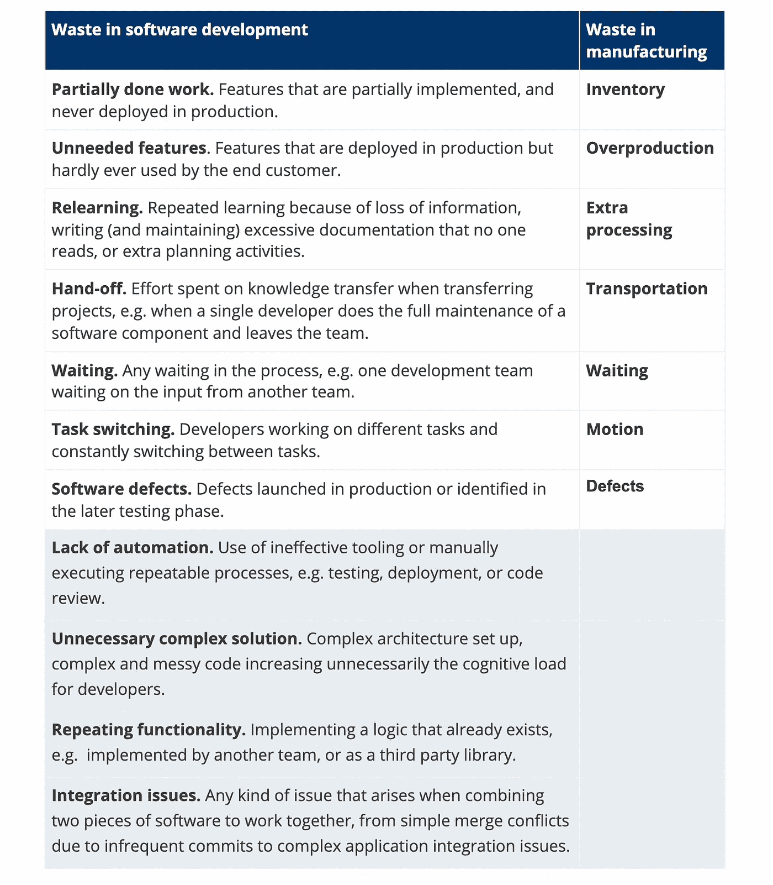
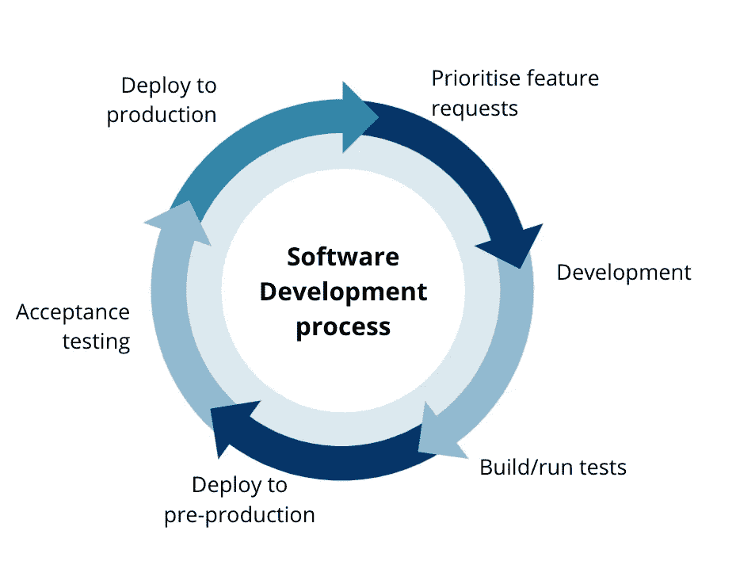
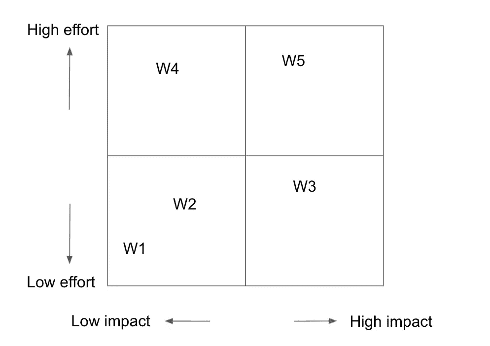

# 如何消除软件开发中的浪费

> 原文：<https://medium.com/codex/how-to-remove-waste-in-software-development-4660461c0f01?source=collection_archive---------7----------------------->

在我之前的[博客文章中，](https://marinastojanovski.medium.com/is-your-digital-product-ready-to-grow-e2b2c13f55ad)我指出在软件开发过程中最大限度地减少浪费是产品成功发展的关键因素之一。在这篇文章中，我将更详细地解释这一点:为什么消除浪费在每个过程中都很重要，软件开发中常见的浪费类型是什么，以及如何从结构上解决消除浪费的问题。

# 浪费的过程会导致巨大的损失

*浪费是指没有为客户增加价值的任何花费或努力。*

浪费是不需要的和无用的，如果管理不善，会导致巨大的损失。以时装业为例，据估计，到 2030 年，更好的废物管理每年可以为[€节省 40 亿英镑。大约 35%的浪费发生在服装到达最终消费者之前的供应链中。](https://www.globalfashionagenda.com/publications-and-policy/pulse-of-the-industry/)

我不知道在软件产品开发领域有这样的估计。与制造业相比，这个领域要抽象得多，因此量化浪费是一个更加困难的话题。然而，我认为在软件开发中，浪费的可能性更大，因为它通常是隐藏的，不容易被发现。意识到消除浪费行为的重要性的组织肯定会从更高的生产率和更满意的客户中受益。

# **软件开发中常见的浪费类型**

术语浪费与*精益制造*的概念密切相关，精益制造是一种专注于在制造系统中最大限度减少浪费和提高生产率的方法。精益制造的起源基于丰田生产系统，由日本工业工程师 Taichi Ohno 于 20 世纪 50 年代开发。太极设计了制造系统中的七种浪费:*库存、生产过剩、额外加工、运输、等待、运动和缺陷。*

精益作为一种哲学在最近几十年出现，并成为所有行业分支的灵感。消除浪费的想法在 90 年代变得如此流行，激发了精益软件开发和看板。精益制造中的七种浪费已经转化为软件开发中的七种浪费。

尽管这种翻译很好地抓住了软件开发中一些常见的低效率，但是我们不应该完全依赖它，因为软件开发是一个与制造非常不同的领域。在制造业中，一个实体产品是按照一定数量的步骤构建的，而在软件开发中，我们按照一个非常复杂的过程构建一些无形的东西。在制造业中，构建第二个产品意味着重复相同的过程，而在软件开发中，源代码可以简单地重用，无需重新实现。在软件开发中有一些类型的浪费对于制造业来说是不典型的，反之亦然。

在下表中，我列出了我在许多组织中遇到的最常见的低效问题。前七种源自精益制造，其他的是常见的浪费，但却是软件开发特有的。

图一。软件开发过程中的常见浪费

# **如何消除软件开发中的浪费**

有时组织会整合**的重点废物减少**方法。员工在清除垃圾时会投入一段特殊的时间。这可能是一个有用的实践，因为此时没有其他的特性开发优先级。然而，由于专门用于减少浪费的时间通常是有限的，这段时间通常导致清理非常容易解决的问题，例如，删除未使用的代码，清理积压。需要更关键的改变的问题，比如重新设计系统，或者调整治理方法，仍然没有解决。

另一种做法是**持续减少浪费**，将产品开发的一部分(10-15%)持续用于改进。这种方法的积极一面是它是一个连续的过程，不会阻碍特性的开发。然而在实践中，由于交付特性的截止日期紧迫，这 10–15%可能永远得不到优先考虑。要做到这一点，团队应该有一个良好的纪律，并确保定期将减少浪费的问题纳入他们的 sprint backlog 中。

虽然这两种方法都很有价值，但我经常发现它们的局限性。在第一种方法中，解决哪个问题的决定可能是由个人做出的，在第二种方法中，这通常是团队的决定。在回顾会议期间，开发团队可能会发现他们工作中的一个关键瓶颈，但是如果这不是团队可以自主解决的事情(例如，与另一个团队或产品经理的无效沟通)，他们会让问题悬而未决。

这是不幸的，因为这可能会导致在基础仍然错误的情况下花费精力解决小问题。产品开发是一个复杂的系统，需要不同利益相关者和团队的共同努力。在整个系统中应该有一个有效的信息流，以使这个系统的工作达到最佳状态。应对这一挑战的方法之一是组建一个由不同角色组成的团队，他们将以更具战略性和结构化的方式做出减少废物的决策。

## 识别流程中的浪费

从减少浪费开始的一个好方法是评估我们遵循的功能开发过程的每个阶段。我们评估每个阶段是否有效和高效地执行，以及是否产生高质量的输出。常见浪费的列表(图 1)可以用作指南，但是我们不应该只考虑这些类型的浪费。每个过程都是独一无二的，很可能包含自己独特的隐藏浪费。

图二。软件开发过程的例子

例如，产品开发可能遵循图 2 所示的过程。

当我们评估开发阶段时，我们可能会发现很高比例的用户故事处于“进行中”状态。这是上面列出的常见浪费之一——部分完成的工作。

团队应该讨论并找出这个问题背后的原因。这可能是由于频繁改变业务优先级，团队中缺乏领域知识，或者仅仅是低效的积压管理。虽然这个问题可能会被软件工程师发现，但是浪费是在之前的阶段，在特性请求优先级排序期间造成的，应该由产品所有者/经理来解决。

另一个例子可能是在验收测试阶段发现了大量的缺陷。这是前几个阶段测试不足的迹象。通过观察验收测试中确定的缺陷类型，我们可以发现单元测试或集成测试不够充分。一旦确定了浪费，解决方案就变得显而易见了——例如，调整测试策略和增加单元测试的代码覆盖率阈值。

## 按优先顺序处理

下一步是优先化。这是重要的一步，不应该避免。减少浪费的整个过程都需要付出努力，所以这种努力应该以最佳的方式来获得最佳的结果。

图 3。优先级矩阵

我们可以使用一个简单的优先排序技术，如图 3 所示，其中每个确定的浪费都分配有影响值和努力值(消除浪费所需的努力)。一旦我们在这个矩阵中绘制了浪费，我们就通过选择那些具有高价值和合理的低工作量的浪费来进行优先排序。例如，我们可以选择要解决的前三种浪费，并将其整合到我们的路线图中。

当然，做出准确的量化估计通常是不可行的，但也是不切实际和不必要的。根据我们的最佳猜测来确定浪费的优先顺序就足够了。

清除废物是一个持续渐进的过程。人们有容易适应浪费行为的自然倾向，因此建立一个整合精益思想的持续流程非常重要。

## **最终想法**

浪费通常是由于犯错误或没有意识到。但只要我们从这些错误中吸取教训，这就不是真正的浪费。如果我们对这些错误视而不见，不去做任何改进，那将是一种浪费。

PS。这是本系列所有文章的索引:

[#1。你的数字产品准备好成长了吗？](https://marinastojanovski.medium.com/is-your-digital-product-ready-to-grow-e2b2c13f55ad)

[#2。什么是有效的产品策略？](https://marinastojanovski.medium.com/what-is-an-effective-product-strategy-4c4fe27ee0ee)

[#3。为成功建立产品开发团队](https://marinastojanovski.medium.com/set-up-a-product-development-team-for-success-5de260e8fbfd)

[#4。如何消除软件开发中的浪费](https://marinastojanovski.medium.com/how-to-remove-waste-in-software-development-4660461c0f01)

#5.如何构建可扩展的软件产品(即将推出)