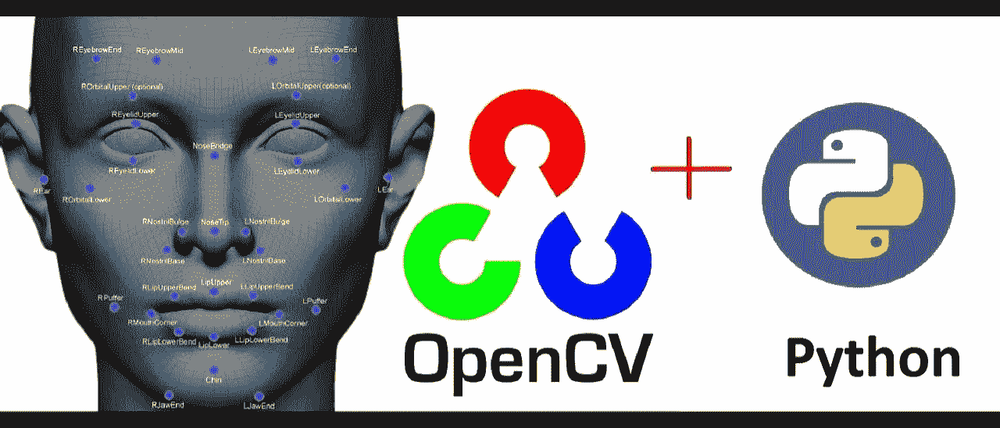
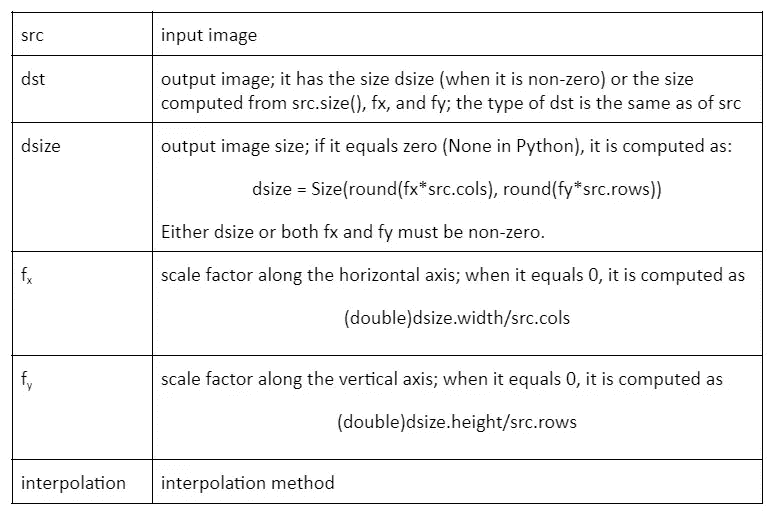

# 如何使用 Python OpenCV 调整图像大小？

> 原文：<https://medium.com/codex/how-to-resize-images-using-python-opencv-85a195cd8543?source=collection_archive---------15----------------------->



图片来自谷歌

让我们，从什么是 OpenCV 开始。OpenCV 或开源计算机视觉库是一个在 Apache 2.0 许可下的开源和免费使用的库。OpenCV 主要用于计算机视觉、图像处理和机器学习任务。该库最初是由英特尔在 1999 年开发的。OpenCV 支持多种语言，如 C++、Python、Java 等。，可以在 Windows、Linux、Android 和 Mac OS 上使用。它最初是用 C++编写，所有新的开发都是在 C++中进行的。Python、Java、MATLAB 被用作最初 OpenCV C++实现的包装器。

OpenCV C++ API 和 Python 的最佳品质结合在一起，形成了 OpenCV 的 Python API，称为 OpenCV-Python。虽然 Python 比 C/C++慢，但它可以很容易地用 C/C++进行扩展，这允许我们编写更快、更有效的代码。OpenCV-Python 可以与 Numpy 等各种 Python 库集成，以识别图像模式和结构进行分析。

对象检测、面部识别、自我运动估计、运动检测、分割等。是 OpenCV 的一些主要应用。该库还包括 boosting、决策树、k 近邻、随机森林、支持向量机、深度神经网络等。

# **图像大小调整**

调整图像大小意味着缩放图像或改变原始尺寸、宽度和/或高度。

图像大小调整包括:

*   像素的重采样
*   新像素的插值
*   保持图像的纵横比

***调整大小功能***

*语法:*

```
resize(src, dsize[, dst[, fx[, fy[, interpolation]]]])
```

在哪里，



变量描述

# **调整大小方法**

1.  **带比例因子**

缩放因子也称为比例因子，是缩放或乘以某个量的数字，在本例中是图像的宽度和高度。它有助于保持纵横比和显示质量。因此，当您放大或缩小图像时，它不会出现失真。

*代码:*

```
# Importing librariesimport cv2from google.colab.patches import cv2_imshow# Reading the imageimage = cv2.imread("/content/neon.jpg")print("Shape:", image.shape)cv2_imshow(image)# Scaling Up the image 1.8 and 1.4 times at x and y axis respectively by specifying both scaling factorsup_x = 1.8up_y = 1.4# Scaling Down the image 0.2 times specifying a single scale factordown = 0.2scaled_down = cv2.resize(image, None, fx=down, fy=down, interpolation=cv2.INTER_LINEAR)scaled_up = cv2.resize(image, None, fx= up_x, fy= up_y, interpolation=cv2.INTER_LINEAR)# Display images and press any key to check next imageprint("Scaled Down\n")cv2_imshow(scaled_down)cv2.waitKey()print("\nScaled Up\n")cv2_imshow(scaled_up)cv2.waitKey()
```

**2。带宽度和高度**

它将根据指定的高度和宽度调整图像的大小。

*代码:*

```
# Set rows and columns# Downsize the image using new  width and heightdown_width = 800down_height = 500down_points = (down_width, down_height)resize_down = cv2.resize(image, down_points, interpolation= cv2.INTER_LINEAR)# Downsize the image using new  width and heightup_width = 1500up_height = 2500up_points = (up_width, up_height)resize_up = cv2.resize(image, up_points, interpolation = cv2.INTER_LINEAR)# Display imagesprint("Resized Down by defining height and width\n")cv2_imshow(resize_down)cv2.waitKey()print("\nResized Up by defining height and width\n")cv2_imshow(resize_up)cv2.waitKey()cv2.destroyAllWindows()
```

如需完整代码，请访问下面的 [Colab 笔记本](https://colab.research.google.com/drive/1r9dTeaK9Y_Ki4olNgGX9JjCLmBEELTHX?usp=sharing)。

***感谢您的阅读！***