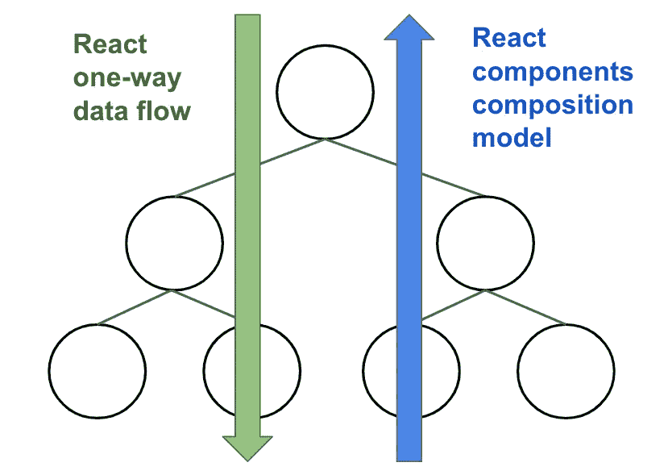

# 如何用 React 测试库复用测试？

> 原文：<https://medium.com/codex/how-to-reuse-tests-with-react-testing-library-a36049715942?source=collection_archive---------7----------------------->

React 测试库是一个测试 React 组件的轻量级解决方案。它使用 JavaScript 测试运行器来运行测试，并让您测试选择器和固定文本。重用测试非常容易。它可以在 React repo 上获得。这里有一个如何使用它的快速教程。

React 测试库是一个测试 React 组件的轻量级解决方案