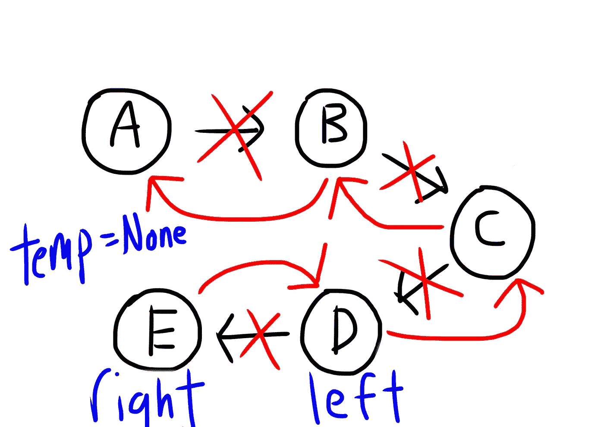

# 如何反转链表——使用 Python 直观地解释

> 原文：<https://medium.com/codex/how-to-reverse-a-linked-list-explained-visually-using-python-8eb5fad9e64f?source=collection_archive---------6----------------------->

事实上，几年前我花了很长时间才明白如何做到这一点，并希望尽可能清楚地解释这一点。如果你对链表完全陌生，我以前写过一篇短文，从本质上解释了它们是什么以及如何在这里对它们进行编码: