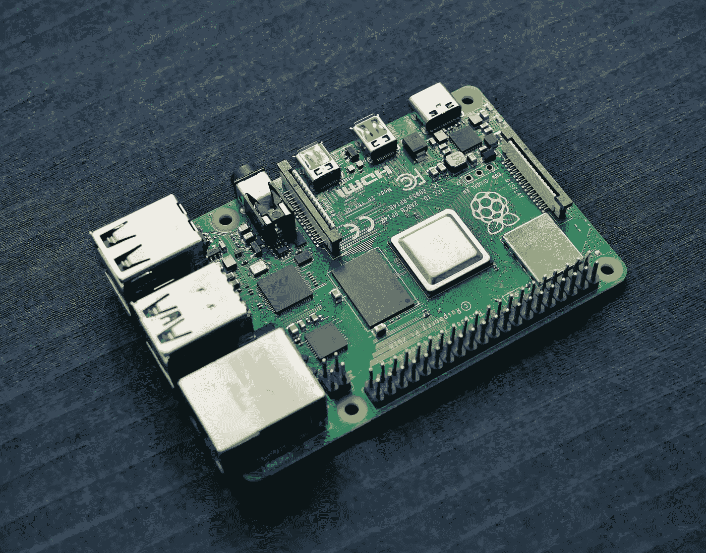

# 如何在您的 Raspberry Pi 上启动运行 Python 程序

> 原文：<https://medium.com/codex/how-to-run-a-python-program-at-startup-on-your-raspberry-pi-d5cc1730d4db?source=collection_archive---------0----------------------->

Vishnu Mohanan 在 [Unsplash](https://unsplash.com/s/photos/raspberry-pi?utm_source=unsplash&utm_medium=referral&utm_content=creditCopyText) 上的照片

如果你读过我的其他文章，你会知道我正在建造一个人工智能喂鸟器。我没有意识到的一个问题是让我的主要 python 脚本在 Raspberry Pi 打开时自动运行。在这个项目的最后阶段，我没有键盘、显示器或鼠标插入 Pi，所以我需要一种方法让程序自己运行。安…