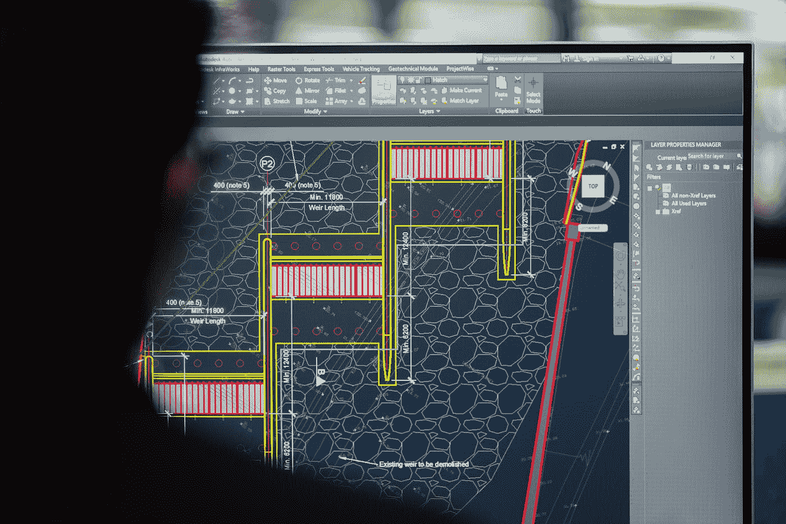

# 如何进行一次成功的软件工程师绩效评审？

> 原文：<https://medium.com/codex/how-to-run-a-successful-software-engineer-performance-review-4587d4a6431f?source=collection_archive---------15----------------------->

在绩效评估过程中，你会问不同的问题，这取决于你所在的组织类型和你的项目范围。例如，在迭代软件开发项目中，开发人员完成任务的速度是一个重要的度量标准。如果你有一个大型开发团队，你的软件工程师的能力将决定你项目的成败。

在 [Unsplash](https://unsplash.com?utm_source=medium&utm_medium=referral) 上拍摄的 [ThisisEngineering RAEng](https://unsplash.com/@thisisengineering?utm_source=medium&utm_medium=referral)