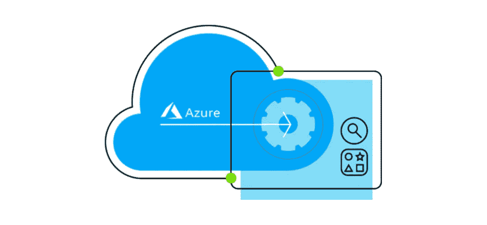

# 如何在 Azure 上运行后台作业

> 原文：<https://medium.com/codex/how-to-run-background-jobs-on-azure-eb16a791e6a8?source=collection_archive---------12----------------------->

一些应用程序作为不需要用户交互的后台任务运行。它们独立运行，不需要用户界面的帮助。后台作业启动交互，并不断接受交互式用户请求。它最小化了应用程序通常给用户界面带来的负担。

例如，一个应用程序需要生成用户正在浏览的图像的缩略图…