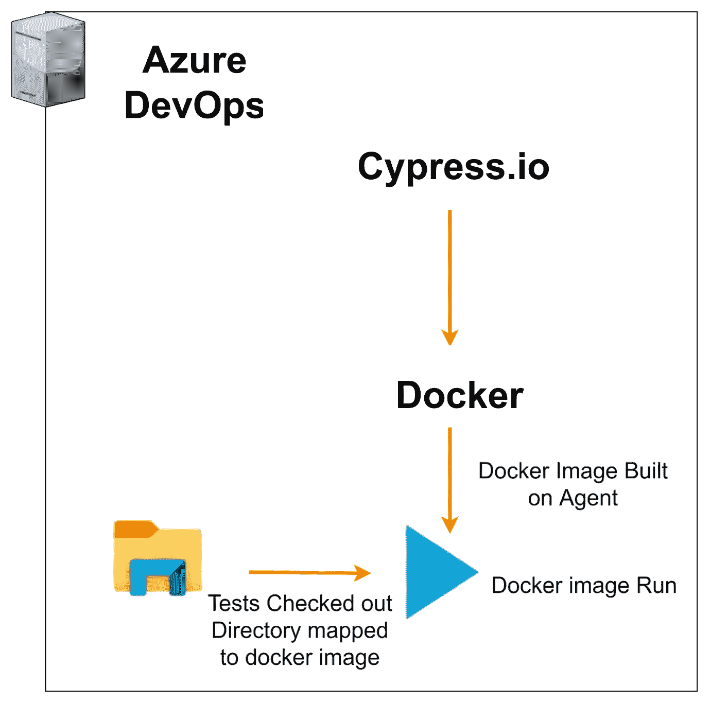
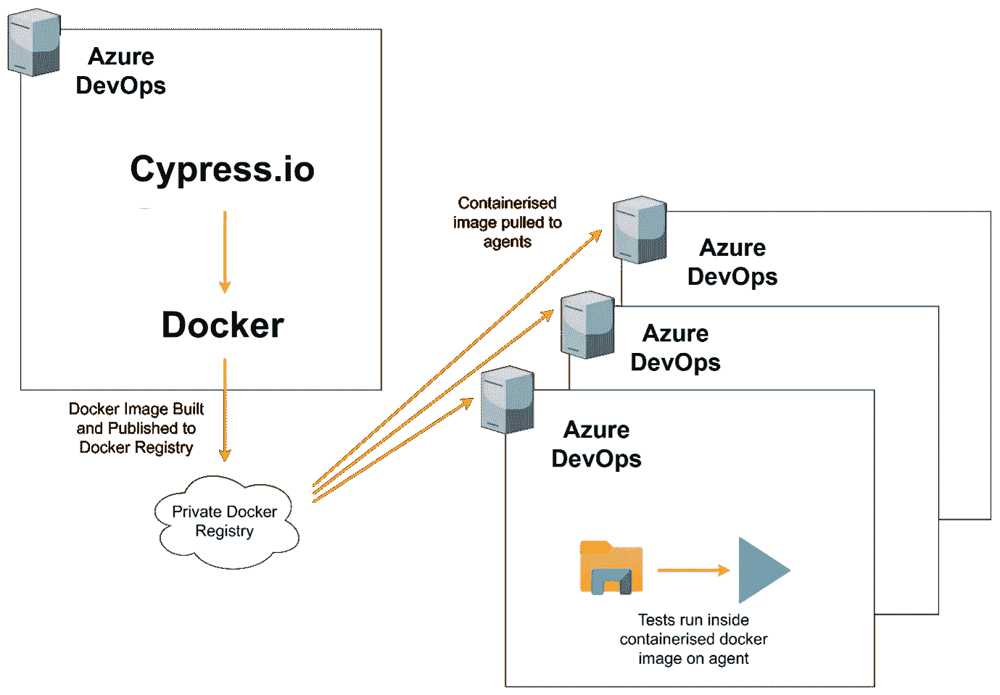

# 如何在 Azure DevOps 中将 Cypress Docker 映像作为构建代理运行

> 原文：<https://medium.com/codex/how-to-run-cypress-docker-images-as-build-agents-in-azure-devops-72050cb54cc9?source=collection_archive---------3----------------------->

通过在不同浏览器版本上运行的灵活性，减少测试执行时间

*作者:*

[*奥立弗琼脂*](https://www.linkedin.com/in/oliver-agar-1a31445/) *，测试工程高级软件开发工程师*[](https://www.sidetrade.com/?utm_source=other&utm_medium=other&utm_campaign=Medium-Cypress-Azure)

*[*萨姆贝里*](https://www.linkedin.com/in/sam-berry98/) *，软件开发工程师* [*侧钻*](https://www.sidetrade.com/?utm_source=other&utm_medium=other&utm_campaign=Medium-Cypress-Azure)*

*[*西蒙·帕尔*](https://www.linkedin.com/in/drsimonparr) *，在*[*side trade*](https://www.sidetrade.com/?utm_source=other&utm_medium=other&utm_campaign=Medium-Cypress-Azure)从事测试工程的高级软件开发人员*

*在 [Sidetrade](https://www.sidetrade.com/?utm_source=other&utm_medium=other&utm_campaign=Medium-Cypress-Azure) 之前，我们一直专注于开发在构建管道中运行的自动化测试。我们的口号是能够在任何时候针对任何环境运行我们的测试——无论是发布还是开发——以便我们能够向客户交付尽可能好的质量。*

*我们在下面解释我们如何设法在 [Azure DevOps](https://azure.microsoft.com/en-us/services/devops/?nav=min#overview) 中运行我们的自动化 UI 测试，同时并行运行测试以减少测试执行时间，同时也给我们针对不同浏览器版本运行的灵活性。*

# *设置 Azure DevOps 代理*

*最初，我们需要将 [Cypress](https://www.cypress.io/) 安装到我们管道中的每个代理上。不一定是问题，因为它只是通过[节点包管理器](https://www.npmjs.com/) (npm)安装。然而，随着时间的推移，每一个新版本的 Cypress 都会占用代理的资源。*

*考虑到这一点，我们创建了包含 Cypress 映像和相关必要工具的 docker 映像(例如 [Oracle Instant Client](https://www.oracle.com/database/technologies/instant-client.html) )。代理会检查我们的测试，并在 docker 容器中运行它们。如果不需要每次运行都安装 Cypress，代理就不需要每次运行都花时间安装必要的包，从而加快了测试的执行。*

**

**作者图片**

*然而，如果测试停滞或耗时太长，Azure DevOps 会停止运行，但容器映像仍会在代理上运行，耗尽其资源。我们需要进入特工体内杀死容器。*

*然后，我们研究了创建集装箱码头形象，供我们的代理使用。这是供我们的构建代理使用和执行测试的单一映像。我们现在只需要维护我们的图像，然后可以跨多个代理使用。*

**

*作者图片*

*创建了两个图像:*

*基于 Cypress 基本节点图像的带有[边缘](https://www.microsoft.com/en-us/edge)、 [Chrome](https://www.google.co.uk/chrome/) 和 [Firefox](https://www.mozilla.org/en-GB/firefox/) 的基本图像*

*使用我们的浏览器映像，构建了另一个安装了 Cypress 和其他测试所需工具的映像*

*这给了我们一次又一次重用相同映像的灵活性，以及轻松扩展我们的构建代理的能力。使用我们的定制映像作为代理，在测试执行时，它将复制我们的测试并运行测试中的特性。*

# *浏览器版本管理*

*为了充分代表我们应用的目标用户，我们需要在 Chrome、Edge 和 Firefox 上进行测试。这些浏览器大约每六周发布一个新的主要版本。*

*从经验来看，我们已经看到了引入新浏览器功能时出现的问题，特别是在安全性和 cookie 处理方面，因此我们必须通过每隔几个月更新我们的基本映像来密切跟踪每个浏览器的当前发布版本。*

*因为我们现在有了各种浏览器图像的基础图像，所以当客户对特定的浏览器版本有问题时，我们可以快速地在以前的浏览器版本上运行我们的测试。*

*我们还跟踪大多数浏览器的测试版分支，以确保我们在任何重大问题上获得早期警报。*

# *测试的并行化*

*随着测试套件的增长，我们需要减少测试执行的时间。虽然使用 [Cypress 仪表盘](https://www.cypress.io/dashboard/)可以做到这一点，但这不是一个选项。*

*因此，我们利用 Azure DevOps 中的[矩阵策略，在可用代理之间外包测试规范/浏览器执行。](https://docs.microsoft.com/en-us/azure/devops/pipelines/get-started-multiplatform?view=azure-devops)*

```
*parameters:- name: platformdisplayName: Platform Under Testtype: stringdefault: Platform01values:- Platform01- Platform02- Platform03- name: uiSuitesdisplayName: UI Feature Teststype: objectdefault:suites:- ‘Feature1’- ‘Feature2’- ‘Feature3’- ‘Feature4’- name: testBrowserdisplayName: Browsers to Runtype: objectdefault:browsers:- chrome- edge- firefoxvariables:dockerContainer: <Our Custom Cypress Docker Image>stages:- stage: uiRundependsOn: []condition: succeededOrFailed()jobs:- job: uiSuitestimeoutInMinutes: Xpool: Linuxcontainer: $[ variables[‘dockerContainer’] ]dependsOn: []strategy:matrix:${{ each suite in parameters.uiSuites.suites }}:${{ each browser in parameters.testBrowser.browsers }}:${{ suite }}-${{ browser }}:TAG: ${{ suite }}BROWSER: ${{ browser }}steps:- script: npm run cy:run:$(platform) run — — browser $(BROWSER) –spec “cypress/integration/$(TAG).featurecontinueOnError: true- task: PublishBuildArtifacts@1inputs:PathtoPublish: ‘$(System.DefaultWorkingDirectory)’ArtifactName: ‘drop_$(TAG)_$(BROWSER)’publishLocation: ‘Container’- task: PublishTestResults@2inputs:testResultsFormat: ‘JUnit’testResultsFiles: ‘**/test-results.*.xml’failTaskOnFailedTests: truetestRunTitle: ‘UI Run $(uiSuites) — $(BROWSER)’*
```

*这给了我们在管道运行时选择测试平台、运行特性和浏览器的灵活性。对于每个功能/浏览器组合，在 Azure DevOps 中创建一个构建作业。当代理从池中可用时，将运行功能测试。可用的代理越多，我们可以并行运行的功能/浏览器组合就越多。根据 Azure DevOps 中的工作负载，我们还有机会让更多代理上线。总的来说，这将我们的测试执行时间提高了 80%以上。*

**

*作者图片*

*不是所有的测试都适合并行化，要么是由于应用程序、我们的测试中的疏忽，要么是出于效率的设计。为了确保我们在并行运行中只包括合适的测试套件，我们确定了哪些套件在并行运行时会出现问题，并在管道中创建了一个单独的步骤，以确保每个套件都在一个代理上运行，称为“顺序套件”。*

# *结论*

*通过使用我们的定制 docker 构建映像作为容器化代理，再加上矩阵策略，我们已经看到测试执行时间从大约八个小时减少到仅仅一个小时。为了不从开发者构建中攫取构建代理，我们还引入了专门的测试场代理来执行我们的测试。*

*请在下面的评论中告诉我们您的想法，不要忘记关注我们在 Sidetrade Tech Hub 上的更多活动！*