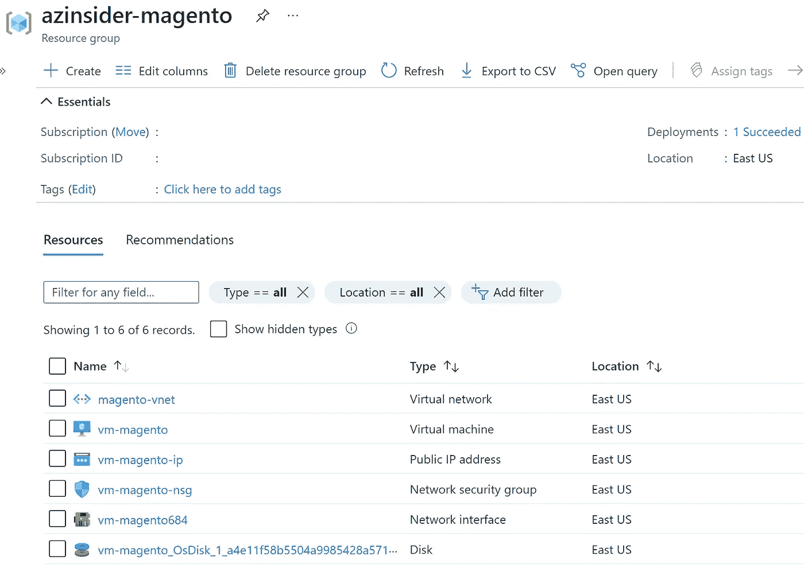
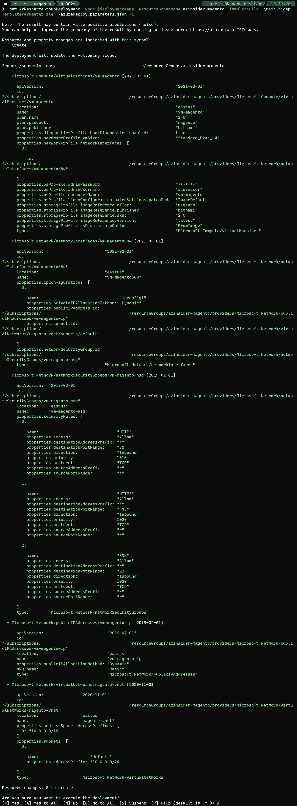
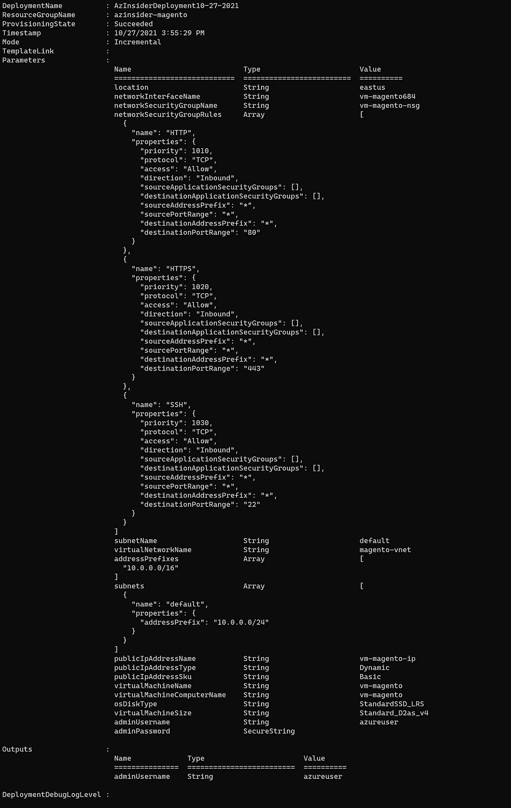

# 💪如何使用 Bicep 在 Azure 中运行 Magento

> 原文：<https://medium.com/codex/how-to-run-magento-in-azure-using-bicep-c685feedd7c3?source=collection_archive---------5----------------------->

这个示例场景展示了使用基础设施即代码将 Magento 部署到 Azure 中的 Linux VM。


如何使用 Bicep 在 Azure 中运行 Magento

本文将回顾如何使用 Bicep 在 Linux 虚拟机中部署 Magento，Bicep 是一种用于声明式部署 Azure 资源的领域特定语言(DSL)。

Magento 是一个用 PHP 编写的开源电子商务平台。它使用多种其他 PHP 框架，如 Laminas 和 Symfony。

# 先决条件

*   一个活跃的 Azure 账户:你可以[免费](https://azure.microsoft.com/free/)创建一个账户。
*   [Azure 二头肌](https://github.com/azure/bicep)安装在你的本地机器上。
*   Azure PowerShell。参见:[安装 Azure PowerShell](https://docs.microsoft.com/en-us/powershell/azure/install-az-ps) 。
*   Azure 订阅中的资源组

我们开始吧！

# 解决方案概述

我们将创作一个 Bicep 模板，在 Azure 中基于 Linux 的虚拟机上创建一个 Magento 实例。

我们将处理两个文件:

*   *main.bicep* :这是二头肌模板
*   *azure deploy . parameters . JSON*:这个参数文件包含用于部署 Bicep 模板的值

在部署此解决方案之前，我们必须接受虚拟机映像的法律条款。要阅读并接受法律条款，您可以使用 PowerShell 通过下面的 cmdlet 接受条款和条件:

```
Get-AzMarketplaceTerms `
-Publisher 'bitnami' `
-Product 'moodle' `
-Name '3-0' |
Set-AzMarketplaceTerms -Accept
```

# 部署的资源

*   Linux Debian 10.10 虚拟机
*   IP 地址(公有和私有)
*   虚拟网络和子网
*   唱片
*   网络安全配置



Magento —部署的资源

现在让我们使用 Bicep 模板在 Azure 上部署 Moodle。

# 1.Azure 二头肌模板-参数

我们将定义以下参数:

```
param location string
param networkInterfaceName string
param networkSecurityGroupName string
param networkSecurityGroupRules array
param subnetName string
param virtualNetworkName string
param addressPrefixes array
param subnets array
param publicIpAddressName string
param publicIpAddressType string
param publicIpAddressSku string
param virtualMachineName string
param virtualMachineComputerName string
param osDiskType string
param virtualMachineSize string
param adminUsername string@secure()
param adminPassword string
```

# 2.Azure 二头肌模板-变量

我们将定义以下变量:

```
var nsgId = resourceId(resourceGroup().name, 'Microsoft.Network/networkSecurityGroups', networkSecurityGroupName)
var vnetId = resourceId(resourceGroup().name, 'Microsoft.Network/virtualNetworks', virtualNetworkName)
var subnetRef = '${vnetId}/subnets/${subnetName}'
```

# 3.Azure 二头肌模板—资源

我们将定义以下资源:

```
resource networkInterfaceName_resource 'Microsoft.Network/networkInterfaces@2021-03-01' = {
  name: networkInterfaceName
  location: location
  properties: {
    ipConfigurations: [
      {
        name: 'ipconfig1'
        properties: {
          subnet: {
            id: subnetRef
          }
          privateIPAllocationMethod: 'Dynamic'
          publicIPAddress: {
            id: pip.id
          }
        }
      }
    ]
    networkSecurityGroup: {
      id: nsgId
    }
  }
  dependsOn: [
    networkSecurityGroupName_resource
    virtualNetworkName_resource
    pip
  ]
}resource networkSecurityGroupName_resource 'Microsoft.Network/networkSecurityGroups@2019-02-01' = {
  name: networkSecurityGroupName
  location: location
  properties: {
    securityRules: networkSecurityGroupRules
  }
}resource virtualNetworkName_resource 'Microsoft.Network/virtualNetworks@2020-11-01' = {
  name: virtualNetworkName
  location: location
  properties: {
    addressSpace: {
      addressPrefixes: addressPrefixes
    }
    subnets: subnets
  }
}resource pip 'Microsoft.Network/publicIpAddresses@2019-02-01' = {
  name: publicIpAddressName
  location: location
  properties: {
    publicIPAllocationMethod: publicIpAddressType
  }
  sku: {
    name: publicIpAddressSku
  }
}resource virtualMachineName_resource 'Microsoft.Compute/virtualMachines@2021-03-01' = {
  name: virtualMachineName
  location: location
  properties: {
    hardwareProfile: {
      vmSize: virtualMachineSize
    }
    storageProfile: {
      osDisk: {
        createOption: 'FromImage'
        managedDisk: {
          storageAccountType: osDiskType
        }
      }
      imageReference: {
        publisher: 'bitnami'
        offer: 'magento'
        sku: '2-0'
        version: 'latest'
      }
    }
    networkProfile: {
      networkInterfaces: [
        {
          id: networkInterfaceName_resource.id
        }
      ]
    }
    osProfile: {
      computerName: virtualMachineComputerName
      adminUsername: adminUsername
      adminPassword: adminPassword
      linuxConfiguration: {
        patchSettings: {
          patchMode: 'ImageDefault'
        }
      }
    }
    diagnosticsProfile: {
      bootDiagnostics: {
        enabled: true
      }
    }
  }
  plan: {
    name: '2-0'
    publisher: 'bitnami'
    product: 'magento'
  }
}
```

# 4.Azure 二头肌模板—输出(可选)

我们将定义以下输出:

```
output adminUsername string = adminUsername
```

# 5.参数文件

下面的代码显示了参数文件的定义:

```
{
    "$schema": "[https://schema.management.azure.com/schemas/2015-01-01/deploymentParameters.json#](https://schema.management.azure.com/schemas/2015-01-01/deploymentParameters.json#)",
    "contentVersion": "1.0.0.0",
    "parameters": {
        "location": {
            "value": "eastus"
        },
        "networkInterfaceName": {
            "value": "vm-magento684"
        },
        "networkSecurityGroupName": {
            "value": "vm-magento-nsg"
        },
        "networkSecurityGroupRules": {
            "value": [
                {
                    "name": "HTTP",
                    "properties": {
                        "priority": 1010,
                        "protocol": "TCP",
                        "access": "Allow",
                        "direction": "Inbound",
                        "sourceApplicationSecurityGroups": [],
                        "destinationApplicationSecurityGroups": [],
                        "sourceAddressPrefix": "*",
                        "sourcePortRange": "*",
                        "destinationAddressPrefix": "*",
                        "destinationPortRange": "80"
                    }
                },
                {
                    "name": "HTTPS",
                    "properties": {
                        "priority": 1020,
                        "protocol": "TCP",
                        "access": "Allow",
                        "direction": "Inbound",
                        "sourceApplicationSecurityGroups": [],
                        "destinationApplicationSecurityGroups": [],
                        "sourceAddressPrefix": "*",
                        "sourcePortRange": "*",
                        "destinationAddressPrefix": "*",
                        "destinationPortRange": "443"
                    }
                },
                {
                    "name": "SSH",
                    "properties": {
                        "priority": 1030,
                        "protocol": "TCP",
                        "access": "Allow",
                        "direction": "Inbound",
                        "sourceApplicationSecurityGroups": [],
                        "destinationApplicationSecurityGroups": [],
                        "sourceAddressPrefix": "*",
                        "sourcePortRange": "*",
                        "destinationAddressPrefix": "*",
                        "destinationPortRange": "22"
                    }
                }
            ]
        },
        "subnetName": {
            "value": "default"
        },
        "virtualNetworkName": {
            "value": "magento-vnet"
        },
        "addressPrefixes": {
            "value": [
                "10.0.0.0/16"
            ]
        },
        "subnets": {
            "value": [
                {
                    "name": "default",
                    "properties": {
                        "addressPrefix": "10.0.0.0/24"
                    }
                }
            ]
        },
        "publicIpAddressName": {
            "value": "vm-magento-ip"
        },
        "publicIpAddressType": {
            "value": "Dynamic"
        },
        "publicIpAddressSku": {
            "value": "Basic"
        },
        "virtualMachineName": {
            "value": "vm-magento"
        },
        "virtualMachineComputerName": {
            "value": "vm-magento"
        },
        "osDiskType": {
            "value": "StandardSSD_LRS"
        },
        "virtualMachineSize": {
            "value": "Standard_D2as_v4"
        },
        "adminUsername": {
            "value": "your-admin-username"
        },
        "adminPassword": {
            "value": null
        }
    }
}
```

# 6.Azure Bicep 模板-部署

我们将使用下面的命令来部署我们的二头肌模板:

```
$date = Get-Date -Format "MM-dd-yyyy"
$deploymentName = "AzInsiderDeployment"+"$date"New-AzResourceGroupDeployment -Name $deploymentName -ResourceGroupName azinsider-magento -TemplateFile .\main.bicep -TemplateParameterFile .\azuredeploy.parameters.json -c
```

下图显示了部署的预览:



部署预览

然后我们将执行部署。下图显示了部署输出:



部署输出

现在，您可以从 Azure 门户获取公共 IP 和私有 IP，并浏览到 Magento 实例:


Magento 在 Azure 使用二头肌

该解决方案的完整代码可以在以下 URL 中找到。请随意投稿！

[](https://github.com/daveRendon/azinsider/tree/main/application-workloads/magento) [## 主 daveRendon/azinsider 上的 azin sider/应用程序工作负载/magento

### 在 GitHub 上创建一个帐户，为 daveRendon/azinsider 开发做出贡献。

github.com](https://github.com/daveRendon/azinsider/tree/main/application-workloads/magento) 

👉 [*在此加入****azin sider****邮箱列表。*](http://eepurl.com/gKmLdf)

*-戴夫·r·*