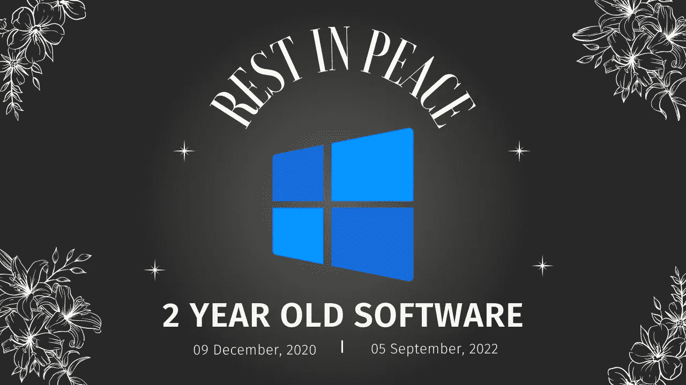

# 如何拯救老化的软件以保证产品的长寿

> 原文：<https://medium.com/codex/how-to-save-aging-software-to-guarantee-a-long-living-product-7a71b3e58196?source=collection_archive---------12----------------------->

## 对抗衰老的风险和基本原则

图片由[作者](http://www.arnoldcode.com)经由 Canva.com 制作

只需要一个简单的请求就可以扩展已经运行多年的软件的功能，而且没有人需要关心代码。

[或者仅仅是一个 npm 包分销商改变了主意](https://www.theregister.com/2016/03/23/npm_left_pad_chaos/)，以前使用的包已经被简单地停止了。作为一个…