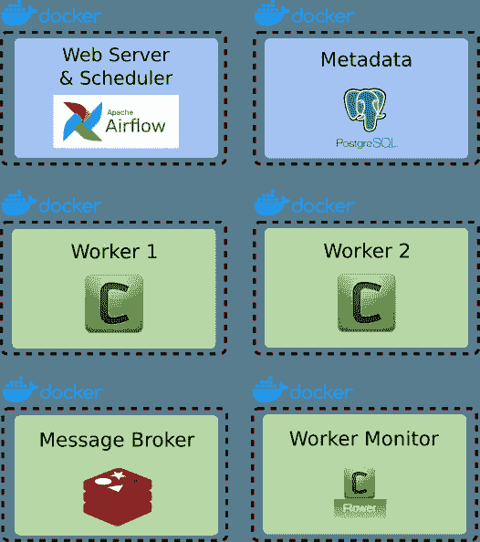
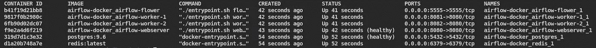
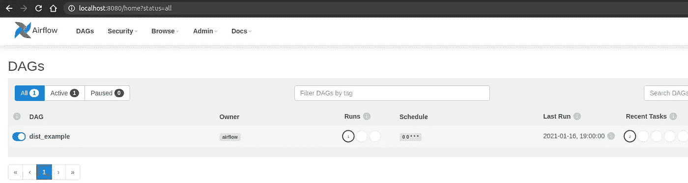
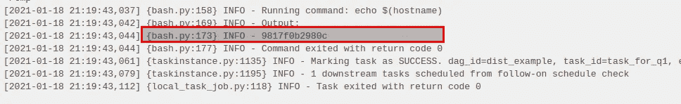
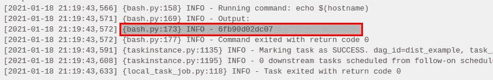
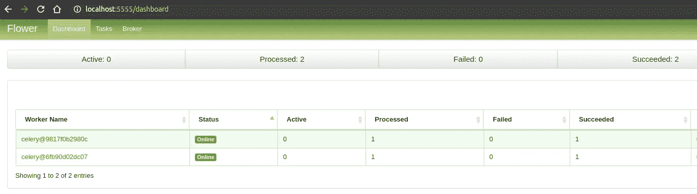

# 如何使用 Redis 和 Celery 扩展 Apache Airflow 2.0

> 原文：<https://medium.com/codex/how-to-scale-out-apache-airflow-2-0-with-redis-and-celery-3e668e003b5c?source=collection_archive---------0----------------------->

## [法典](http://medium.com/codex)

Apache Airflow 已经成为数据工程领域最流行的工具之一。它是一个为您提供编程创作、调度和监控工作流的平台。气流可以配置运行不同的执行器，如[顺序](https://airflow.apache.org/docs/apache-airflow/stable/executor/sequential.html)、[调试](https://airflow.apache.org/docs/apache-airflow/stable/executor/debug.html)、[本地](https://airflow.apache.org/docs/apache-airflow/stable/executor/local.html)、 [Dask](https://airflow.apache.org/docs/apache-airflow/stable/executor/dask.html) 、[芹菜](https://airflow.apache.org/docs/apache-airflow/stable/executor/celery.html)、 [Kubernetes](https://airflow.apache.org/docs/apache-airflow/stable/executor/kubernetes.html) 和 [CeleryKubernetes](https://airflow.apache.org/docs/apache-airflow/stable/executor/celery_kubernetes.html) 。作为一名数据工程师，您通常会在本地机器上配置 Apache Airflow，以便在开发工作中使用顺序或本地执行器运行。但是，这种设置会阻止您在分布式环境中测试工作流。在本文中，我将带您一步一步地组装 docker-compose，这将允许您在本地机器上模拟一个分布式环境。我们将使用 Celery Executor 设置气流，它将把负载分配给工作节点。我在这里讨论的方法可以扩展到在分布式生产环境中部署。


# 先决条件:

*   Linux (64 位)
*   码头工人
*   docker-撰写

# 步骤 1:结构设置

让我们首先明确我们将如何使用 Docker 建立一个分布式气流。在这个设置中，我们将使用 Postgres 作为后端来存储元数据，使用 Redis 作为消息代理。我们可以选择使用 RabbitMQ 而不是 Redis 然而，Redis 比 RabbitMQ 更容易部署和维护。后者需要额外的努力来维护，并且很难调试崩溃。

如下图所示，我们将使用 docker-compose 旋转六个不同的 docker 容器。Airflow 服务器及其调度程序将共享同一个容器。我们将为 Postgres 和 Redis 使用公开的 docker 图像。这两个容器将用于工作节点，最后一个容器将专用于监视工作节点。



多码头集装箱中的气流成分

首先，让我们看看这个项目的文件夹结构。父文件夹 airflow-docker 包含两个文件夹(dags 和 config)和三个文件(docker-compose.yml、Dockerfile 和 entry point . sh)。DAGs 文件夹包含一个示例 DAG(sample _ DAG . py ),我们将在最后执行它来演示我们的分布式环境。config 文件夹包含一个环境变量文件和几个支持气流配置设置的文件。

```
airflow-docker
|__dags
   |__sample-dag.py
|__config
   |__common.env
   |__connections.yml
   |__requirements.txt
   |__setup_connections.py
   |__variables.json
|__docker-compose.yml
|__Dockerfile
|__entrypoint.sh
```

# 步骤 2:定义环境变量和额外的 Python 包

让我们首先为 Postgres、Redis 和 Airflow 定义我们将在 docker-compose.yml 文件中使用的环境变量。出于简化的原因，我选择使用单个环境文件；但是，您可以将它们分割成单独的文件，或者直接在 docker-compose 文件中定义它们。

*   **common.env**

```
# Postgres DB 
POSTGRES_USER=airflow
POSTGRES_PASSWORD=airflow
POSTGRES_DB=airflow
POSTGRES_PORT=5432
POSTGRES_HOST=postgres# Redis
REDIS_HOST=redis
REDIS_PORT=6379# Airflow User 
AF_USER_NAME=airflow
AF_USER_PASSWORD=airflow
AF_USER_FIRST_NAME=Tejas
AF_USER_LAST_NAME=M
AF_USER_EMAIL=test@test.com
AF_USER_ROLE=Admin
```

使用 requirements.txt 文件安装您可能需要的任何其他 python 包。

*   **requirements.txt**

```
snowflake-connector-python==2.3.8
```

# 步骤 3:定义气流的连接和变量

您需要的所有气流连接都可以在这个 YAML 文件中定义。

*   **connections.yml**

```
SAMPLE_DB:
  conn_type: mysql
  host: 192.168.254.210
  login: myuser
  password: mypassword
  schema: sample_db
  port: 3306
SAMPLE_HTTP:
  conn_type: http
  login: myuser
  password: mypassword
```

任何需要的变量都可以添加到 variable.json 文件中。

*   **variables.json**

```
{
    "NOTIFICATION_EMAILS": "test@test.com",
    "sample_api_secret": "abc123"
}
```

# 步骤 4: Python 脚本在 Airflow 中创建连接

我们将使用以下 python 脚本来创建上一步中定义的所有连接。

*   **setup_connections.py**

```
import yaml
from airflow import settings
from airflow.models import Connection

with open("connections.yml", "r") as f:
    connection_dict = yaml.safe_load(f.read())for connection_name, connection in connection_dict.items():
    conn = Connection(
        conn_id=connection_name,
        conn_type=connection.get('conn_type'),
        host=connection.get('host'),
        login=connection.get('login'),
        password=connection.get('password'),
        port=connection.get('port'),
        schema=connection.get('schema'),
        extra=connection.get('extra')
    ) 
    session = settings.Session
    session.add(conn)
    session.commit()
```

# 步骤 5:创建用于测试的 DAG 文件

这是一个示例 DAG 文件，用于演示我们的分布式气流工作环境。我们使用两个 BashOperators，每个都将在独立的 worker 节点上运行。

*   **sample-dag.py**

```
from airflow import DAG
from airflow.operators.bash_operator import BashOperator
from datetime import datetime, timedeltadefault_args = {
  'owner': 'airflow',
  'depends_on_past': False,
  'start_date': datetime(2021, 1, 15),
  'email': ['[airflow@example.com](mailto:airflow@example.com)'],
  'email_on_failure': False,
  'email_on_retry': False,
  'retries': 1,
  'retry_delay': timedelta(minutes=5),
}dag = DAG(  'dist_example',
        schedule_interval='0 0 * * *' ,
                catchup=False,
        default_args=default_args
    )
create_command = 'echo $(hostname)'t1 = BashOperator(
  task_id='task_for_q1',
  bash_command=create_command,
  queue='queue_1',
  dag=dag
)t2 = BashOperator(
  task_id= 'task_for_q2',
  bash_command=create_command,
  queue='queue_2',
  dag=dag
)t1 >> t2
```

# 步骤 6:准备 Dockerfile 以创建基础映像

我们将使用 **python:3.8-slim-buster** 映像用于 Airflow 服务器、调度程序、工作节点和工作监视器。我们正在安装 netcat，它将在 entrypoint.sh 脚本中用于检查 Postgres 和 Redis 的服务状态。我们还安装了 vim 编辑器，以防您出于调试目的需要查看 docker 中的任何配置文件。

最后，我们使用 pip 来安装 apache-airflow 和所选的包。在步骤 2 中，您还可以在 requirements.txt 中定义任何额外的 python 包。

*   **Dockerfile**

```
FROM python:3.8-slim-buster
RUN apt-get update && \
    apt-get install -y netcat && \
    apt-get install vim -y && \
    pip3 install apache-airflow[celery,redis,postgres,crypto]==2.0.0
WORKDIR /root/airflow
COPY config/variables.json variables.json
COPY config/connections.yml connections.yml
COPY config/setup_connections.py setup_connections.py
COPY config/requirements.txt requirements.txt
COPY entrypoint.sh entrypoint.sh
COPY dags/ dags
ENTRYPOINT ["./entrypoint.sh"]
```

# 步骤 7:定义气流停靠图像的入口点

我们将使用这个参数化的 shell 脚本通过 docker-compose.yml 启动 web 服务器、工作节点和工作监视器。

*   **entrypoint.sh**

```
#!/usr/bin/env bash
TRY_LOOP="20"
wait_for_port() {
  local name="$1" host="$2" port="$3"
  local j=0
  while ! nc -z "$host" "$port" >/dev/null 2>&1 < /dev/null; do
    j=$((j+1))
    if [ $j -ge $TRY_LOOP ]; then
      echo >&2 "$(date) - $host:$port still not reachable, giving up"
      exit 1
    fi
    echo "$(date) - waiting for $name $host... $j/$TRY_LOOP"
    sleep 5
  done
}
create_airflow_user() {
  airflow users create \
  --username "$AF_USER_NAME" \
  --firstname "$AF_USER_FIRST_NAME" \
  --lastname "$AF_USER_LAST_NAME" \
  --role "$AF_USER_ROLE" \
  --email "$AF_USER_EMAIL" \
  --password "$AF_USER_PASSWORD"
}
setup_airflow_variables() {
    if [ -e "variables.json" ]; then
      echo "Start importing Airflow variables"
      airflow variables import variables.json
    fi
}
setup_airflow_connections() {
    if [ -e "connections.yml" ]; then
      echo "Start setting up Airflow connections"
      python3 setup_connections.py
    fi
}
install_python_packages() {
    if [ -e "requirements.txt" ]; then
      echo "Installing additional Python packages"
      pip3 install -r requirements.txt
    fi
}
wait_for_port "Postgres" "$POSTGRES_HOST" "$POSTGRES_PORT"
wait_for_port "Redis" "$REDIS_HOST" "$REDIS_PORT"export AIRFLOW__CORE__SQL_ALCHEMY_CONN \
AIRFLOW__CELERY__RESULT_BACKEND \
AIRFLOW__CORE__FERNET_KEY \
AIRFLOW__CORE__LOAD_EXAMPLES \
AIRFLOW__CORE__EXECUTORAIRFLOW__CORE__SQL_ALCHEMY_CONN="postgres+psycopg2://$POSTGRES_USER:$POSTGRES_PASSWORD@$POSTGRES_HOST:$POSTGRES_PORT/$POSTGRES_DB"
AIRFLOW__CELERY__RESULT_BACKEND="db+postgresql://$POSTGRES_USER:$POSTGRES_PASSWORD@$POSTGRES_HOST:$POSTGRES_PORT/$POSTGRES_DB"
AIRFLOW__CORE__LOAD_EXAMPLES=False
AIRFLOW__CORE__EXECUTOR=CeleryExecutor
AIRFLOW__CORE__FERNET_KEY="wVKXj_gUFi0scVsP-HARZYyxxihQCpj3B2gA_ERaIBE="case "$1" in
    webserver)
        airflow db init
        sleep 10
        create_airflow_user
        setup_airflow_variables
        setup_airflow_connections
        install_python_packages
        exec airflow scheduler &
        exec airflow webserver
        ;;
    worker)
        airflow db init
        sleep 10
        install_python_packages
        exec airflow celery "$@" -q "$QUEUE_NAME"
        ;;
    flower)
        airflow db init
        sleep 10
        exec airflow celery "$@"
        ;;
    *)
        exec "$@"
        ;;
esac
```

# 第八步:把它们放在一起，组成一个文档

这是在我们启动分布式气流环境之前将所有东西打包在一起的最后一步。我们有六种不同的服务，它们与我在步骤 1 中用图形描述的相匹配。Redis 容器将在端口 6379 上运行，Postgres 容器将在端口 5432 上运行。我们还通过环境文件 common.env 将所需的值传递给 Postgres 映像。Redis 和 Postgres 都可以独立启动。

Airflow 服务器需要 Postgres 作为元数据，因此我们在 docker-compose 文件中添加了一个“depends_on”标签，从而增加了依赖性。web 服务器通过端口 8080 可用。这两个工作线程在单独的端口上可用，第一个工作线程在端口 8081 上可用，第二个工作线程在 8082 上可用。每个工作线程都与一个队列相关联。队列的名称是在名为 QUEUE_NAME 的环境变量下定义的。最后，工人监视器，芹菜花，将在端口 5555 上可用。

*   **docker-compose.yml**

```
version: '3.7'
services:redis:
    image: redis:latest
    ports:
      - "6379:6379"

  postgres:
    image: postgres:9.6
    env_file:
      - config/common.env
    ports:
      - "5432:5432"
    healthcheck:
      test: [ "CMD-SHELL", "pg_isready -U airflow" ]
      interval: 10s
      timeout: 5s
      retries: 5airflow-webserver:
      build: .
      restart: always
      command: webserver
      depends_on:
        postgres:
          condition: service_healthy
      ports:
        - "8080:8080"
      env_file: 
        - config/common.env
      healthcheck:
        test: [ "CMD-SHELL", "[ -f /airflow/airflow-webserver.pid ]" ]
        interval: 30s
        timeout: 30s
        retries: 3airflow-worker-1:
      build: .
      command: worker
      restart: always
      depends_on:
        - airflow-webserver
      ports:
        - "8081:8080"
      env_file: 
        - config/common.env
      environment:
        - QUEUE_NAME=queue_1airflow-worker-2:
      build: .
      command: worker
      restart: always
      depends_on:
        - airflow-webserver
      ports:
        - "8082:8080"
      env_file: 
        - config/common.env
      environment:
        - QUEUE_NAME=queue_2airflow-flower:
      build: .
      command: flower
      restart: always
      depends_on:
        - airflow-worker-1
        - airflow-worker-2
      ports:
        - "5555:5555"
      env_file: 
        - config/common.env
```

# 步骤 9:部署分布式气流

如果一切都配置正确，您应该能够从 airflow-docker 目录执行以下命令。如果您在启动 docker 容器时遇到任何问题，请检查您的配置文件。

```
docker-compose up -d --build
```

让我们通过执行以下命令来确认您的所有容器都已启动并运行:

```
docker ps
```



正在运行的容器列表

如果您看到所有六个容器都在运行，那么您已经在本地机器上成功地部署了您的分布式气流环境。现在，让我们通过执行示例 DAG 文件来验证它是否在分布式模式下工作。导航到位于 [http://localhost:8080](http://localhost:8080) 的 Airflow UI，使用您在 common.env 文件中定义的用户名和密码登录。登录后，您应该会看到一个名为“dist_example”的 DAG。一旦你解除暂停，它将在几秒钟后执行。



气流 UI DAGs 视图

如果它成功运行，您应该检查它的每个任务的日志，以确保这两个任务在不同的工作节点上运行。您应该会看到两个日志的不同主机名，如下所示。



任务 1 的日志(task_for_q1)



任务 2 的日志(任务 _ 第二季度)

您也可以通过在[http://localhost:5555/dashboard](http://localhost:5555/dashboard)导航到 Worker Monitor(芹菜花)来确认这一点。您应该会看到类似的输出，如下图所示。



如果您已经做到了这一步，那么您已经成功地部署了一个分布式气流环境。恭喜你！

# 结论

在本文中，我解释了如何在您的本地机器上用 Redis 和 Celery 快速建立一个分布式气流环境。该设置将在工作流开发和测试阶段为您提供帮助。我希望这篇文章中的所有脚本可以帮助您作为一个起点，快速建立一个满足您需要的环境。我希望这些逐步说明对你有用。请在下面留下你对这篇文章的评论。