# 如何在 Kaggle 的宇宙飞船泰坦尼克号比赛中获得~80%的准确率

> 原文：<https://medium.com/codex/how-to-score-80-accuracy-in-kaggles-spaceship-titanic-competition-using-random-forest-classifier-e7d06ce25bad?source=collection_archive---------2----------------------->

## 这是一个逐步指导您提交。csv”文件的预测，以 Kaggle 为新的泰坦尼克号的竞争。


由 [unsplash](http://unsplash.com) 拍摄的图像

# 介绍

Kaggle 最近推出了一项名为“泰坦尼克号飞船”的有趣比赛。它旨在更新广受欢迎的泰坦尼克号竞赛，帮助数据科学新手学习机器学习的基础知识，熟悉 Kaggle 的平台，并结识社区中的其他人。这篇文章是一篇对初学者友好的关于泰坦尼克号比赛的分析。它涵盖了从数据中获得任何有意义的见解，以及使用 RandomForestClassifier 以大约 80%的准确度预测测试集的“基础事实”的步骤。

## 索引

1.  问题定义和指标
2.  关于数据
3.  探索性数据分析
4.  数据清理和预处理
5.  特征提取和特征选择
6.  基线模型性能和模型构建
7.  提交和功能重要性

## 1.问题定义和指标

首先，我们必须了解这个问题。这是 2912 年，星际客轮泰坦尼克号与隐藏在尘埃云中的时空异常相撞。可悲的是，它和 1000 年前的同名物遭遇了相似的命运。虽然飞船完好无损，但几乎一半的乘客被运送到了另一个维度！为了帮助救援人员找回失踪的乘客，我们面临的挑战是使用从飞船受损的计算机系统中恢复的记录来预测哪些乘客被运送到了另一个维度。

> 这个问题是一个二元分类问题，我们必须预测哪些乘客被运送到另一个维度，我们将使用准确性作为衡量标准来评估我们的结果。

## 2.关于数据

我们将使用 3 个 CSV 文件:

*   **火车文件**(space ship _ titanic _ train . CSV)——包含乘客的个人记录，这些记录将用于建立机器学习模型。
*   **测试文件**(space ship _ titanic _ test . CSV)—包含剩余三分之一乘客(~4300)的个人记录，但不包含目标变量(即为乘客运输的值)。它将用于查看我们的模型在看不见的数据上表现如何。
*   样本提交文件(sample _ submission . CSV)——包含我们必须提交预测的格式。

我们将使用 python 来解决这个问题。你可以从 Kaggle [这里](https://www.kaggle.com/competitions/spaceship-titanic/data)下载数据集。

**导入所需的库**

**读取数据**

让我们复制一份训练和测试数据，这样即使我们对这些数据集进行任何更改，也不会影响原始数据集。

接下来，我们将查看训练和测试数据集的结构。我们将首先检查现有的特性，然后查看它们的数据类型。

```
Index(['PassengerId', 'HomePlanet', 'CryoSleep', 'Cabin', 'Destination', 'Age',
       'VIP', 'RoomService', 'FoodCourt', 'ShoppingMall', 'Spa', 'VRDeck',
       'Name', 'Transported'],
      dtype='object')
```

在训练数据集中，我们有 13 个自变量和 1 个目标变量(已传输)。让我们看看测试数据集的列。

```
Index(['PassengerId', 'HomePlanet', 'CryoSleep', 'Cabin', 'Destination', 'Age',
       'VIP', 'RoomService', 'FoodCourt', 'ShoppingMall', 'Spa', 'VRDeck',
       'Name'],
      dtype='object')
```

我们在测试数据集中具有与训练数据集相似的特征，除了我们将使用由训练数据构建的模型预测的运输。

下面给出了每个变量的描述。

*   **乘客 Id** —每位乘客的唯一 Id。每个 Id 采用 gggg_pp 的形式，其中 gggg 表示与乘客一起旅行的组，pp 是他们在组中的编号。一个群体中的人往往是家庭成员，但不总是。
*   **母星** —乘客离开的星球，通常是他们永久居住的星球。
*   **低温睡眠**——表示乘客是否选择在航行期间进入假死状态。低温睡眠中的乘客被限制在他们的船舱里。
*   **客舱** —乘客所住的客舱号。采用 deck/num/side 的形式，其中 side 可以是 P 表示左舷，也可以是 S 表示右舷。
*   **目的地**——乘客将要下船的星球。
*   **年龄** —乘客的年龄。
*   **VIP**——旅客在航程中是否为特殊 VIP 服务付费。
*   客房服务、美食广场、购物中心、水疗中心、VR deck——乘客在泰坦尼克号飞船的众多豪华设施中支付的费用。
*   **姓名** —乘客的名和姓。
*   **传送** —乘客是否被传送到另一个维度。这是目标，我们试图预测的列。

让我们打印训练数据集的每个变量的数据类型。

```
PassengerId      object
HomePlanet       object
CryoSleep        object
Cabin            object
Destination      object
Age             float64
VIP              object
RoomService     float64
FoodCourt       float64
ShoppingMall    float64
Spa             float64
VRDeck          float64
Name             object
Transported        bool
dtype: object
```

我们可以看到在训练数据集中有三种格式的数据类型:

*   **对象**(分类变量)——训练数据集中的分类变量有:乘客 Id、母星、低温睡眠、客舱、目的地、VIP 和姓名
*   **float64** (Float 变量，即包含一些小数值的数值变量)——我们的训练数据集中的数值变量:年龄、客房服务、美食广场、购物中心、水疗中心和 VRDeck
*   **bool** (布尔变量，即具有两个可能值之一的变量，例如真或假)——我们的数据集中的布尔变量被传输

让我们看看我们的训练和测试数据集的形状。

```
The shape of the train dataset is:  (8693, 14)
The shape of the test dataset is:  (4277, 13)
```

我们在训练数据集中有 8693 行和 14 列，在测试数据集中有 4277 行和 13 列。

1.  探索性数据分析

***单因素分析***

单变量分析是分析数据的最简单形式，我们单独检查每个数据以了解其值的分布。

***目标变量***

我们将首先查看目标变量，即运输。由于它是一个分类变量，让我们看看它的百分比分布和柱状图。

```
True     0.503624
False    0.496376
Name: Transported, dtype: float64
```

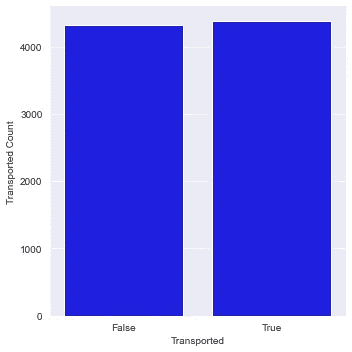

在列车数据集中的 8693 名乘客中，有 4378 人(约 50%)被运送到了另一个维度。

接下来让我们想象一下独立的分类特征。

***【自变量(分类)***

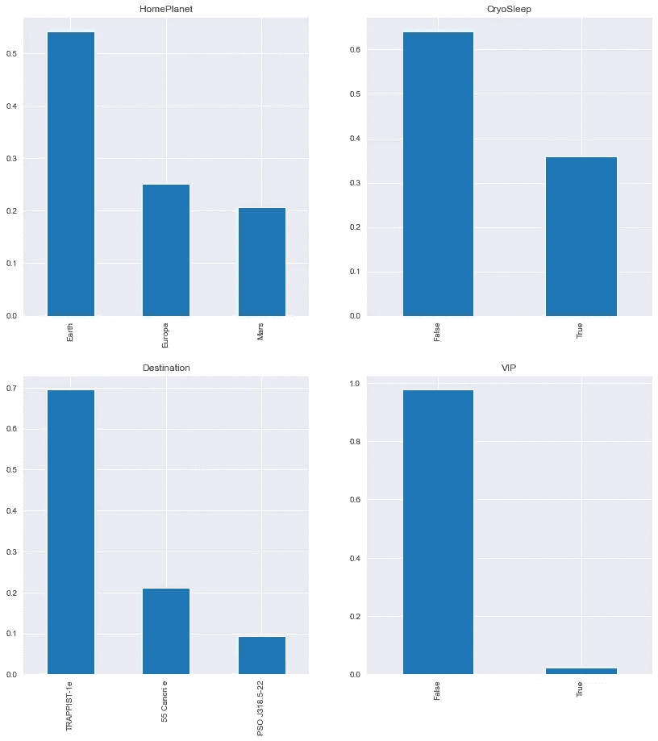

从上面的柱状图可以推断:

*   列车上大约 50%的乘客离开了地球
*   训练数据集中大约 30%的乘客处于低温睡眠状态(即被限制在他们的客舱内。)
*   训练数据集中大约 69%的乘客会去 TRAPPIST-1e
*   训练数据集中不到 1%的乘客为 VIP 服务付费

座舱列采用甲板/编号/侧面的形式。因此，让我们提取并可视化 CabinDeck 和 CabinSide 特征。

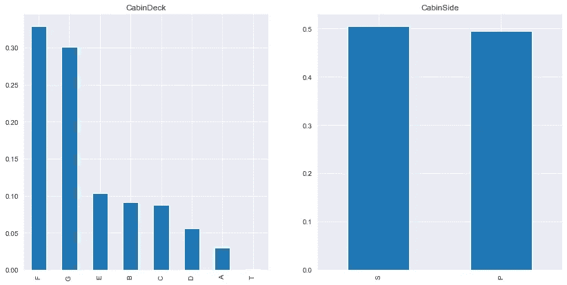

从上面的图中我们可以推断:

*   列车组中大约 60%的乘客在 F 层和 G 层
*   与 P 相比，在客舱侧的乘客百分比没有太大差别

我们已经看到了分类变量。现在让我们把数字变量形象化。

***年龄***

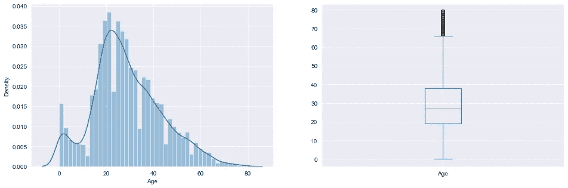

年龄变量中有异常值，分布相当正常。

***客房服务***

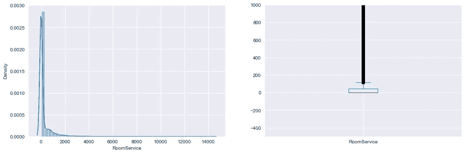

我们可以看到，RoomService 的分布中，大部分数据都是偏左的，也就是说不是正态分布，有大量的离群值。我们以后会努力让它正常起来。

***温泉***

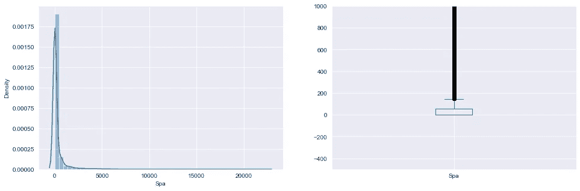

有一个与客房服务类似的分布。它包含许多异常值，并且不是正态分布的。

客房服务、美食广场、购物中心、水疗中心、VRDeck 是乘客在泰坦尼克号飞船的许多豪华设施中的每一个的账单金额，所以让我们看看 VRDeck、美食广场和购物中心是否有类似的分布。

***VRDeck***

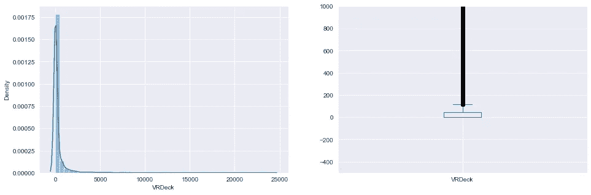

***美食广场***

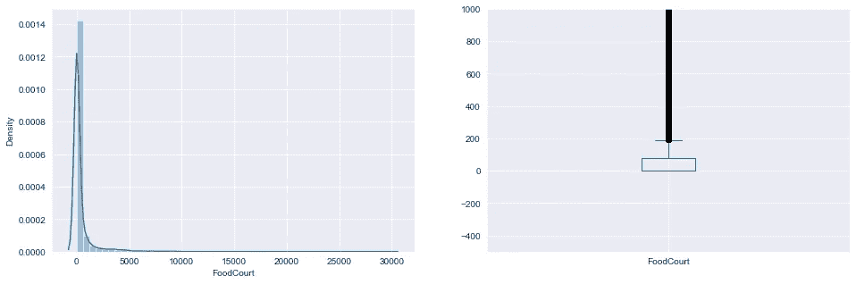

***ShoppingMall***

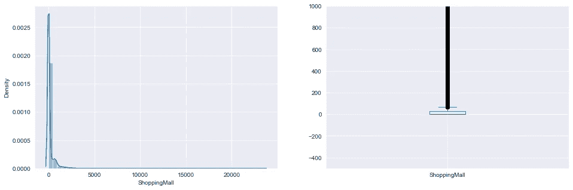

我们可以看到 VRDeck、FoodCourt 和 ShoppingMall 也有类似的分布。都不是正态分布，都有离群值。

***双变量分析***

在单独查看每个变量后，我们将再次探究它们，以查看它们与目标变量的关系。首先，我们将找到分类变量和目标变量之间的关系。

为此，我们将首先创建一个数据帧来存储运送的乘客数量，以及每个分类变量运送的乘客百分比。

现在，让我们看看分类变量是如何与运输相关的。

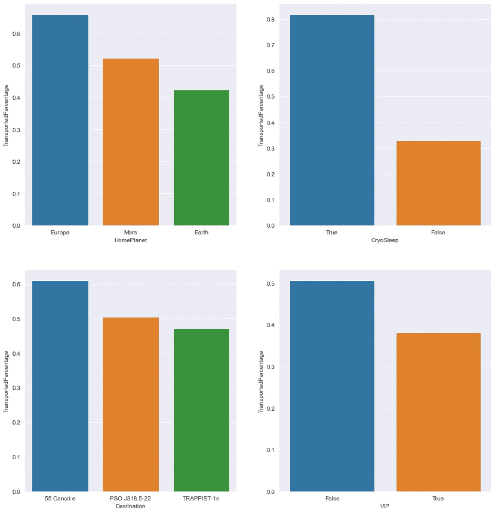

我们可以推断:

*   大约 64%来自欧罗巴的乘客被运送
*   大约 78%的低温睡眠乘客被运送
*   与 PSO j 318.5–22 和 TRAPPIST-1e 的乘客相比，55 can care 的乘客比例更高
*   大约 38%为特殊 VIP 服务付费的乘客被运送

接下来，让我们看看 CabinDeck 和 CabinSide 列如何与 transported 相关联。我们将遵循与上面相同的步骤。

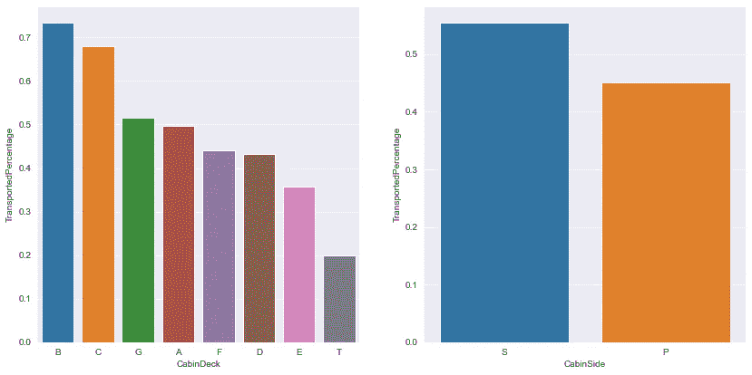

*   B 舱和 C 舱运送的乘客比例最高
*   与机舱侧 P 的乘客相比，机舱侧 S 的乘客被运送到另一维度的比例更大

PassengerId 列采用 gggg_pp 的形式，其中 gggg 表示与乘客一起旅行的团队，pp 表示他们在团队中的人数。我们想知道一个组中的人数与他们是否被运送的关系，因此，我们将从 PassengerId 列中提取 PassengerGroup 要素，获取一个组中的人数，然后可视化它与运送的要素的关系。

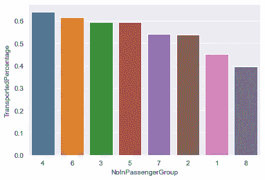

没有一个清晰的模式来说明一个团体中的人数如何影响他们是否被运送。所以，我们将看看“如果乘客是一个人或不是”如何影响他们是否被运送。

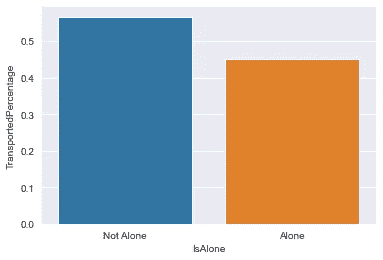

与孤独的乘客相比，似乎更多不孤独的乘客被传送到了另一个维度。
姓名列还包含乘客的名和姓。所以，让我们提取每个乘客的姓氏，看看家庭规模是否会影响乘客是否被运送。

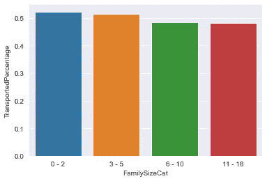

被转移的小家庭的百分比高于大家庭。这可能是较小的家庭是富裕的家庭，并被运送。让我们看看家庭规模如何影响收入。

为了做到这一点，我们将把每位乘客在泰坦尼克号飞船的许多豪华设施上的所有账单金额加起来。然后，我们将根据 FamilySizeCat 绘制它

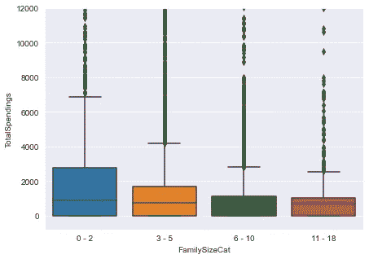

我们的假设似乎是正确的。似乎家庭规模较小的乘客更富有。

现在，让我们想象一下相对于目标变量的独立变量的数值。

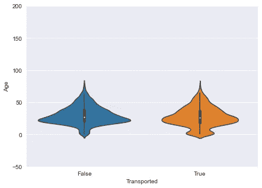

看起来 0 岁到 4 岁的乘客的比例比年长的乘客的比例要高。我们将创建一个新的专栏 AgeCat，以确认与老年乘客相比，是否运送了更多的年轻乘客。

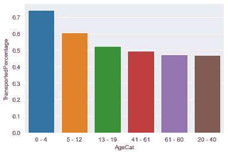

从上面的图中我们可以推断:

*   大约 74%的 0-4 岁乘客被运送
*   大约 60%的 5-12 岁的乘客被运送

现在，对剩余的数字自变量做同样的操作。

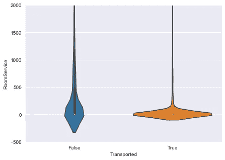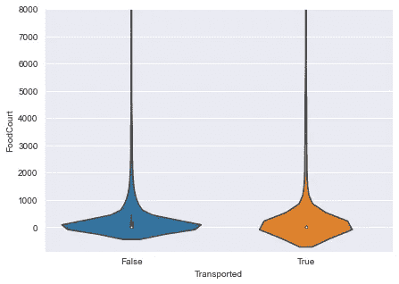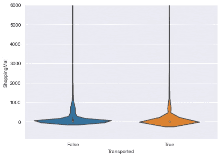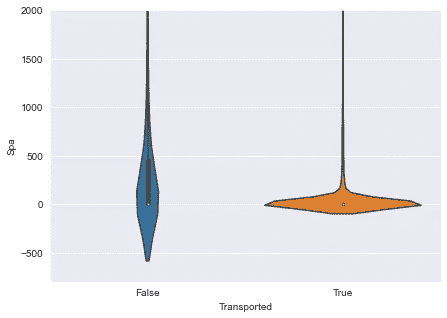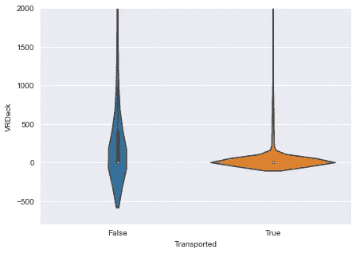

观察结果:

*   被运输的乘客花费的账单看起来很集中，接近于零。
*   VRDeck、Spa 和 RoomService 似乎有类似的分布，而 ShoppingMall 和 RoomService 似乎也有类似的分布。

我们已经看到家庭规模如何影响支出。现在让我们来看看在 Cryosleep 中当选的乘客与支出的关系。

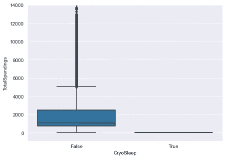

从上图可以看出，低温睡眠中的乘客支出为 0。现在我们来看看 VIP 身份是如何影响支出的。

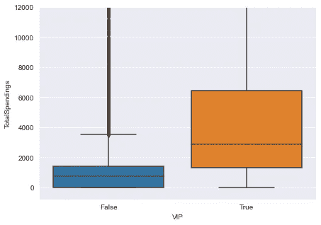

可以看出，有 VIP 身份的乘客比没有 VIP 身份的乘客支出更高。

让我们看看年龄类别如何与乘客的总支出相关联。

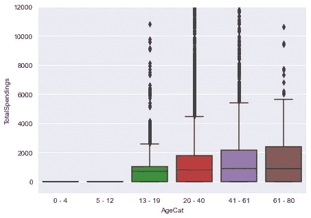

从上图可以推断:

*   年龄在 0-12 岁之间的乘客没有支出
*   开支随着年龄的增长而增加

## 4.清洗和预处理

在研究了数据中的变量后，我们现在可以估算缺失值并处理异常值。

首先，让我们删除为探索性数据分析创建的列。

我们将结合训练和测试数据，使清理和预处理更容易

让我们看看新数据集的形状。

```
(12970, 13)
```

数据集有 12970 行和 13 列。让我们看看数据集中每个变量缺失的百分比。

```
PassengerId     0.000
HomePlanet      2.221
CryoSleep       2.390
Cabin           2.305
Destination     2.113
Age             2.082
VIP             2.282
RoomService     2.028
FoodCourt       2.228
ShoppingMall    2.359
Spa             2.190
VRDeck          2.066
Name            2.267
dtype: float64
```

除了 PassengerId 列之外，每个列中都有缺失值，但缺失值不到变量的 50%。我们将首先通过使用模式进行插补来处理分类列中的缺失值。

```
['PassengerId',
 'HomePlanet',
 'CryoSleep',
 'Cabin',
 'Destination',
 'VIP',
 'Name']
```

现在，让我们找到一种方法来填充数字特征中缺失的值。

```
['Age', 'RoomService', 'FoodCourt', 'ShoppingMall', 'Spa', 'VRDeck']
```

我们将从年龄开始。在执行 EDA 时，我们看到如果乘客年龄小于 13 岁或处于低温睡眠状态，客房服务、美食广场、购物中心、水疗中心和 VRDeck 总计为 0，因此让我们创建一个函数来处理这种情况。

现在，让我们使用平均值来填充剩余的缺失值。

```
PassengerId     0
HomePlanet      0
CryoSleep       0
Cabin           0
Destination     0
Age             0
VIP             0
RoomService     0
FoodCourt       0
ShoppingMall    0
Spa             0
VRDeck          0
Name            0
dtype: int64
```

正如我们所看到的，所有缺失的值都已填充到数据集中。

***异常值处理***

正如我们在前面的单变量分析中看到的，RoomService、FoodCourt、ShoppingMall、Spa 和 VRDeck 包含异常值，因此我们必须将它们视为异常值，因为异常值的存在会影响我们数据的分布。为此，我们将剪切 99%分位数上的异常值。

我们的数据集现在是干净的！

## 5.特征提取和特征选择

基于我们的 EDA，让我们创建一个函数来创建可能影响目标变量的新特性。

现在，让我们删除用于创建这些特征的变量，这些变量与从数据集中去除噪声没有太大关系。

```
(12970, 15)
```

现在，我们将把我们的分类数据转换成模型可理解的数字数据。

接下来，我们将拆分数据，以获得训练和测试数据。

让我们打印火车的形状和测试数据，以确保我们正确地分割数据。

```
(8693, 23)
(4277, 23)
```

## 6.基线模型性能和模型构建

是时候准备好输入模型的数据了。

特征选择在模型构建中一直起着关键作用。我们将执行χ运算来检索 22 个最佳特征，如下所示。

```
Index(['Age', 'CabinDeck', 'DeckPosition', 'Regular', 'Luxury',
       'TotalSpendings', 'DeckAverageSpent', 'NoRelatives', 'FamilySizeCat',
       'HomePlanet_Earth', 'HomePlanet_Europa', 'HomePlanet_Mars',
       'CryoSleep_False', 'CryoSleep_True', 'Destination_55 Cancri e',
       'Destination_TRAPPIST-1e', 'VIP_False', 'VIP_True', 'CabinSide_P',
       'CabinSide_S', 'IsAlone_Alone', 'IsAlone_Not Alone'],
      dtype='object')
```

接下来，为了我们的模型构建，我们将使用随机森林，一种树集成算法，并试图提高准确性。

我们将使用交叉验证分数来评估基线模型的准确性。

```
0.7889098998887654
0.01911345656998776
```

我们得到了 78.9%的平均精确度，现在我们将通过调整模型的超参数来提高精确度。我们将使用网格搜索来获得超参数的优化值。网格搜索是从一系列超参数中选择最佳参数的一种方式，通过参数网格将参数化。

我们将调整 max_depth 和 n _ estimators 参数。max_depth 决定树的最大深度，n_estimators 决定将在随机森林模型中使用的树的数量。

```
RandomForestClassifier(max_depth=11, n_estimators=101, random_state=1)
```

因此，max_depth 变量的优化值是 11，n_estimators 的优化值是 101。现在，让我们使用这些优化值来构建最终模型。

```
RandomForestClassifier(max_depth=11, n_estimators=101, random_state=1)
```

现在，让我们用优化的参数来查看我们的模型的新精度分数，以确认它得到了改进。

```
0.8047907728163567
0.018872624931449773
```

该模型现在的平均准确率为 80.5%，这是一个进步。是时候使用我们选择的特征对测试数据集进行预测了。

## 7.提交和功能重要性

在我们提交之前，让我们导入示例提交文件，看看我们的提交应该具有的格式。

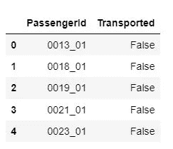

如我们所见，我们将只需要 PassengerId 和 Transported 用于最终提交。为此，我们将使用测试集的 PassengerId 和我们的预测。请记住，我们需要将 0 转换为 False，将 1 转换为 True。

特征重要性允许您理解特征和目标变量之间的关系。让我们画出特性的重要性来理解什么特性是最重要的，什么特性对模型是不相关的。

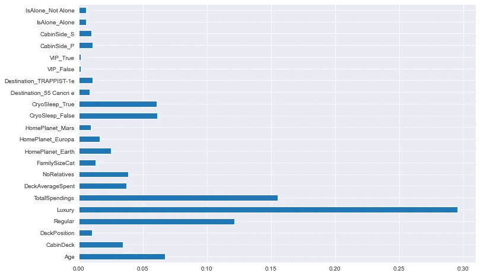

从上面的图中我们可以看出，奢侈是最重要的特征，其次是总支出，以及常规。因此，特征工程帮助我们预测目标变量。

我希望你喜欢阅读。你可以在 [GitHub](https://github.com/ebunoluwazaynab/Spaceship-Titanic) 上找到我的代码。