# 如何使用 Rvest 抓取 Etsy 产品数据

> 原文：<https://medium.com/codex/how-to-scrape-etsy-product-data-using-rvest-1972155bd6e9?source=collection_archive---------7----------------------->

最初发表于 [ScraperAPI](https://www.scraperapi.com/blog/how-to-scrape-etsy/) 。

为什么要刮 Etsy？据 Statista 统计，自 2015 年成立以来， [Etsy 已经成为一家价值 300 亿美元的电子商务公司，拥有超过 440 万活跃卖家和 8190 万买家](https://www.statista.com/statistics/409375/etsy-active-buyers/#:~:text=As%20of%202020,%20close%20to,buyers%20in%20the%20previous%20year.)。那是很多用户。

尽管不如电商巨头亚马逊(Amazon)知名，但 Etsy 是全球最大的非常规和创意商品市场之一。

对我们来说，这也意味着我们可以利用大量信息做出明智的决定。

无论你是想通过收集价格信息打入特定行业，还是想分析产品趋势以找到有利可图的利基市场，构建 Etsy web scraper 都可以为你节省大量时间，并有可能为你带来丰厚的利润。

这种脚本的另一个潜在用途是帮助卖家和店主更好地理解竞争格局，发现价格或需求的行业变化，等等。

如果你想增压你的 Etsy 或电子商务的客户数据，那么这是你的教程！

# 构建 Rvest Etsy 刮刀的分步指南

对于本教程，我们将使用 [Rvest 框架](https://rvest.tidyverse.org/)和 [Dplyr](https://dplyr.tidyverse.org/) 来抓取 Etsy 的[男生服装部分](https://www.etsy.com/c/clothing/boys-clothing/costumes?ref=catnav-10923)。

在开始编写脚本之前，我们需要安装两件东西:

*   [安装 R](https://www.r-project.org/)
*   [安装 R Studio](https://www.rstudio.com/)

一旦安装并打开 R Studio，就该下载并安装我们的依赖项了。

# 1.安装 Rvest 和 Dplyr

在 R Studio 中，让我们创建一个名为 rvest-etsy-scraper 的新目录，并将其保存到您机器中的一个可访问的文件夹中，以便在需要时更容易找到。

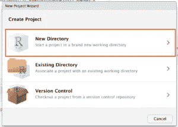

随着新项目的打开，我们可以创建一个新的脚本，并随意命名。在我们的例子中，为了简单起见，我们称之为 etsy-rvest。

现在，我们可以用两行简单的代码安装我们的依赖项:

`install.packages("rvest")`

`install.packages("dplyr")`

安装完成后，我们可以对我们的代码行做一点修改，将包导入到项目中:

`library("rvest")`

`library("dplyr")`

# 2.下载 Etsy 的 HTML 进行解析

没有 HTML，就没有解析。记住这一点，让我们向服务器发送一个 HTTP 请求，并将响应存储在一个名为“page”的变量中。

`link = "https://www.etsy.com/c/clothing/boys-clothing/costumes?ref=pagination&explicit=1&page=1"`

`page = read_html(link)`

请注意，我们使用了不同类别页面的 URL 版本。

如果您手动导航到该网站，您会看到这是该 URL 的原始版本:

[https://www.etsy.com/c/clothing/boys-clothing/costumes?ref=catnav-10923](https://www.etsy.com/c/clothing/boys-clothing/costumes?ref=catnav-10923)

然而，当我们在分页中导航时——我们肯定希望从这个类别中抓取所有页面——我们需要给脚本提供对每个页面的访问。

为了更直观，下面是分页的第二个 URL:

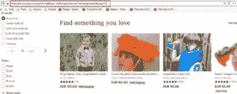

[https://www.etsy.com/c/clothing/boys-clothing/costumes?ref =分页& page=2](https://www.etsy.com/c/clothing/boys-clothing/costumes?ref=pagination&page=2)

因此，我们可以简单地通过改变 URL 中的‘page’参数来访问第 1 页。

我们将在本教程的后面更深入地讨论这个问题，但是现在，让我们试着从第一页中获取一些数据。

# 3.查找目标 CSS 属性

有两种常见的方法来定义 CSS 选择器，我们需要提取产品的名称、价格和 URL。

第一种方法是手动转到页面本身，并使用检查工具。windows 上可以用 CTRL + Shift + C 打开，Mac 上可以用 CMD + Shift + C 打开。

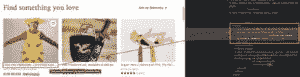

或者我们可以使用 SelectorGadget 这样的工具为我们想要抓取的元素选择正确的 CSS 类。

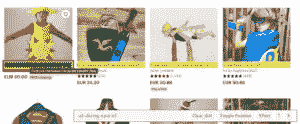

经过一些测试，我们确定每页有 64 个产品列表，这些是每个元素的 CSS 类:

*   产品名称:
    . v2-清单-卡片 h3
*   产品价格:
    。wt-文本-标题-01。wt-文本-标题-01。货币价值
*   商品网址:
    Li . wt-list-unstyled div . js-merch-stash-check-listing a . listing-link

如果您一直在关注，您可能想知道我们是如何获得产品 URL 的属性的。这就是事情变得棘手的地方。

## 使用 SelectorGadget 进行逻辑测试

并非每个网站都是以相同的方式构建的，所以没有办法直接从 SelectorGadget 获取 CSS 属性，因为 URL 每次都不在特定的元素中。

例如，在许多网站上，产品的 URL 往往与产品名称在同一个元素中。然而，Etsy 的情况并非如此。

然而，我们可以使用 SelectorGadget 找到像 URL 这样的 CSS 元素的另一种方法是:测试属性。

打开 SelectorGadget 后，我们首先找到了产品卡本身的最高级别元素。

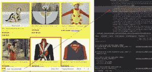

在

*   元素中，我们希望找到包含产品 URL 的主元素。

接下来，我们知道我们想要将 div 中的标记作为目标来查找 URL。我们使用 SelectorGadget 来验证我们选择了 64 个元素来验证我们的逻辑是正确的。

这就是为什么在抓取网页时，理解网页的结构是如此重要。

**提示:**你可以使用我们的 [CSS 选择器备忘单](https://www.scraperapi.com/blog/css-selectors-cheat-sheet/)来学习更多关于 CSS 选择器的知识，并帮助你加快 scraper 的开发时间。

现在我们知道了如何选择每个元素来获得我们想要的数据，让我们测试我们的脚本。

# 4.测试我们的解析脚本

对于这个测试，我们希望运行整个脚本来提取页面上 64 个产品的名称。

这就是 Dplyr 派上用场的地方，因为它允许我们使用管道操作符(%>%)来简化这个过程。

简单地说，管道操作符(%>%)获取左边的任何值，对其进行计算，并将结果作为第一个参数传递给管道后面的函数。

**注:**如果你想了解更多关于管道工的知识，可以查看我们的[初学 R 网刮教程](https://www.scraperapi.com/blog/web-scraping-with-r/)。

`product_name = page %>% html_nodes(".v2-listing-card h3") %>% html_text()`

如您所见，我们正在将存储在“page”变量中的值(即我们之前下载的 HTML)传递给我们的“html_nodes()”函数。

该操作的结果随后被传递给下面的函数——“html _ text()”——所以我们只提取元素内部的文本，而不携带标签和其他任何东西。

要进行测试，请在控制台中键入“product_names”。

这就对了，短短几秒钟内就有 64 个产品名称。

不幸的是，页面上有很多空白，以及每个字符串开头和结尾的那些烦人的\n。

为了清理这些，让我们为“product_name”变量添加一个额外的函数:

`%>% stringr::str_trim()`

结果如下:

更干净、更美观的产品名称，任何人都可以阅读，而不会有额外的代码混乱。

# 5.使用相同的逻辑获得其余的元素

好了，现在我们知道我们的脚本正在工作，让我们在页面上抓取每个元素的价格和 URL。

`product_price = page %>% html_nodes(".wt-text-title-01 .wt-text-title-01 .currency-value") %>% html_text()`

`product_url = page %>% html_nodes("li.wt-list-unstyled div.js-merch-stash-check-listing a.listing-link") %>% html_attr("href")`

对于属性，我们没有使用 html_text()函数，而是使用 html _ attr(“href”)来提取所选属性中的值，在本例中是“href”。

# 6.将我们的数据发送到数据框

好的，目前为止我们的刮刀运行良好。然而，将数据记录到我们的控制台可能不是处理它的最佳方式。让我们创建一个数据框来组织我们的数据，以便稍后进行分析。

为此，我们将调用 Rvest data.frame()函数，并将变量用作列。

`costumes_ideas = data.frame(product_name, product_price, product_url, stringsAsFactors = FALSE)`

我们可以输入 View(costumes_ideas)来查看我们刚刚创建的数据框。

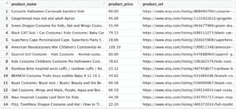

**注意:**视图命令是区分大小写的，所以要确保 v 是大写的。

# 7.让我们的脚本导航分页页面

既然我们已经在一个页面上测试了我们的 scraper，我们准备通过让它移动到其他页面并提取相同的数据来稍微扩展一下。

虽然有几种方法可以做到这一点，但我们将首先创建一个 for 循环来抓取两页。当然，您可以将它扩展到更大的项目，这样可以节省很多很多页面，但是为了节省时间和简化，让我们保持较小的范围。

编写 for 循环时要考虑几件事:

*   分析分页页面的 URL 以确定它们的数量——在我们的示例类别中，总共有 194 个页面。
*   看一下数字是如何增加的——在我们的例子中，每个页面的 URL 中的分页都增加了一个，但并不是每个网站都是这样。

记住这两点，我们就可以继续构建循环了。

`costumes_ideas = data.frame()`

`for (page_result in seq(from = 1, to = 2, by = 1)) {`

`link = paste0("https://www.etsy.com/c/clothing/boys-clothing/costumes?ref=pagination&explicit=1&page=", page_result)`

`page = read_html(link)`

`product_name = page %>% html_nodes(".v2-listing-card h3") %>% html_text() %>% stringr::str_trim()`

`product_price = page %>% html_nodes(".wt-text-title-01 .wt-text-title-01 .currency-value") %>% html_text()`

`product_url = page %>% html_nodes("li.wt-list-unstyled div.js-merch-stash-check-listing a.listing-link") %>% html_attr("href")`

`costumes_ideas = rbind(costumes_ideas, data.frame(product_name, product_price, product_url, stringsAsFactors = FALSE))`

`}`

好了，这里发生了很多事情，让我们来看一下每一部分:

*   我们在 for 循环外创建了一个空数据帧，以避免用下一个循环的新数据覆盖前一个循环的现有数据。
*   然后，我们用 rbind()函数包装旧的数据框，该函数使用空数据框作为第一个参数。这将获取每一轮数据并将其添加到现有数据中，而不是将其覆盖。
*   page_result 将从值 1 开始，然后增加 1，直到达到 2。这将是我们浏览导航的主要方式。
*   paste0()函数将把我们的 URL 和 page_result 值粘在一起，同时为我们自动删除任何空白。

我们脚本的其余部分将保持不变；我们只需将其剪切并粘贴到 for 循环中。

测试时间到了！

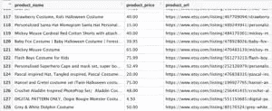

我们走吧！几秒钟之内就刮出了 128 个元素(64 乘 2 页)。

然而，从 194 页中刮出 2 页是不是很神奇？让我们进一步扩大我们的项目。

# 8.使用 ScraperAPI 实现可伸缩性

网站是给用户用的，不是给机器人用的。出于这个原因，许多网站有不同的方法来防止脚本在短时间内访问和提取太多的页面。

为了避免这些措施，我们必须创建一个函数来更改我们的 IP 地址，访问 IP 地址池以便我们的脚本在其中循环，创建一些方法来处理验证码，并处理 javascript 页面——这变得越来越常见。

或者我们可以通过 ScraperAPI 的服务器发送 HTTP 请求，让他们自动处理一切。

我们只需要[创建一个免费的 ScraperAPI 帐户来兑换 5000 个免费的 API 调用](https://www.scraperapi.com/signup)并获得我们的 API 密钥。

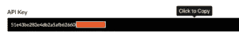

然后，我们将对代码做三点小小的调整。

`library("rvest")`

`library("dplyr")`

`costumes_ideas = data.frame()`

`for (page_result in seq(from = 1, to = 194, by = 1)) {`

`link = paste0("http://api.scraperapi.com?api_key=51e43be283e4db2a5afb62660xxxxxxx&url=https://www.etsy.com/c/clothing/boys-clothing/costumes?ref=pagination&explicit=1&page=", page_result, "&country_code=us")`

`page = read_html(link)`

`product_name = page %>% html_nodes(".v2-listing-card h3") %>% html_text() %>% stringr::str_trim()`

`product_price = page %>% html_nodes(".wt-text-title-01 .wt-text-title-01 .currency-value") %>% html_text()`

`product_url = page %>% html_nodes("li.wt-list-unstyled div.js-merch-stash-check-listing a.listing-link") %>% html_attr("href")`

`costumes_ideas = rbind(costumes_ideas, data.frame(product_name, product_price, product_url, stringsAsFactors = FALSE))`

`}`

首先，我们将抓取的总页数增加到 194 页，这是该类别的总页数。

然后，我们将我们的目标 URL 作为 ScraperAPI 请求的参数传递:

“http://api.scraperapi.com？API _ key = 51e 43 be 283 E4 db 2 a5 AFB 62660 XXXXXX**&URL = https://www . etsy . com/c/clothing/boys-clothing/costumes？ref = pagination&explicit = 1&page =**

最后，我们在 page_result 后面添加了“&country_code=us”参数，告诉 ScraperAPI 从美国 IP 地址发送我们的请求。

因为在写这篇文章的时候，我们的脚本是从一个意大利 IP 地址发送请求，结果会与我们在美国境内搜索的结果不同——另外，价格是以欧元而不是美元计算的，这是一个重要的区别。

让我们运行最后一个测试，看看我们得到了什么—但请记住这将需要一段时间，因为我们的脚本需要移动到 194 页的每一页，并抓取每个元素:

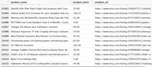

您还会注意到您的 ScraperAPI 仪表板上的活动:

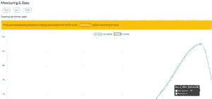

厉害！我们现在有 12，415 个数据点，但是我们可能希望将其保存为不仅仅是一个数据框，以便于分析，对吗？

# 9.将我们的数据放入 Excel 文件

这是我们喜欢 r 的原因之一。将您的数据框导出为 Excel 文件就像安装软件包一样简单。

`install.packages("writexl")`

**注意:**在控制台中键入安装命令。

将我们的新依赖项添加到脚本的顶部。

`library("writexl")`

在循环之外创建一个新函数，其中第一个参数是数据框的名称，第二个参数是路径和文件的名称。

`write_xlsx(costumes_ideas,"/Users/lyns/Documents/Coding/costumes-data.xlsx")`

**注意:**这里有一个关于[如何使用 write_xlsx()函数](https://datatofish.com/export-dataframe-to-excel-in-r/)的快速指南。

最后，我们只运行我们的 scraper 的两个新行(不需要重新运行整个脚本)，就这样。

如果我们转到函数中指定的路径，我们会在其中找到新的 Excel 文件。

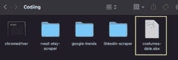

我们现在可以松一口气了，因为它没有打嗝！

# 包扎

非常感谢您参与我们这个激动人心的项目。r 是一种简单而强大的语言，结合 ScraperAPI 的所有功能，我们可以创建高效且几乎不可阻挡的脚本来抓取任何网站。

除了防止我们被屏蔽或禁止，ScraperAPI 还为我们的脚本增加了休息时间，以避免服务器过载或损坏我们正在抓取和抓取的网站。

如果你想了解更多关于我们 API 的其他应用，[我们的文档已经准备好了有用的代码片段](https://www.scraperapi.com/documentation/)和你需要的一切，以其他[网络抓取工具](https://www.scraperapi.com/blog/the-10-best-web-scraping-tools/)的一小部分成本来创建最好的机器人。

如果你想学习抓取其他网站，用不同的语言创建抓取器，这里有一些我们的顶级资源，可以帮助你不断提高你的技能:

*   [如何刮亚马逊产品数据](https://www.scraperapi.com/blog/how-to-scrape-amazon-product-data/)
*   [使用 Python 和 Scrapy 从谷歌搜索中抓取数据【分步指南】](https://www.scraperapi.com/blog/scrape-data-google-search-results/)
*   [用美汤一步一步打造 Python Web Scraper】](https://www.scraperapi.com/blog/web-scraping-python/)
*   [网页抓取最佳实践:ScraperAPI 备忘单](https://www.scraperapi.com/blog/web-scraping-best-practices/)

下次见，刮刮快乐！