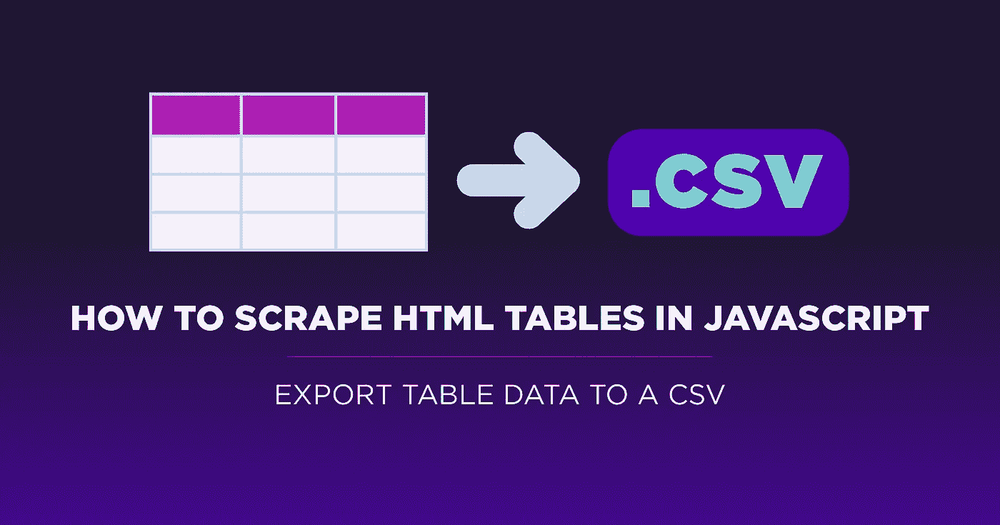

# 如何在 JavaScript 中抓取 HTML 表格[将表格数据导出为 CSV]

> 原文：<https://medium.com/codex/how-to-scrape-html-tables-in-javascript-export-table-data-to-a-csv-acd01c6ddce?source=collection_archive---------1----------------------->

最初发表于 [ScraperAPI](https://www.scraperapi.com/blog/scrape-html-table-to-csv/) 。

HTML 表格是网络上最好的数据源。它们易于理解，并能以简单易读和易懂的格式保存大量数据。对于任何对数据科学或数据分析感兴趣的开发人员来说，能够抓取 HTML 表格是一项需要开发的关键技能。

在本教程中，我们将深入研究 HTML 表格，并构建一个简单而强大的脚本来提取表格数据并将其导出到 CSV 文件中。

# 什么是 HTML 网页表格？

HTML 表格是一组行和列，用于直接在网页上以网格格式显示信息。它们通常用于显示表格数据，如电子表格或数据库，并且是我们项目的重要数据源。

从体育数据到天气数据，再到书籍和作者的数据，网络上大多数大型数据集都可以通过 HTML 表格访问，因为它们能够以结构化且易于导航的格式显示信息。

对我们来说，好消息是，与动态生成的内容不同，HTML 表格的数据直接存在于 HTML 文件的 table 元素中，这意味着我们可以像处理 web 的其他元素一样抓取我们需要的所有信息——只要我们理解它们的结构。

# 理解 HTML 表格的结构

虽然您只能在前端看到列和行，但是这些表实际上是使用一些不同的 HTML 标记创建的:

*   :它标志着 HTML 表格的开始
*   :表示表格中的一行
*   `<td>`:定义表格中的单元格

内容放在`<td>`标签中，`<tr>`用于创建一行。换句话说:*表格>行>单元格* || *表格> tr > td* 层次结构被遵循来创建一个 HTML 表格。

可以使用表示*表头*的`<th>`标签创建一个特殊的单元格。基本上，可以使用`<th>`标签创建第一行的第一个单元格，以指示该行是表格的标题。

下面是一个创建简单的两行两列 HTML 表格的示例:

但是在抓取 HTML 表格时有一个主要的区别。与网页上的其他元素不同，CSS 选择器的目标是所有的单元格和行——甚至是整个表格——因为所有这些元素实际上都是`<table>`元素的组件。

我们不需要为每个数据点指定一个 CSS 选择器，而是需要创建一个包含表中所有行的列表，并遍历这些行以从它们的单元格中获取数据。

如果我们理解这个逻辑，创建我们的脚本实际上是非常简单的。

# 用节点将 HTML 表抓取到 CSV。射流研究…

如果这是你第一次使用 Node。JS 对于网络抓取，浏览一下我们之前的教程可能会有帮助:

*   [使用 JavaScript 和 Node.js 进行网页抓取](https://www.scraperapi.com/blog/web-scraping-javascript-tutorial/)
*   [如何免费搭建 LinkedIn 刮刀](https://www.scraperapi.com/uncategorized/how-to-build-a-linkedin-scraper/)
*   [如何一步一步打造足球数据刮刀](https://www.scraperapi.com/blog/how-to-scrape-football-data/)

然而，我们会尽可能让这个教程对初学者友好，这样你甚至可以把它作为一个起点。

**注:**为节点。JS 安装说明，请参考列表上的第一条。

对于今天的项目，我们将使用 [Axios](https://www.npmjs.com/package/axios) 和 [Cheerio](https://cheerio.js.org/) 构建一个 web scraper 来抓取[https://datatables.net/examples/styling/display.html](https://datatables.net/examples/styling/display.html)上显示的员工数据。

我们将提取每个雇员的姓名、职位、办公室、年龄、开始日期和工资，然后使用 [ObjectsToCsv](https://www.npmjs.com/package/objects-to-csv) 包将数据发送到 CSV。

# 1.准备好我们的文件

为了启动我们的项目，让我们创建一个名为 *html-table-scraper* 的新目录，在 VScode(或者您偏好的代码编辑器)上打开新文件夹，并打开一个新终端。

在终端中，我们将运行`npm init -y`来启动一个新节点。JS 项目。现在，您的文件夹中会有一个新的 JSON 文件。

接下来，我们将使用以下命令安装依赖项:

*   阿希奥斯:`npm install axios`
*   再见:`npm install cheerio`
*   ObjectsToCsv: `npm install objects-to-csv`

我们的一个命令安装:`npm i axios cheerio objects-to-csv`。

现在我们可以创建一个名为 *tablescraper.js* 的新文件，并在顶部导入我们的依赖项。

此外，您的项目应该是这样的:

# 2.使用 DevTools 测试目标站点

在编写代码之前，我们需要了解网站是如何构建的。是的，所有的表都使用基本结构，但这并不意味着所有的表都是平等创建的。

我们需要确定的第一件事是，这实际上是否是一个 HTML 表。站点使用 JavaScript 将数据注入到它们的表中是非常常见的，尤其是当涉及到实时数据时。对于这些情况，我们必须使用完全不同的方法，比如使用无头浏览器。

为了测试数据是否在 HTML 文件中，我们需要做的就是复制一些数据点——比如说名称——并在页面的源代码中寻找它。

我们对其他名字和数据点也做了同样的处理，只是为了确认一下，是的，所有的数据都在我们的掌握之中。另一个有趣的惊喜是，表的所有行都在原始 HTML 中，尽管在前端似乎有某种分页。

另外，我们现在还知道总共有 57 行要刮。这很重要，因为我们可以知道我们是否真的获取了所有可用的数据。

我们想在浏览器上直接测试的第二件事是我们的选择器。我们可以使用浏览器的控制台通过`document.querySelectorAll()` `method`抓取元素，而不是发送一堆不必要的请求。

如果我们到控制台键入`document.querySelectorAll('table')`，它将返回四个不同的表。

将鼠标放在表格上，我们很快意识到第一个表格(数字 0)是正确的。所以让我们再做一次，但是指定类——在列表中用点表示。).

太好了，我们离数据又近了一步！

通过仔细观察，表的数据被包装在一个`<tbody>`标签中，所以让我们将它添加到我们的选择器中，以确保我们只抓取包含我们想要的数据的行。

最后，我们希望获取所有的行，并验证我们的选择器是否获取了全部 57 行。

**注意:**因为我们使用控制台来选择呈现的 HTML 上的元素，所以我们需要将显示项目的总量设置为 100。否则，控制台上的选择器将只显示 10 个节点项。

有了这些信息，我们现在可以开始编写代码了！

# 3.发送我们的 HTTP 请求并解析原始 HTML

Axios 使得在`Async Function`中发送 HTTP 请求变得非常容易。我们需要做的就是创建一个异步函数，并在一个名为`response`的常量中将 URL 传递给 Axios。我们还将记录响应的状态代码(对于成功的请求应该是 200)。

**注意:**您可以随意命名这些变量，但要尽可能保持描述性。

接下来，我们将把来自响应的数据(原始 html)存储到一个名为 HTML 的新常量中，这样我们就可以把它传递给 Cheerio，用`cheerio.load()`进行解析。

4.遍历 HTML 表格行

使用我们之前测试过的选择器，让我们选择 HTML 表中的所有行。

出于测试的目的，让我们使用 console . log()all rows 的长度来验证我们确实选择了所有的目标行。

57 正是我们的目标！

当然，为了遍历行列表，我们将使用`.each()`方法，但是还有一件事我们需要弄清楚:单元格的顺序。

与常见的 HTML 元素不同，单元格没有分配给它们的唯一类。所以试图用 CSS 类来抓取每个数据点可能会很麻烦。相反，我们将瞄准`<td>`在其行中的位置。

换句话说，我们将告诉我们的脚本转到每一行，选择该行中的所有单元格，然后根据每个数据点在该行中的位置将其存储在一个变量中。

**注:**在节点。JS，所有列表都从 0 开始。所以第一个位置是[0]，第二个单元格是[1]。

但是我们怎么知道哪个位置是哪个位置呢？我们回到浏览器的控制台，进行测试:

现在我们知道了每个元素相对于其他元素的位置，下面是完成的解析器:

5.将抓取的数据推入一个空数组

如果我们`console.log()`抓取数据，我们会看到我们从每个单元格中抓取了文本，但结果非常杂乱——这反过来使我们更难创建 CSV 文件。

因此，在我们导出数据之前，让我们通过将数据推送到一个空数组来创建一个简单的节点列表，从而给它一些顺序。

首先，在主函数外部创建一个空数组——如果在函数内部创建空数组，每次迭代都会覆盖它，这不是我们想要的。

然后，作为解析器的一部分，让我们使用。push()方法将数据存储在我们创建的空列表中。

像往常一样，让我们`console.log()`employee data 的长度，以确保我们现在有 57 个条目。

对于可视化上下文，我们还可以记录数组，看看里面存储了什么。

正如我们所看到的，所有的数据现在都存储在节点项中，节点项包含了结构化格式的所有数据。

# 6.将抓取的数据发送到 CSV 文件

组织好数据后，我们可以将列表传递给`ObjectsToCsv`,它会为我们创建文件，不需要额外的工作:

我们需要做的就是创建一个新的 csv 对象，并将列表传递给`ObjectsToCsv`，然后告诉它将列表保存在我们提供路径的机器中。

# 7.HTML 表格刮刀[全部代码]

恭喜你，你已经正式创建了你的第一个 HTML 表格刮刀！将您的代码与本教程完成的代码库进行比较，以确保您没有遗漏任何内容:

运行我们的脚本后，在我们的项目文件夹中会创建一个新的 CSV 文件:

现在，您可以使用这些数据进行进一步的分析，如根据职位或开始日期进行工资比较，或者在更大的工作数据集中寻找趋势。

当然，这个脚本可以用来处理您找到的几乎任何 HTML 表格，所以请对新的可能性保持开放的心态

# 避免阻塞:在一行代码中集成 ScraperAPI

在你离开之前，还有一件事我们需要做，以使我们的铲运机更有弹性，那就是处理防刮技术和系统。很多网站不喜欢被抓取，因为，可悲的是，很多抓取工具优化得很差，往往会损害他们的网站。

出于这个原因，你需要遵循一些[网络抓取最佳实践](https://www.scraperapi.com/blog/web-scraping-best-practices/)，以确保你正确地处理你的项目，而不会给你的目标网站带来太大的压力，也不会让你的脚本和 IP 面临被禁或被列入黑名单的风险——使其无法再次从你的机器上访问所需的数据。

为了处理 IP 旋转、JavaScript 渲染、[查找并实现 HTTP 头](https://www.scraperapi.com/blog/headers-and-cookies-for-web-scraping/)、验证码等等，我们需要做的就是通过 ScraperAPI 的服务器发送我们的初始请求。这个 API 将使用多年的统计分析和机器学习来确定头和代理的最佳组合，处理任何不成功的请求并为我们的请求计时，这样它就不会使我们的目标服务器过载。

将它添加到我们的脚本中就像将这个字符串添加到传递给 Axios 的 URL 中一样简单:

记得用你自己的 API 密匙替换`{Your_API_Key}`——你可以通过创建一个[免费的 ScraperAPI 账户](https://www.scraperapi.com/signup)来生成。

当 ScraperAPI 为您处理任何复杂问题时，您的初始请求将会花费稍长的时间，并且只会为成功的请求消耗 API 信用。

现在轮到你了。网络抓取是一种实践。每个网站都是一个不同的难题，所以没有一种方法可以解决问题。相反，专注于利用基础来应对更复杂的挑战。

如果你想继续练习，我们推荐几个网站:

*   [https://quotes.toscrape.com/](https://quotes.toscrape.com/)
*   https://books.toscrape.com/
*   【https://datatables.net/examples/index 

下次见，刮刮快乐！