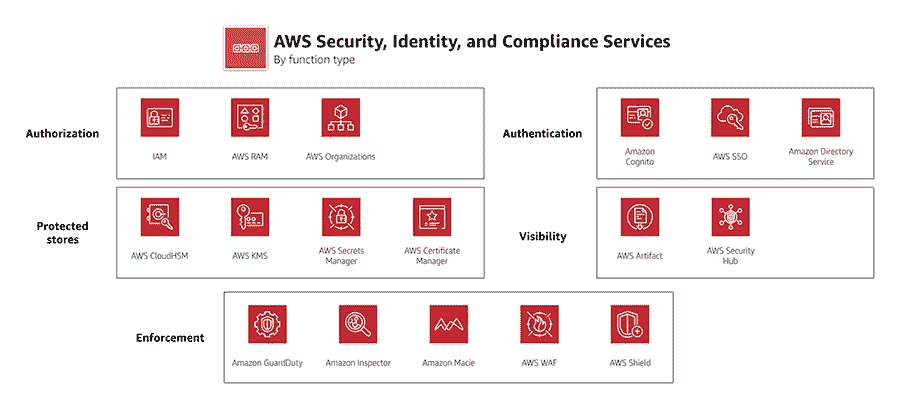

# 如何保护您的 AWS 基础设施？

> 原文：<https://medium.com/codex/how-to-secure-your-aws-infrastructure-e11275c2936e?source=collection_archive---------4----------------------->

您也许能够构建、扩展、自动化您的 AWS 基础设施并使其可靠，但是，保护它是首先要考虑的最重要的事情。将基础设施放在云中意味着将它放在公共场所，那么如何保护它呢？你如何确保不是所有的公众都能看到或使用它？在本文中，让我们来看看应该用来确保基础设施安全的 AW 安全服务。

## AWS IAM 策略

使用 IAM 策略管理和限制对 AWS 资源的访问。策略是 AWS 中的一个对象，当它与身份(用户、组或角色)或资源相关联时，定义其权限。可以定义策略来说明用户在其帐户中可以做什么，以及他/她可以访问哪些服务。

不同的 IAM 策略有- [**基于身份的策略**](https://docs.aws.amazon.com/IAM/latest/UserGuide/access_policies.html#policies_id-based) ， [**基于资源的策略**](https://docs.aws.amazon.com/IAM/latest/UserGuide/access_policies.html#policies_resource-based) ， [**权限边界**](https://docs.aws.amazon.com/IAM/latest/UserGuide/access_policies.html#policies_bound) ， [**组织 scp**](https://docs.aws.amazon.com/IAM/latest/UserGuide/access_policies.html#policies_scp)， [**访问控制列表(ACL)**](https://docs.aws.amazon.com/IAM/latest/UserGuide/access_policies.html#policies_acl)，**[**会话策略**](https://docs.aws.amazon.com/IAM/latest/UserGuide/access_policies.html#policies_session) **。****

** [## IAM 中的策略和权限

### 您可以通过创建策略并将其附加到 IAM 身份(用户、用户组或角色)来管理 AWS 中的访问…

docs.aws.amazon.com](https://docs.aws.amazon.com/IAM/latest/UserGuide/access_policies.html) 

我发现了一个非常详细的解释，我在这里看看。

 [## AWS IAM 策略:最佳实践&如何创建 IAM 策略

### AWS 身份和访问管理(IAM)是一个 web 服务，帮助管理和控制访问和…

spacelift.io](https://spacelift.io/blog/iam-policy) 

## 静态数据和传输中数据的 AWS 数据加密

数据加密是 AWS 推荐的保护数据安全的关键服务之一。

AWS KMS 密钥管理服务为您提供对用于保护数据的加密密钥的集中控制。

[https://docs . AWS . Amazon . com/white papers/latest/introduction-AWS-security/data-encryption . html](https://docs.aws.amazon.com/whitepapers/latest/introduction-aws-security/data-encryption.html)

## AWS VPC -虚拟私有云

AWS VPC 是云中逻辑隔离的网络。把你的资源放在 VPC，完全控制里面的资源。您可以限制从外部访问您的 VPC 资源，并且只允许受信任的实体访问。

VPC 的主要安全概念是-

1.  Internet Gateway -连接到 VPC 的网关，用于实现 VPC 中的资源与互联网之间的通信。
2.  路由表-一组称为路由的规则，用于确定网络流量的流向。
3.  子网-VPC 中的一系列 IP 地址。
4.  NACL -网络访问控制层是您子网级别的防火墙。NACL 是无状态的，即入站规则的任何更改都不会影响出站规则。每个 NACL 存在的最大规则数是 20。
5.  安全组——这些是 EC2 实例级别的防火墙。安全组是有状态的，即入站规则中的任何更改都将自动反映在出站规则中。每个安全组可以存在的最大规则数是 50。

[https://docs . AWS . Amazon . com/VPC/latest/user guide/what-is-Amazon-VPC . html](https://docs.aws.amazon.com/vpc/latest/userguide/what-is-amazon-vpc.html)

## 自动气象站 VPC 流量日志

VPC 流日志是一项功能，使您能够捕获进出 VPC 网络接口的 IP 流量信息。流量日志数据可以发布到亚马逊云观察日志或亚马逊 S3。创建流日志后，您可以在所选目标中检索和查看其数据。

VPC 流日志可以在 ENI(弹性网络接口)级别、子网级别或 VPC 级别启用，这种粒度有助于您在不同阶段清晰地排除网络问题。

[https://docs . AWS . Amazon . com/VPC/latest/user guide/flow-logs . html](https://docs.aws.amazon.com/vpc/latest/userguide/flow-logs.html)

## AWS 守卫职责

Amazon GuardDuty 是一项智能威胁检测服务，它会持续监控恶意活动和未经授权的行为，以保护您的 AWS 帐户、工作负载和存储在亚马逊 S3 的数据。GuardDuty 分析了多个 AWS 数据源中的数百亿个事件，如 AWS CloudTrail 事件日志、亚马逊 VPC 流量日志和 DNS 日志。

[https://aws.amazon.com/guardduty/](https://aws.amazon.com/guardduty/)

## AWS 直接连接

AWS Direct Connect 是一种云服务解决方案，可以轻松建立从您的场所到 AWS 的专用网络连接。使用 AWS Direct Connect，您可以在 AWS 和您的数据中心、办公室或托管环境之间创建专用连接。这可以增加带宽吞吐量，并提供比基于互联网的连接更一致的网络体验。

AWS Direct Connect 与所有可通过互联网访问的 AWS 服务兼容，速度从 50 Mbps 到 100 Gbps 不等。

 [## AWS 直连|混合云网络| AWS

### 在您的场所和 AWS 之间创建专用网络连接 AWS Direct Connect 是一个云服务解决方案，它…

aws.amazon.com](https://aws.amazon.com/directconnect/) 

## AWS VPC 端点

VPC 端点支持您的 VPC 和受支持的 AWS 服务以及由 AWS PrivateLink 支持的 VPC 端点服务之间的私有连接。AWS PrivateLink 是一项技术，使您能够通过使用私有 IP 地址来私下访问服务。

VPC 端点有两种类型

1.  网关端点-它支持 S3 和 DynamoDB。您需要将网关端点指定为去往受支持的 AWS 服务的流量的路由表目标。
2.  接口端点-接口端点由 AWS PrivateLink 提供支持。这里，通信通过弹性网络接口与子网 IP 地址范围内的私有 IP 地址进行。它充当发往受支持的 AWS 服务或 VPC 端点服务的流量的入口点。

 [## VPC 端点

### 使用 VPC 端点将您的 VPC 私下连接到其他 AWS 服务和端点服务。

docs.aws.amazon.com](https://docs.aws.amazon.com/vpc/latest/privatelink/vpc-endpoints.html) 

# 结论

无论您使用什么服务，无论您的基础设施如何可扩展和可靠，您都必须确保您的数据是加密的，限制访问，并防止攻击。使用 VPC 保持您的基础设施在云中隔离，VPC 流量日志和警卫职责保护您的 VPC 免受入侵者。加密服务确保您的数据不可理解或暴露给未知的资源，直接连接和端点始终是一个安全的数据传输管道。

知识学分- AWS 官方网站

— — — — — — — — — — — — — — — — — — — — — — — -

> 当你累了的时候不要停下来。完成后停止。

希望在我们未来的文章中听到你的想法和要求。

谢谢你。**