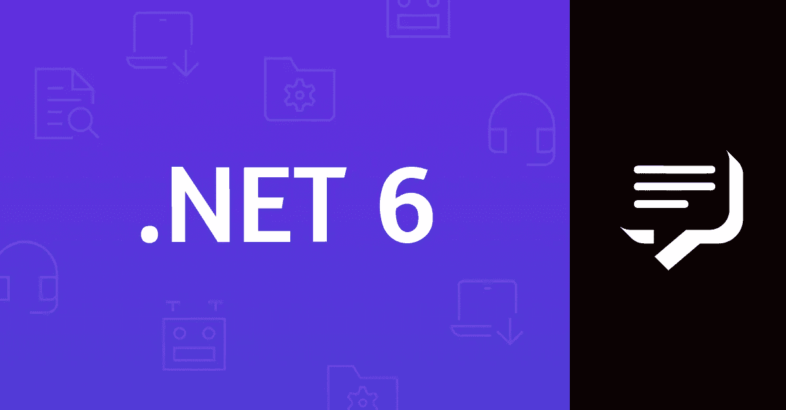
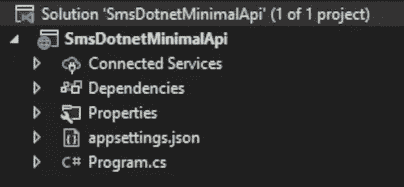

# 如何用发送短信？Net 6 最小 API

> 原文：<https://medium.com/codex/how-to-send-an-sms-with-net-6-minimal-api-82e63c1e3734?source=collection_archive---------6----------------------->

我一直在看。Net 6 已经有一段时间了，很多人一直在谈论的一个令人兴奋的特性是最小 API。虽然意见似乎分歧很大，但我认为这是一个值得欢迎的补充。它消除了使用 ASP.NET MVC 的许多负担，当然也降低了入门门槛，与 NodeJS 中的 ExpressJS 有相似的感觉。

一年多前，我们发布了一篇名为“[如何用 ASP.NET 核心 MVC](https://learn.vonage.com/blog/2020/07/09/how-to-send-an-sms-with-asp-net-core-mvc) 发送短信”的博文。所以随着。Net 6，我想这将是一个好主意，看看使用新的最小 API 语法来模拟相同的功能会是什么样子。

# 给我代码

你可以直接跳到 [GitHub](https://github.com/Vonage-Community/blog-sms-dotnet_minimal_api-send_sms) 上的代码。

# 先决条件

*   。Net 6 RC 2 SDK 或更高版本
*   Visual Studio 2022 预览版或 Visual Studio 代码

# Vonage API 帐户

要完成这个教程，你需要一个 [Vonage API 账户](http://developer.nexmo.com/ed?c=blog_text&ct=2021-11-09-how-to-send-an-sms-with-net-6-minimal-api)。如果你还没有，你可以今天[注册](http://developer.nexmo.com/ed?c=blog_text&ct=2021-11-09-how-to-send-an-sms-with-net-6-minimal-api)并开始用免费信用点数进行构建。一旦你有了一个帐户，你可以在 [Vonage API 仪表板](http://developer.nexmo.com/ed?c=blog_text&ct=2021-11-09-how-to-send-an-sms-with-net-6-minimal-api)的顶部找到你的 API 密匙和 API 秘密。

# 创建项目

我发现创建一个新的最小 API 项目的最简单的方法是使用下面的命令

微软也有一个关于使用 Visual Studio 创建一个新的最小 API 项目的很棒的教程。

我们现在应该有一个带有“Hello World”端点的 API。对此我们将添加两个 NuGet 包，第一个是 [Vonage 的。net SDK](https://www.nuget.org/packages/Vonage/)5 . 9 . 2 版本在编写的时候。因为这将是一个 API，我们没有 UI，所以第二个是 Swashbuckle / Swagger，它将使我们能够轻松地尝试我们创建的任何端点。

# 小的更美

与通常的`appsettings.json`一样，您新创建的项目将只是一个文件，`Program.cs`。这确实是最小的，至少对 ASP.Net 项目来说是这样。

让我们打开`Program.cs`，它应该是这样的。

这是你拥有羽翼丰满所需要的一切。NET API 都在一个文件中。这将为构建小型 API 或微服务提供一个更轻松的起点。老实说，当我回想起 WebAPI 需要多少代码才能产生相同的结果时，我仍然感到震惊。

# 配置

让我们从添加一些设置开始。在`appsettings.json`中，我们需要添加我们的 Vonage 密钥和密码，这些用于通过 Vonage 的服务验证您的应用程序，可以在[仪表板](https://dashboard.nexmo.com/)的顶部找到。

目前，我们还没有配置依赖注入，所以让我们将 VonageClient 类添加到服务集合中。这将允许它被注入到我们将进一步使用的任何类或方法中。

在文件顶部导入所需的名称空间。

向服务集合注册 VonageClient。

每次一行，我们可以看到我们得到了一个 IConfiguration 的实例，这使我们能够访问我们需要的应用程序设置。然后从配置中检索密钥和秘密，以便我们可以创建 VonageClient 构造函数所需的凭证。

# 发送短信

现在我们已经配置好了 VonageClient 类，并准备好了注入，让我们创建一个可以向其发送请求的新端点。我们需要向端点传递一个数据模型，因此需要在一个名为“SmsModel”的新文件中创建一个类。然后在类内部，我们要添加以下属性。

创建好模型后，我们可以继续添加一个新的 POST 方法，将 VonageClient 和我们的 SmsModel 类作为参数。

代码块中发生了几件事情。首先，我们使用`MapPost`扩展方法在[http://localhost:5000/SMS](http://localhost:5000/sms)创建一个端点。其次，我们声明方法的参数；`VonageClient`将使用我们之前设置的依赖注入进行注入，`SmsModel`将使用[模型绑定](https://docs.microsoft.com/en-us/aspnet/core/mvc/models/model-binding?view=aspnetcore-6.0)使用请求体进行创建。

该方法的主体执行发送 SMS 的实际工作。我们使用传入的模型中的数据创建 SendSmsRequest 的实例，然后只需将请求类传递给 SmsClient 的`SendAnSmsAsync`方法。本着“极小”的精神，这只是一句台词！

# 尝试一下

项目现在应该构建、运行和接收请求。如前所述，虽然我们没有 UI 来测试这一点，所以我们将添加几行代码来实现我们的项目中的 Swagger UI。

紧接在 var builder = WebApplication 之后。CreateBuilder(args)我们需要添加两行代码。这些将为依赖注入添加必要的服务。

添加了这些之后，我们在`app.Run()`行之前注册了 Swagger 中间件

现在我们已经写好了所有的代码，我们可以运行项目了，如果您使用的是 Visual Studio，请按 F5 键，或者在项目文件夹中运行下面的命令

现在浏览到[https://localhost:5001/swagger](https://localhost:5001/swagger)，您应该能够使用 SMS 端点上的“试用”按钮。从那里你会看到一个 200 响应代码，并收到一条短信。

# 确认

输入验证是任何 API 的重要组成部分，正如你在 ASP.NET MVC 中发现的那样，在最小的 API 中没有内置的验证。Damian Edwards 创建了一个名为 [MinimalValidation](https://github.com/DamianEdwards/MiniValidation) 的小库，使用了类似于 MVC 验证的验证属性。

就个人而言，我更喜欢[流畅验证](https://fluentvalidation.net/)，因为它使用代码来定义规则而不是属性。下面是一个例子，包括验证在内的完整代码请查看 GitHub 上的[库。](https://github.com/Vonage-Community/blog-sms-dotnet_minimal_api-send_sms)

服务注册和端点更改

模型验证器

验证扩展

# 最后的想法

MVC 是一个功能全面的框架，集成了内置的模型绑定和验证、通过过滤器的可扩展管道、基于约定和声明的行为等等。有些可能不需要特定的特性，或者有性能限制，这使得使用 MVC 并不理想。随着越来越多的功能作为 ASP.NET 核心中间件浮出水面(授权、认证、路由等)，ASP.NET 6 和极简 API 将这些功能轻而易举地发挥出来，非常适合以可维护的方式及时创建轻量级微服务。

# 资源

*   本教程的代码可以在 GitHub 上找到
*   微软[最小 API 概述](https://docs.microsoft.com/en-us/aspnet/core/fundamentals/minimal-apis?view=aspnetcore-6.0)
*   大卫·福勒的要点[最小 API 一览](https://gist.github.com/davidfowl/ff1addd02d239d2d26f4648a06158727)
*   什么人在[推特上谈论最小 API](https://twitter.com/hashtag/minimalapis)
*   [Vonage 短信 API](https://www.vonage.co.uk/communications-apis/sms/)

*最初发布于*[*https://learn . vonage . com/blog/2021/11/09/how-to-send-an-SMS-with-net-6-minimal-API/*](https://learn.vonage.com/blog/2021/11/09/how-to-send-an-sms-with-net-6-minimal-api/)