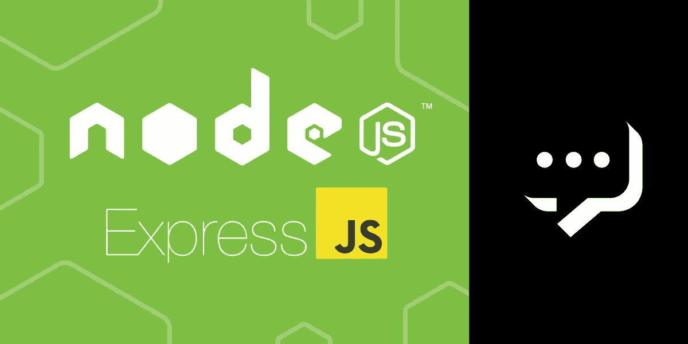
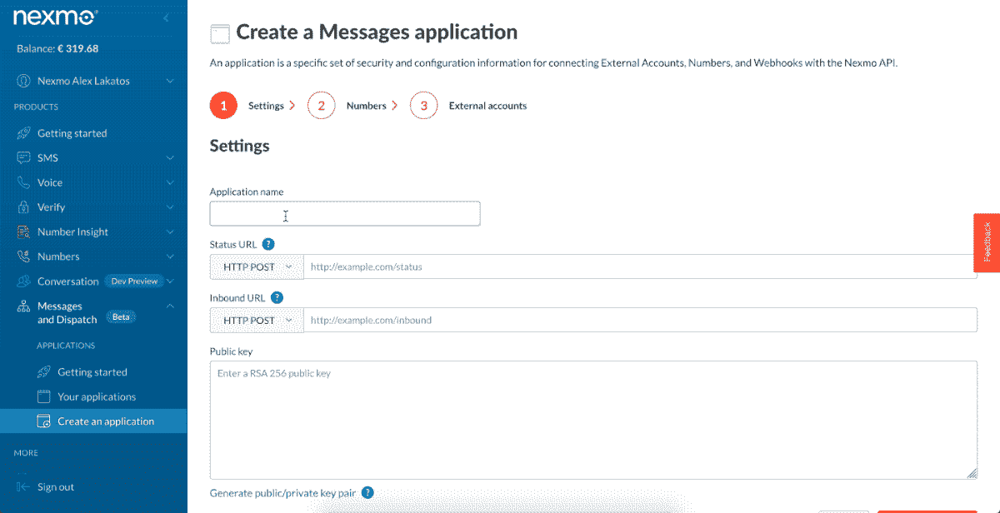
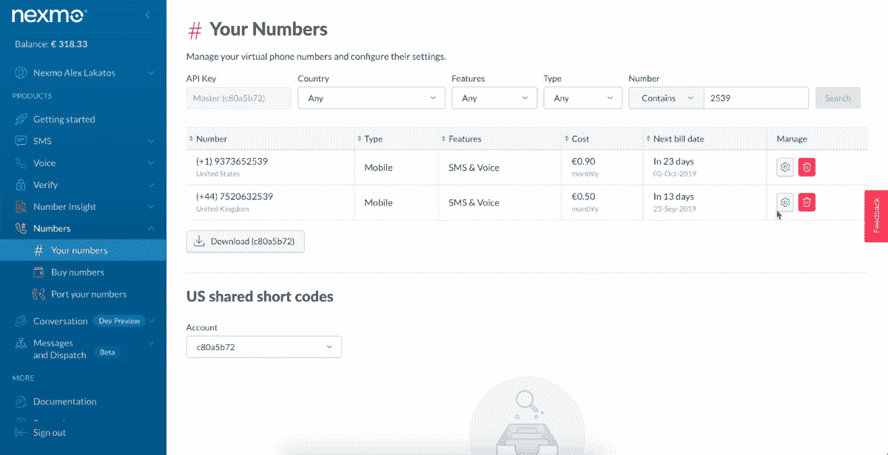
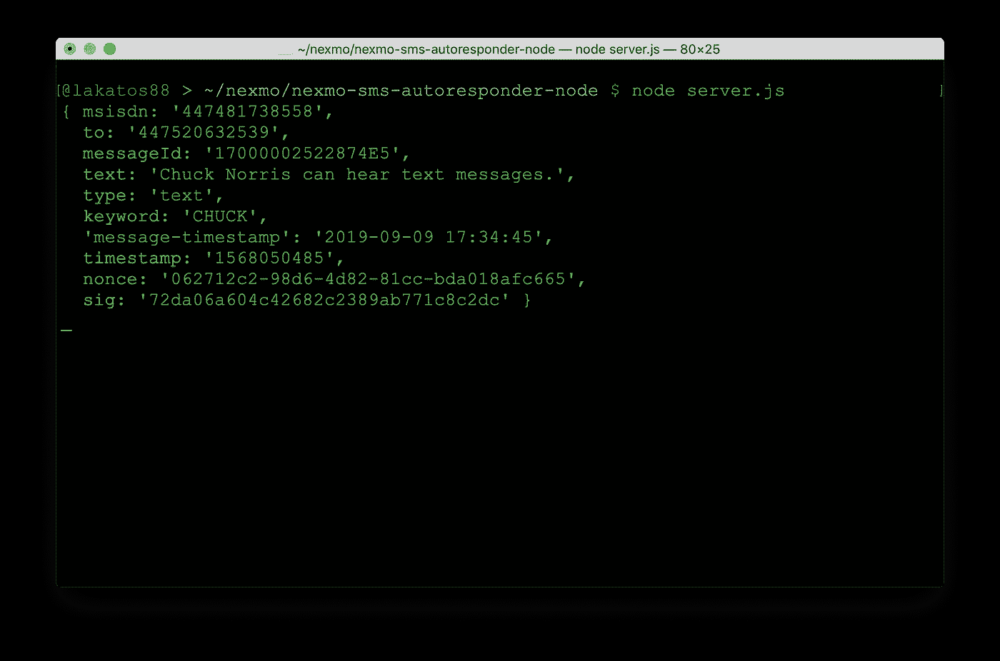

# 如何用 Node.js 和 Express 收发短信

> 原文：<https://medium.com/codex/how-to-send-and-receive-sms-messages-with-node-js-and-express-ea08fb31b8d1?source=collection_archive---------9----------------------->

## [法典](http://medium.com/codex)

Vonage 有几个 API，允许你在世界任何地方发送和接收大量的短信。一旦您获得了虚拟电话号码，您就可以使用 API 来管理出站消息(“发送”)和入站消息(“接收”)。在本文中，您将学习如何使用 [Node.js](https://nodejs.org/) 和 [Express](https://expressjs.com/) 发送和接收短信。

我们将首先使用 Node.js 和旧的 [SMS API](https://developer.nexmo.com/messaging/sms/overview) 发送一条 SMS，然后重写代码以使用新的 [Vonage Messages API](https://developer.nexmo.com/messages/overview) 发送相同的 SMS。

然后，我们将构建一个可以使用 Express 接收 SMS 消息的 Webhook。在本文中，我们将专注于发送和接收短信，但如果你想用 Facebook Messenger、Viber 或 Whatsapp 发送和接收信息，你也可以用 [Messages API](https://developer.nexmo.com/messages/overview) 来完成。

您可以扩展我们在此构建的应用程序，以回复收到的 SMS 消息，或者包含更复杂的交互式元素，让您能够根据自己的 SMS 需求构建自动回复器。

本教程的代码可以在[GitHub](https://github.com/nexmo-community/nexmo-sms-autoresponder-node/)&[Glitch](https://glitch.com/edit/#!/nexmo-sms-autoresponder?path=README.md:1:0)上找到。

# 先决条件

开始之前，请确保您已经:

*   安装在您机器上的 [Node.js](https://nodejs.org/en/download/)
*   使我们本地机器上的代码可以被外界访问
*   [Nexmo CLI](https://developer.nexmo.com/tools) : `npm install -g nexmo-cli`

# Vonage API 帐户

要完成本教程，您将需要一个 [Vonage API 帐户](http://developer.nexmo.com/ed?c=blog_text&ct=2019-09-16-how-to-send-and-receive-sms-messages-with-node-js-and-express-dr)。如果你还没有，你可以今天就[注册](http://developer.nexmo.com/ed?c=blog_text&ct=2019-09-16-how-to-send-and-receive-sms-messages-with-node-js-and-express-dr)开始用免费的信用点数建造。一旦你有了一个帐户，你可以在 [Vonage API 仪表板](http://developer.nexmo.com/ed?c=blog_text&ct=2019-09-16-how-to-send-and-receive-sms-messages-with-node-js-and-express-dr)的顶部找到你的 API 密匙和 API 秘密。

本教程还使用了一个虚拟电话号码。要购买号码，请前往*号码* > *购买号码*并搜索符合您需求的号码。

# 使用 SMS API 发送 SMS 消息

SMS API 是第一个 Vonage API，我们将使用它向您的电话号码发送 SMS 消息。

## 安装 Node.js 依赖项

首先，初始化一个 NPM 包，否则，旧版本的 NPM 会抱怨没有先安装一个包。只需使用 init 的默认值，然后安装`@vonage/server-sdk` Node.js 包。

## 初始化相关性

我们将创建一个新的 JavaScript 文件，姑且称之为`index.js`。

我们需要在您创建的`index.js`文件中初始化我们之前安装的 Nexmo 节点库:

用您实际的 API 密钥和秘密替换那里的值。

## 发送短信

Vonage 节点服务器 SDK 有一个用 SMS API 发送 SMS 的方法，那就是`vonage.message.sendSms`。该方法将 3 个字符串和一个对象作为参数:发送 SMS 的虚拟号码、发送 SMS 的电话号码、消息文本和 SMS 编码选项。它还接受在 API 请求完成时调用的回调。

响应数据包含所有已发送消息的数组，以及关于它们状态的信息。在大多数情况下，它将是数组中的一个元素，但如果 SMS 超过 160 个字符，它将被分成多个部分，然后数组包含关于发送的每个部分的数据。如果消息的状态为 0，则 SMS 发送成功，否则，消息的错误数据在消息的`error-text`属性上。

因为我的文本中有一个表情符号，所以我在选项对象中设置了类型`unicode`，否则，这个表情符号将作为`?`在网络上发送。

如果您的运营商网络支持字母数字发送者 id，`FROM`可以是文本而不是电话号码(在我的例子中是`Nexmo`)。如果你的网络不支持字母数字发件人 id(例如[在美国](https://help.nexmo.com/hc/en-us/articles/115011781468))，它必须是一个电话号码。

根据你想发送短信的国家，有规定要求你拥有发送短信的电话号码，所以你必须购买一个电话号码。您可以在 [Vonage API 仪表板](https://dashboard.nexmo.com/buy-numbers)中或通过 CLI 来完成:

您可以运行该代码并通过以下方式接收 SMS 消息:

# 使用消息 API 发送 SMS 消息

有一个新的处理发送文本消息的 API 叫做 Vonage Messages API。它是一个多通道 API，可以通过不同的通道发送消息，如 SMS、Facebook Messenger、Viber 和 Whatsapp。该 API 目前处于测试阶段，所以如果我们想用它来发送相同的短信，我们需要安装 Nexmo Node.js SDK 的测试版。

## 运行 ngrok

如果你以前没用过 ngrok，有一篇[博文](https://www.nexmo.com/blog/2017/07/04/local-development-nexmo-ngrok-tunnel-dr)解释了如何使用。如果你熟悉 ngrok，在 3000 端口上用`http`运行它。

ngrok 运行后，它会给你一个随机的 URL，我们稍后会把它作为我们的 Webhooks 的基础。我的长这样:`[http://5b5c1bd0.ngrok.io](http://5b5c1bd0.ngrok.io.)` [。](http://5b5c1bd0.ngrok.io.)

## 创建“信息”应用程序

为了与 Messages API 交互，我们需要在 Vonage API 平台上创建一个 Messages 应用程序来验证我们的请求。把应用程序想象成容器，元数据，把你所有的数据放在 Nexmo 平台上。我们将[使用 Vonage API 仪表板](https://dashboard.nexmo.com/messages/create-application)创建一个，这需要一个名称、入站 URL 和状态 URL。

我们还将在磁盘上保存一个密钥文件。应用程序在公钥/私钥系统上工作，因此当您创建一个应用程序时，会生成一个公钥并用 Vonage 保存，而生成一个私钥，而不是用 Vonage 保存，并通过应用程序的创建返回给您。稍后，我们将使用私钥来验证我们的库调用。

使用您在上一步中获得的 ngrok URL，并填充各个字段，为各个字段添加`/webhooks/status`和`/webhooks/inbound`。当消息到达消息 API 时，关于消息的数据被发送到入站 URL。当您使用 API 发送消息时，关于消息状态的数据被发送到状态 URL。

## 初始化相关性

让我们替换之前创建的文件的内容。我们需要在您创建的`index.js`文件中初始化我们之前安装的 Nexmo 节点库:

将其中的值替换为您实际的 API 密钥和密码、您之前刚刚创建的应用程序的应用程序 id 以及您保存的私有密钥的路径。

## 发送相同的短信

为了用 Messages API 发送 SMS 消息，我们将使用 Nexmo 节点库测试版中的`nexmo.channel.send`方法。该方法接受对象作为参数，其中包含有关收件人、发件人和内容的信息。对于不同的渠道，它们会有所不同，您需要查看其他渠道的 [API 文档](https://developer.nexmo.com/api/messages-olympus)。

对于 SMS，接收者和发送者的类型是`sms`，对象也必须包含一个数字属性。内容对象接受文本类型和文本消息。回调返回一个错误和响应对象，我们将记录关于操作成功或失败的消息。

您可以运行该代码并通过以下方式接收 SMS 消息:

就是这样，您已经使用两个不同的 Vonage APIs 发送了相同的 SMS 消息。您会注意到 Messages API 的用法要冗长得多，而这两种 API 只需要一种方法来完成同样的事情。

# 接收短信

当 Vonage 电话号码收到 SMS 消息时，Vonage 会将该消息传递给您在 Vonage API 仪表板中指定的 Webhook。为了设置 webhook URL，请转到 Vonage API 仪表板中[您的电话号码旁边的小齿轮图标，并使用`YOUR_NGROK_URL/webhooks/inbound`填写“入站 Webhook URL”字段。不要忘记替换你实际的 ngrok 网址。](https://dashboard.nexmo.com/your-numbers)

## 创建 Web 服务器

我们将使用`express`创建我们的 web 服务器，因为它是用于此目的的最流行和最容易使用的 Node.js 框架之一。我们还将查看入站 URL 的请求体，因此我们需要安装来自 npm 的`body-parser`和`express`。

让我们为此创建一个新文件，将其命名为`server.js`:

我们将创建一个基本的`express`应用程序，它使用来自`bodyParser`的 JSON 解析器，并将`urlencoded`选项设置为`true`。让我们填写我们创建的`server.js`文件。我们将使用端口 3000 让服务器监听，我们已经在端口 3000 上运行了 ngrok。

## 为入站 URL 创建 Webhook

对于入站 URL，我们将为`/webhooks/inbound`创建一个 post 处理程序，我们将把请求体记录到控制台。因为 Vonage 有一个重试机制，如果 URL 没有用`200 OK`响应，它将继续重新发送消息，所以我们将发送回一个`200`状态。

您可以使用以下命令运行代码:

## 尝试一下

现在，从您的手机向您的 Vonage 号码发送短信。您应该在运行代码的终端窗口中看到记录的消息。它看起来像这样:

我希望它能起作用，并且您已经学会了如何使用 Vonage APIs 和 Node.js 发送和接收 SMS 消息。

*最初发布于*[*https://learn . vonage . com/blog/2019/09/16/how-to-send-and-receive-SMS-messages-with-node-js-and-express-dr/*](https://learn.vonage.com/blog/2019/09/16/how-to-send-and-receive-sms-messages-with-node-js-and-express-dr/)