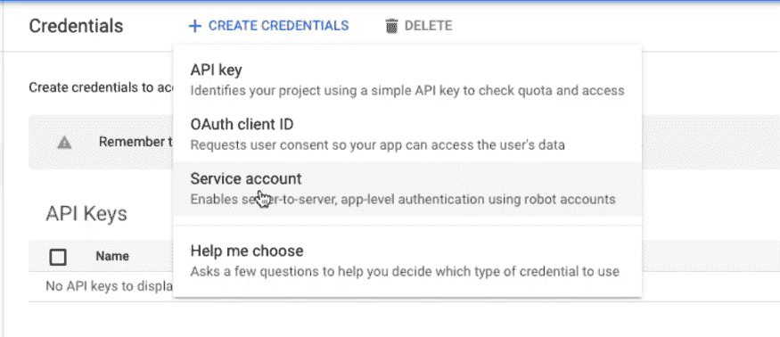
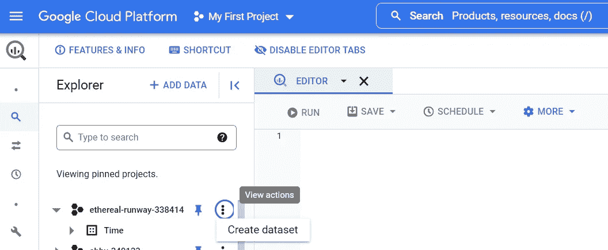

# 如何通过 Pandas 将数据从 Google Sheets 发送到 BigQuery

> 原文：<https://medium.com/codex/how-to-send-data-from-google-sheets-to-bigquery-via-pandas-ff3f3b0552f0?source=collection_archive---------5----------------------->

## 了解如何自动快速地将数据从 Google Sheets 和 Excel 发送到 Big Query


[Unsplash](https://unsplash.com?utm_source=medium&utm_medium=referral) 上 [AltumCode](https://unsplash.com/@altumcode?utm_source=medium&utm_medium=referral) 拍摄的照片

Google BigQuery (GBQ)不需要额外的维护成本，可以在不到一分钟的时间内处理您的数据。在本文中，您可以了解如何使用 BigQuery API 将数据从 CSV 和 JSON 文件上传到 GBQ，或者从其他 Google 服务[上传数据。今天，我将告诉你如何将你一直以来的最爱——Google Sheets 和 Excel 中的数据上传到 BigQuery。](https://www.owox.com/blog/use-cases/load-data-into-bigquery/)

Python 数据分析师和工程师喜欢用熊猫来分析数据。分析完成后，将转换和计算的数据加载到 BigQuery 是一种常见的做法&在本文中，我将带您完成这些步骤。

首先，确保你有一个谷歌账户。谷歌通常提供免费积分，所以第一年你不必为访问他们的资源付费。

**使用熊猫开始使用谷歌表单需要三个步骤:**

1.  激活 API
2.  设置服务帐户，授予访问权限
3.  创建密钥
4.  编写访问数据的代码

**将数据框架推送到谷歌查询:**

1.  启用大查询 API
2.  如果需要，建立第二个服务帐户，授予权限
3.  在 Google 查询控制台中为数据集创建模板
4.  通过 pandas 将您的 Google 表单推到您在上一步中创建的目标表中

我们开始吧。

# 激活 API


**激活 Google Sheets API**

为了激活这项服务，我们必须告诉谷歌，我们的帐户将使用它。所以让我们谷歌一下谷歌云。然后在他们的网站上点击控制台按钮。在这里，我们可以看到我们所有的帐户资源。然后在搜索栏中搜索 Google Sheets API，然后单击 enable。完成后，还可以通过搜索 Google Drive API 并重复相同的过程来启用 Google Drive API。

太好了！现在我们已经完成了 API 的激活，让我们来设置一些服务帐户。然后，我们将授予这些服务帐户对某些工作表的访问权限。之后，我们将编写一些 Python 代码来访问这些数据。

# 创建服务帐户


**转到凭据-:** 要创建服务帐户，我们必须转到凭据控制面板。转到 API&服务，然后转到凭证。在那里，我们将看到如下所示的页面。点击创建凭据按钮，然后点击服务帐户按钮。你想给它取什么名字都行。



一旦完成命名，**赋予帐户编辑权限**(在选择角色>项目>编辑或所有者下)。我给了自己主人。


太好了！现在，我们已经创建了一个服务帐户，让我们最后创建一个密钥。在下一页中，点击 Create Key 按钮，选择 JSON，然后点击 Create 按钮。这会将一个 JSON 文件下载到您的计算机上。现在我们可以开始编码了。


为了让我们访问该文件，我们必须通过其客户端电子邮件访问我们的服务帐户。我们可以在之前下载的 JSON 文件中找到这一点:


JSON 文件内部的例子。

复制 client_email 字段中引号之间的数据，然后单击 share，并通过访问您的 Google Drive 授予该帐户编辑权限。


# 编写代码

```
pip3 install gspread
pip3 install oauth2client.
```

这将使我们获得所需的库，以便在 google cloud 中进行身份验证，并从 google cloud 中进行写入/读取。

```
scope = [**'https://spreadsheets.google.com/feeds'**, **'https://www.googleapis.com/auth/drive'**]
creds = ServiceAccountCredentials.from_json_keyfile_name(**'grab the name of the file you downloaded, save it to your directory before that.json'**, scope)
client = gspread.authorize(creds)**def** iter_pd(df):
    **for** val **in** df.columns:
        **yield** val
    **for** row **in** df.to_numpy():
        **for** val **in** row:
            **if** pd.isna(val):
                **yield ""
            else**:
                **yield** val

**def** pandas_to_sheets(pandas_df, sheet, clear=**True**, formulas=[]):
    *# Updates all values in a workbook to match a pandas dataframe* **if** clear:
        sheet.clear()
    (row, col) = pandas_df.shape
    cells = sheet.range(**"A1:{}"**.format(gspread.utils.rowcol_to_a1(row + **1**, col)))
    **for** cell, val **in** zip(cells, iter_pd(pandas_df)):

     cell.value = val
    sheet.update_cells(cells)
**def** newsheet(client, name):
    client.add_worksheet(title=name, rows=**"100"**, cols=**"20"**)

**import** numpy **as** np
df = pd.DataFrame(client.open(**'TimeSheet'**).worksheet(**'Sheet1'**).get_all_records())
print(df)
column_names = list(df.columns)
print(column_names)
df[**'Total'**]=df.iloc[:,-**4**:].sum(axis=**1**)

print(df)
df = pd.DataFrame(df)
```


> 瞧啊。我们都准备好了。这段代码的一部分已经从这个地方被取走了，所以这段代码的所有荣誉都归于这个基因人:【https://www.danielecook.com/from-pandas-to-google-sheets/[，所以所有的荣誉都归于他。](https://www.danielecook.com/from-pandas-to-google-sheets/)
> 
> 为了进一步分解代码，在“serviceaccountcredentials . from _ json _ keyfile _ name()”部分，请输入您之前下载的 JSON 文件的名称。
> 
> iter_pd 所做的是，它遍历一个熊猫数据帧。它由 pandas_to_sheets 调用，写入指定的 google sheets 文件。最后，函数 newsheet 在现有的电子表格中创建新的工作表。

# 熊猫-将数据帧保存到 BigQuery

如果你想了解更多 [*快速入门:使用客户端库| BigQuery |谷歌云*](https://cloud.google.com/bigquery/docs/quickstarts/quickstart-client-libraries) *，这里有一些阅读材料。*

1.  在 Google Cloud 控制台的项目选择器页面上，选择或创建一个 Google Cloud 项目。*点击- >* [*进入项目选择器*](https://console.cloud.google.com/projectselector2/home/dashboard) *了解更多。*


2.启用 BigQuery API。*点击>* [*启用 API*](https://console.cloud.google.com/flows/enableapi?apiid=bigquery) *阅读更多。*


3.创建一个服务帐户(我已经是上一个帐户的所有者，所以我不需要重新创建。我将在下一节中使用这些相同的凭证，但是通常需要另一个服务帐户，并且创建密钥的过程也需要重复)

4.我将在我的大查询仪表板中做一些**润色，以在控制台中创建一个数据表 name ( *我正在命名我的 Time.pandas)* 。稍后，我将使用 python 将我的 google sheet 数据推送到精确的目标表( *Time.pandas)* 。**

要做到这一点，点击您的项目名称→创建数据集→给它一个名称(我已经给我的命名为“时间”,转到数据集 ID 部分。*注意:它马上就要派上用场了)*



创建数据集

5.**编码**→如果熊猫 gbq 包没有安装，请使用以下命令安装:

```
pip install pandas
# Or
pip3 install pandaspip install pandas-gbq
# Or
pip3 install pandas-gbq
```

> 关于 to_gbq 函数
> 
> 本教程直接使用 pandas DataFrame 的 **to_gbq** 函数写入 Google Cloud BigQuery。关于这个函数的更多细节请参考 API 文档: [pandas。DataFrame.to_gbq — pandas 1.2.3 文档(pydata.org)](https://pandas.pydata.org/pandas-docs/stable/reference/api/pandas.DataFrame.to_gbq.html)。
> 
> 该函数的签名如下所示:

```
#Signature function 
#DataFrame.to_gbq(destination_table, project_id=None, chunksize=None, reauth=False, if_exists='fail', auth_local_webserver=False, table_schema=None, location=None, progress_bar=True, credentials=None)**from** google.oauth2.service_account **import** Credentials
**from** google.oauth2 **import** service_account

 *# Define target table in BQ* target_table = **"Time.pandas(Enter your dataset name)"** project_id = **"Enter what you grabbed from screenshot above"** credential_file = **"your service account file- pls remember to save it in the location of your directory..json"** credential = Credentials.from_service_account_file(credential_file)

*# Save Pandas dataframe to BQ* df.to_gbq(target_table, project_id=project_id, if_exists=**'replace'**, progress_bar=**True**, credentials=credential)
```

6.仔细检查你的仪表板


现在，您可以创建查询并编写一些 SQL，对您的数据执行一些 bigquery ML。

我希望这篇文章能帮助你导航&避免我开始这段旅程时所面临的错误。让我知道你的想法，谢谢！

# **结论**

我们完事了。当你作为一个团队一直在一个谷歌电子表格上工作时，这就很方便了。数据库更新的时候，现在几乎可以瞬间分析！

这不是你可以用谷歌的资源做的唯一事情；有了谷歌云平台，你可以做更多的事情。这包括访问谷歌地图 API、AutoML 等等。