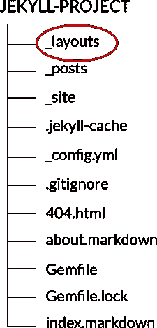
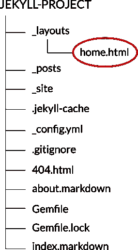
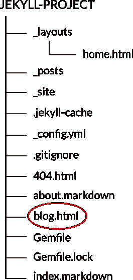
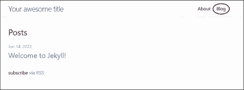

# 如何从子目录服务 Jekyll 博客

> 原文：<https://medium.com/codex/how-to-serve-jekyll-blog-from-a-subdirectory-548a046a3f69?source=collection_archive---------12----------------------->

这是一个分步指南，介绍如何设置 Jekyll 从不同的 URL 而不是根来提供博客帖子。

例如，如果您正在构建一个投资组合网站，您可能希望在主页上显示一个简短的简历和一些投资组合项目，同时从“/blog”子目录中提供博客帖子。

这是 Jekyll 网站的默认 URL 结构:

**首页网址:**[http://127 . 0 . 0 . 1:4000/](http://127.0.0.1:4000/)(显示博文列表)

**帖子网址:**[http://127 . 0 . 0 . 1:4000/Jekyll/update/2022/06/13/welcome-to-Jekyll . html](http://127.0.0.1:4000/jekyll/update/2022/06/13/welcome-to-jekyll.html)(显示单篇博文)

这就是我们想要的:

**首页网址:**[http://127 . 0 . 0 . 1:4000/](http://127.0.0.1:4000/)(显示像你的简历这样的静态内容)

**博客页面网址:**[http://127 . 0 . 0 . 1:4000/Blog](http://127.0.0.1:4000/blog)/(显示博文列表)

**帖子网址:**[http://127 . 0 . 0 . 1:4000/blog/Jekyll/update/2022/06/13/welcome-to-Jekyll . html](http://127.0.0.1:4000/blog/jekyll/update/2022/06/13/welcome-to-jekyll.html)(显示单篇博文)

# 先决条件

您需要在本地机器上安装 Jekyll。

此外，我将假设您使用的是 Jekyll 预装的默认主题 Minima。

# 步骤 1 —创建 home.html 文件

首先，在项目的根目录下创建一个名为`_layouts`的文件夹。



接下来，您必须将`home.html`文件从 Minima 主题文件夹复制到您的项目文件夹中。

要找出 Minima 安装在你系统的什么地方，打开一个终端，`cd`进入你的项目目录，然后运行:

```
bundle show minima
```

我在 Windows 上的路径如下所示:

```
C:\Ruby30-x64\lib\ruby\gems\3.0.0\gems\minima-2.5.1
```

如果您使用的是 Linux，它可能看起来像这样:

```
/home/username/gems/gems/minima-2.5.1
```

在`_layouts`文件夹中找到`home.html`文件:

```
C:\Ruby30-x64\lib\ruby\gems\3.0.0\gems\minima-2.5.1\_layouts\home.html
```

将该文件复制到您之前在项目文件夹中创建的`_layouts`文件夹中。

因此，现在您的项目文件夹应该如下所示:



# 步骤 2 —创建 blog.html 文件

在项目的根目录下创建一个名为`blog.html`的文件。



将以下几行添加到文件中:

```
---
layout: page
title: Blog
permalink: /blog/
---
```

我们在三重破折号之间添加的键-值对成为页面元数据的一部分(或称之为前端内容)，它应该总是出现在文件的顶部。

如果您此时访问 [http://127.0.0.1:4000/](http://127.0.0.1:4000/) ，您将会看到博客页面的链接已经添加到站点导航中。



接下来，打开项目文件夹中的`_layouts\home.html`文件。

您会发现一个标题和一个无序列表，标题中包含一个类`post-list-heading`，无序列表中包含一个类`post-list`并封装在一个`if` 语句中。无序列表中的`for` 循环负责遍历你所有的博客文章，并将它们显示在页面上。

```

    <h2 class="post-list-heading">{{ page.list_title | default: "Posts" }}</h2>
    <ul class="post-list">
      
      <li>
        {%- assign date_format = site.minima.date_format | default: "%b %-d, %Y" -%}
        <span class="post-meta">{{ post.date | date: date_format }}</span>
        <h3>
          <a class="post-link" href="{{ post.url | relative_url }}">
            {{ post.title | escape }}
          </a>
        </h3>
        
          {{ post.excerpt }}
        
      </li>
      
    </ul><p class="rss-subscribe">subscribe <a href="{{ "/feed.xml" | relative_url }}">via RSS</a></p>
  
```

复制这段代码并粘贴到我们之前创建的`blog.html`文件中。

所以现在您的`blog.html`文件应该是这样的:

```
---
layout: page
title: Blog
permalink: /blog/
---
    <h2 class="post-list-heading">{{ page.list_title | default: "Posts" }}</h2>
    <ul class="post-list">
      
      <li>
        {%- assign date_format = site.minima.date_format | default: "%b %-d, %Y" -%}
        <span class="post-meta">{{ post.date | date: date_format }}</span>
        <h3>
          <a class="post-link" href="{{ post.url | relative_url }}">
            {{ post.title | escape }}
          </a>
        </h3>
        
          {{ post.excerpt }}
        
      </li>
      
    </ul><p class="rss-subscribe">subscribe <a href="{{ "/feed.xml" | relative_url }}">via RSS</a></p>

```

# 步骤 3 —添加您的主页内容

在项目文件夹内的`_layouts\home.html`文件中，用您希望在主页上显示的静态内容替换我们在步骤 2 中复制的代码。

```
---
layout: default
---<div class="home">
    
    <h1 class="page-heading">{{ page.title }}</h1>
    {{ content }}<!-- bio -->
    <h2>My name is Jekyll</h2>
    <p>I'm a frontend developer who loves working with HTML, CSS and JavaScript.</p>
</div>
```

# 步骤 4 —修改配置文件

最后，打开`_config.yml`文件并添加以下行:

```
permalink: /blog/:categories/:year/:month/:day/:title:output_ext
```

对`_config.yml`文件进行任何更改后，确保重启服务器。

就是这样！